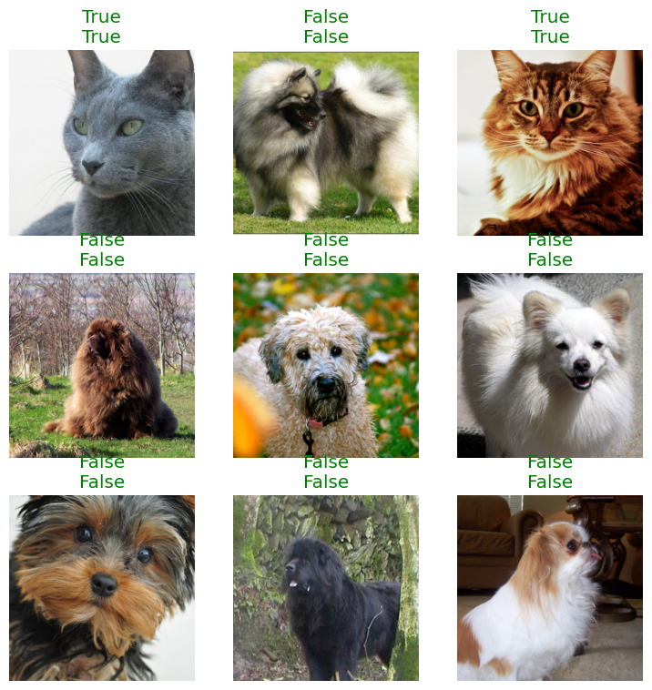

## Classify Cats and Dogs using Fine Tuning of Resnet

Install needed library


```python
! pip install matplotlib==3.7.1 matplotlib-inline==0.1.7 matplotlib-venn==0.11.10
! pip install numpy==1.26.4
! pip install fastai==2.7.16 fastbook==0.0.29
```

    Requirement already satisfied: matplotlib==3.7.1 in /home/andre/miniconda3/envs/venv/lib/python3.12/site-packages (3.7.1)
    Requirement already satisfied: matplotlib-inline==0.1.7 in /home/andre/miniconda3/envs/venv/lib/python3.12/site-packages (0.1.7)
    Requirement already satisfied: matplotlib-venn==0.11.10 in /home/andre/miniconda3/envs/venv/lib/python3.12/site-packages (0.11.10)
    Requirement already satisfied: contourpy>=1.0.1 in /home/andre/miniconda3/envs/venv/lib/python3.12/site-packages (from matplotlib==3.7.1) (1.2.1)
    Requirement already satisfied: cycler>=0.10 in /home/andre/miniconda3/envs/venv/lib/python3.12/site-packages (from matplotlib==3.7.1) (0.12.1)
    Requirement already satisfied: fonttools>=4.22.0 in /home/andre/miniconda3/envs/venv/lib/python3.12/site-packages (from matplotlib==3.7.1) (4.53.1)
    Requirement already satisfied: kiwisolver>=1.0.1 in /home/andre/miniconda3/envs/venv/lib/python3.12/site-packages (from matplotlib==3.7.1) (1.4.5)
    Requirement already satisfied: numpy>=1.20 in /home/andre/miniconda3/envs/venv/lib/python3.12/site-packages (from matplotlib==3.7.1) (1.26.4)
    Requirement already satisfied: packaging>=20.0 in /home/andre/miniconda3/envs/venv/lib/python3.12/site-packages (from matplotlib==3.7.1) (24.1)
    Requirement already satisfied: pillow>=6.2.0 in /home/andre/miniconda3/envs/venv/lib/python3.12/site-packages (from matplotlib==3.7.1) (10.4.0)
    Requirement already satisfied: pyparsing>=2.3.1 in /home/andre/miniconda3/envs/venv/lib/python3.12/site-packages (from matplotlib==3.7.1) (3.1.2)
    Requirement already satisfied: python-dateutil>=2.7 in /home/andre/miniconda3/envs/venv/lib/python3.12/site-packages (from matplotlib==3.7.1) (2.9.0.post0)
    Requirement already satisfied: traitlets in /home/andre/miniconda3/envs/venv/lib/python3.12/site-packages (from matplotlib-inline==0.1.7) (5.14.3)
    Requirement already satisfied: scipy in /home/andre/miniconda3/envs/venv/lib/python3.12/site-packages (from matplotlib-venn==0.11.10) (1.14.0)
    Requirement already satisfied: six>=1.5 in /home/andre/miniconda3/envs/venv/lib/python3.12/site-packages (from python-dateutil>=2.7->matplotlib==3.7.1) (1.16.0)
    Requirement already satisfied: numpy==1.26.4 in /home/andre/miniconda3/envs/venv/lib/python3.12/site-packages (1.26.4)
    Requirement already satisfied: fastai==2.7.16 in /home/andre/miniconda3/envs/venv/lib/python3.12/site-packages (2.7.16)
    Requirement already satisfied: fastbook==0.0.29 in /home/andre/miniconda3/envs/venv/lib/python3.12/site-packages (0.0.29)
    Requirement already satisfied: pip in /home/andre/miniconda3/envs/venv/lib/python3.12/site-packages (from fastai==2.7.16) (24.2)
    Requirement already satisfied: packaging in /home/andre/miniconda3/envs/venv/lib/python3.12/site-packages (from fastai==2.7.16) (24.1)
    Requirement already satisfied: fastdownload<2,>=0.0.5 in /home/andre/miniconda3/envs/venv/lib/python3.12/site-packages (from fastai==2.7.16) (0.0.7)
    Requirement already satisfied: fastcore<1.6,>=1.5.29 in /home/andre/miniconda3/envs/venv/lib/python3.12/site-packages (from fastai==2.7.16) (1.5.55)
    Requirement already satisfied: torchvision>=0.11 in /home/andre/miniconda3/envs/venv/lib/python3.12/site-packages (from fastai==2.7.16) (0.19.0)
    Requirement already satisfied: matplotlib in /home/andre/miniconda3/envs/venv/lib/python3.12/site-packages (from fastai==2.7.16) (3.7.1)
    Requirement already satisfied: pandas in /home/andre/miniconda3/envs/venv/lib/python3.12/site-packages (from fastai==2.7.16) (2.2.2)
    Requirement already satisfied: requests in /home/andre/miniconda3/envs/venv/lib/python3.12/site-packages (from fastai==2.7.16) (2.32.3)
    Requirement already satisfied: pyyaml in /home/andre/miniconda3/envs/venv/lib/python3.12/site-packages (from fastai==2.7.16) (6.0.2)
    Requirement already satisfied: fastprogress>=0.2.4 in /home/andre/miniconda3/envs/venv/lib/python3.12/site-packages (from fastai==2.7.16) (1.0.3)
    Requirement already satisfied: pillow>=9.0.0 in /home/andre/miniconda3/envs/venv/lib/python3.12/site-packages (from fastai==2.7.16) (10.4.0)
    Requirement already satisfied: scikit-learn in /home/andre/miniconda3/envs/venv/lib/python3.12/site-packages (from fastai==2.7.16) (1.5.1)
    Requirement already satisfied: scipy in /home/andre/miniconda3/envs/venv/lib/python3.12/site-packages (from fastai==2.7.16) (1.14.0)
    Requirement already satisfied: spacy<4 in /home/andre/miniconda3/envs/venv/lib/python3.12/site-packages (from fastai==2.7.16) (3.7.5)
    Requirement already satisfied: torch<2.5,>=1.10 in /home/andre/miniconda3/envs/venv/lib/python3.12/site-packages (from fastai==2.7.16) (2.4.0)
    Requirement already satisfied: graphviz in /home/andre/miniconda3/envs/venv/lib/python3.12/site-packages (from fastbook==0.0.29) (0.20.3)
    Requirement already satisfied: transformers in /home/andre/miniconda3/envs/venv/lib/python3.12/site-packages (from fastbook==0.0.29) (4.44.0)
    Requirement already satisfied: datasets in /home/andre/miniconda3/envs/venv/lib/python3.12/site-packages (from fastbook==0.0.29) (2.20.0)
    Requirement already satisfied: ipywidgets<8 in /home/andre/miniconda3/envs/venv/lib/python3.12/site-packages (from fastbook==0.0.29) (7.8.3)
    Requirement already satisfied: sentencepiece in /home/andre/miniconda3/envs/venv/lib/python3.12/site-packages (from fastbook==0.0.29) (0.2.0)
    Requirement already satisfied: comm>=0.1.3 in /home/andre/miniconda3/envs/venv/lib/python3.12/site-packages (from ipywidgets<8->fastbook==0.0.29) (0.2.2)
    Requirement already satisfied: ipython-genutils~=0.2.0 in /home/andre/miniconda3/envs/venv/lib/python3.12/site-packages (from ipywidgets<8->fastbook==0.0.29) (0.2.0)
    Requirement already satisfied: traitlets>=4.3.1 in /home/andre/miniconda3/envs/venv/lib/python3.12/site-packages (from ipywidgets<8->fastbook==0.0.29) (5.14.3)
    Requirement already satisfied: widgetsnbextension~=3.6.8 in /home/andre/miniconda3/envs/venv/lib/python3.12/site-packages (from ipywidgets<8->fastbook==0.0.29) (3.6.8)
    Requirement already satisfied: ipython>=4.0.0 in /home/andre/miniconda3/envs/venv/lib/python3.12/site-packages (from ipywidgets<8->fastbook==0.0.29) (8.26.0)
    Requirement already satisfied: jupyterlab-widgets<3,>=1.0.0 in /home/andre/miniconda3/envs/venv/lib/python3.12/site-packages (from ipywidgets<8->fastbook==0.0.29) (1.1.9)
    Requirement already satisfied: spacy-legacy<3.1.0,>=3.0.11 in /home/andre/miniconda3/envs/venv/lib/python3.12/site-packages (from spacy<4->fastai==2.7.16) (3.0.12)
    Requirement already satisfied: spacy-loggers<2.0.0,>=1.0.0 in /home/andre/miniconda3/envs/venv/lib/python3.12/site-packages (from spacy<4->fastai==2.7.16) (1.0.5)
    Requirement already satisfied: murmurhash<1.1.0,>=0.28.0 in /home/andre/miniconda3/envs/venv/lib/python3.12/site-packages (from spacy<4->fastai==2.7.16) (1.0.10)
    Requirement already satisfied: cymem<2.1.0,>=2.0.2 in /home/andre/miniconda3/envs/venv/lib/python3.12/site-packages (from spacy<4->fastai==2.7.16) (2.0.8)
    Requirement already satisfied: preshed<3.1.0,>=3.0.2 in /home/andre/miniconda3/envs/venv/lib/python3.12/site-packages (from spacy<4->fastai==2.7.16) (3.0.9)
    Requirement already satisfied: thinc<8.3.0,>=8.2.2 in /home/andre/miniconda3/envs/venv/lib/python3.12/site-packages (from spacy<4->fastai==2.7.16) (8.2.5)
    Requirement already satisfied: wasabi<1.2.0,>=0.9.1 in /home/andre/miniconda3/envs/venv/lib/python3.12/site-packages (from spacy<4->fastai==2.7.16) (1.1.3)
    Requirement already satisfied: srsly<3.0.0,>=2.4.3 in /home/andre/miniconda3/envs/venv/lib/python3.12/site-packages (from spacy<4->fastai==2.7.16) (2.4.8)
    Requirement already satisfied: catalogue<2.1.0,>=2.0.6 in /home/andre/miniconda3/envs/venv/lib/python3.12/site-packages (from spacy<4->fastai==2.7.16) (2.0.10)
    Requirement already satisfied: weasel<0.5.0,>=0.1.0 in /home/andre/miniconda3/envs/venv/lib/python3.12/site-packages (from spacy<4->fastai==2.7.16) (0.4.1)
    Requirement already satisfied: typer<1.0.0,>=0.3.0 in /home/andre/miniconda3/envs/venv/lib/python3.12/site-packages (from spacy<4->fastai==2.7.16) (0.12.3)
    Requirement already satisfied: tqdm<5.0.0,>=4.38.0 in /home/andre/miniconda3/envs/venv/lib/python3.12/site-packages (from spacy<4->fastai==2.7.16) (4.66.5)
    Requirement already satisfied: pydantic!=1.8,!=1.8.1,<3.0.0,>=1.7.4 in /home/andre/miniconda3/envs/venv/lib/python3.12/site-packages (from spacy<4->fastai==2.7.16) (2.8.2)
    Requirement already satisfied: jinja2 in /home/andre/miniconda3/envs/venv/lib/python3.12/site-packages (from spacy<4->fastai==2.7.16) (3.1.4)
    Requirement already satisfied: setuptools in /home/andre/miniconda3/envs/venv/lib/python3.12/site-packages (from spacy<4->fastai==2.7.16) (72.1.0)
    Requirement already satisfied: langcodes<4.0.0,>=3.2.0 in /home/andre/miniconda3/envs/venv/lib/python3.12/site-packages (from spacy<4->fastai==2.7.16) (3.4.0)
    Requirement already satisfied: numpy>=1.19.0 in /home/andre/miniconda3/envs/venv/lib/python3.12/site-packages (from spacy<4->fastai==2.7.16) (1.26.4)
    Requirement already satisfied: charset-normalizer<4,>=2 in /home/andre/miniconda3/envs/venv/lib/python3.12/site-packages (from requests->fastai==2.7.16) (3.3.2)
    Requirement already satisfied: idna<4,>=2.5 in /home/andre/miniconda3/envs/venv/lib/python3.12/site-packages (from requests->fastai==2.7.16) (3.7)
    Requirement already satisfied: urllib3<3,>=1.21.1 in /home/andre/miniconda3/envs/venv/lib/python3.12/site-packages (from requests->fastai==2.7.16) (2.2.2)
    Requirement already satisfied: certifi>=2017.4.17 in /home/andre/miniconda3/envs/venv/lib/python3.12/site-packages (from requests->fastai==2.7.16) (2024.7.4)
    Requirement already satisfied: filelock in /home/andre/miniconda3/envs/venv/lib/python3.12/site-packages (from torch<2.5,>=1.10->fastai==2.7.16) (3.15.4)
    Requirement already satisfied: typing-extensions>=4.8.0 in /home/andre/miniconda3/envs/venv/lib/python3.12/site-packages (from torch<2.5,>=1.10->fastai==2.7.16) (4.12.2)
    Requirement already satisfied: sympy in /home/andre/miniconda3/envs/venv/lib/python3.12/site-packages (from torch<2.5,>=1.10->fastai==2.7.16) (1.13.2)
    Requirement already satisfied: networkx in /home/andre/miniconda3/envs/venv/lib/python3.12/site-packages (from torch<2.5,>=1.10->fastai==2.7.16) (3.3)
    Requirement already satisfied: fsspec in /home/andre/miniconda3/envs/venv/lib/python3.12/site-packages (from torch<2.5,>=1.10->fastai==2.7.16) (2024.5.0)
    Requirement already satisfied: nvidia-cuda-nvrtc-cu12==12.1.105 in /home/andre/miniconda3/envs/venv/lib/python3.12/site-packages (from torch<2.5,>=1.10->fastai==2.7.16) (12.1.105)
    Requirement already satisfied: nvidia-cuda-runtime-cu12==12.1.105 in /home/andre/miniconda3/envs/venv/lib/python3.12/site-packages (from torch<2.5,>=1.10->fastai==2.7.16) (12.1.105)
    Requirement already satisfied: nvidia-cuda-cupti-cu12==12.1.105 in /home/andre/miniconda3/envs/venv/lib/python3.12/site-packages (from torch<2.5,>=1.10->fastai==2.7.16) (12.1.105)
    Requirement already satisfied: nvidia-cudnn-cu12==9.1.0.70 in /home/andre/miniconda3/envs/venv/lib/python3.12/site-packages (from torch<2.5,>=1.10->fastai==2.7.16) (9.1.0.70)
    Requirement already satisfied: nvidia-cublas-cu12==12.1.3.1 in /home/andre/miniconda3/envs/venv/lib/python3.12/site-packages (from torch<2.5,>=1.10->fastai==2.7.16) (12.1.3.1)
    Requirement already satisfied: nvidia-cufft-cu12==11.0.2.54 in /home/andre/miniconda3/envs/venv/lib/python3.12/site-packages (from torch<2.5,>=1.10->fastai==2.7.16) (11.0.2.54)
    Requirement already satisfied: nvidia-curand-cu12==10.3.2.106 in /home/andre/miniconda3/envs/venv/lib/python3.12/site-packages (from torch<2.5,>=1.10->fastai==2.7.16) (10.3.2.106)
    Requirement already satisfied: nvidia-cusolver-cu12==11.4.5.107 in /home/andre/miniconda3/envs/venv/lib/python3.12/site-packages (from torch<2.5,>=1.10->fastai==2.7.16) (11.4.5.107)
    Requirement already satisfied: nvidia-cusparse-cu12==12.1.0.106 in /home/andre/miniconda3/envs/venv/lib/python3.12/site-packages (from torch<2.5,>=1.10->fastai==2.7.16) (12.1.0.106)
    Requirement already satisfied: nvidia-nccl-cu12==2.20.5 in /home/andre/miniconda3/envs/venv/lib/python3.12/site-packages (from torch<2.5,>=1.10->fastai==2.7.16) (2.20.5)
    Requirement already satisfied: nvidia-nvtx-cu12==12.1.105 in /home/andre/miniconda3/envs/venv/lib/python3.12/site-packages (from torch<2.5,>=1.10->fastai==2.7.16) (12.1.105)
    Requirement already satisfied: triton==3.0.0 in /home/andre/miniconda3/envs/venv/lib/python3.12/site-packages (from torch<2.5,>=1.10->fastai==2.7.16) (3.0.0)
    Requirement already satisfied: nvidia-nvjitlink-cu12 in /home/andre/miniconda3/envs/venv/lib/python3.12/site-packages (from nvidia-cusolver-cu12==11.4.5.107->torch<2.5,>=1.10->fastai==2.7.16) (12.6.20)
    Requirement already satisfied: pyarrow>=15.0.0 in /home/andre/miniconda3/envs/venv/lib/python3.12/site-packages (from datasets->fastbook==0.0.29) (17.0.0)
    Requirement already satisfied: pyarrow-hotfix in /home/andre/miniconda3/envs/venv/lib/python3.12/site-packages (from datasets->fastbook==0.0.29) (0.6)
    Requirement already satisfied: dill<0.3.9,>=0.3.0 in /home/andre/miniconda3/envs/venv/lib/python3.12/site-packages (from datasets->fastbook==0.0.29) (0.3.8)
    Requirement already satisfied: xxhash in /home/andre/miniconda3/envs/venv/lib/python3.12/site-packages (from datasets->fastbook==0.0.29) (3.4.1)
    Requirement already satisfied: multiprocess in /home/andre/miniconda3/envs/venv/lib/python3.12/site-packages (from datasets->fastbook==0.0.29) (0.70.16)
    Requirement already satisfied: aiohttp in /home/andre/miniconda3/envs/venv/lib/python3.12/site-packages (from datasets->fastbook==0.0.29) (3.10.3)
    Requirement already satisfied: huggingface-hub>=0.21.2 in /home/andre/miniconda3/envs/venv/lib/python3.12/site-packages (from datasets->fastbook==0.0.29) (0.24.5)
    Requirement already satisfied: contourpy>=1.0.1 in /home/andre/miniconda3/envs/venv/lib/python3.12/site-packages (from matplotlib->fastai==2.7.16) (1.2.1)
    Requirement already satisfied: cycler>=0.10 in /home/andre/miniconda3/envs/venv/lib/python3.12/site-packages (from matplotlib->fastai==2.7.16) (0.12.1)
    Requirement already satisfied: fonttools>=4.22.0 in /home/andre/miniconda3/envs/venv/lib/python3.12/site-packages (from matplotlib->fastai==2.7.16) (4.53.1)
    Requirement already satisfied: kiwisolver>=1.0.1 in /home/andre/miniconda3/envs/venv/lib/python3.12/site-packages (from matplotlib->fastai==2.7.16) (1.4.5)
    Requirement already satisfied: pyparsing>=2.3.1 in /home/andre/miniconda3/envs/venv/lib/python3.12/site-packages (from matplotlib->fastai==2.7.16) (3.1.2)
    Requirement already satisfied: python-dateutil>=2.7 in /home/andre/miniconda3/envs/venv/lib/python3.12/site-packages (from matplotlib->fastai==2.7.16) (2.9.0.post0)
    Requirement already satisfied: pytz>=2020.1 in /home/andre/miniconda3/envs/venv/lib/python3.12/site-packages (from pandas->fastai==2.7.16) (2024.1)
    Requirement already satisfied: tzdata>=2022.7 in /home/andre/miniconda3/envs/venv/lib/python3.12/site-packages (from pandas->fastai==2.7.16) (2024.1)
    Requirement already satisfied: joblib>=1.2.0 in /home/andre/miniconda3/envs/venv/lib/python3.12/site-packages (from scikit-learn->fastai==2.7.16) (1.4.2)
    Requirement already satisfied: threadpoolctl>=3.1.0 in /home/andre/miniconda3/envs/venv/lib/python3.12/site-packages (from scikit-learn->fastai==2.7.16) (3.5.0)
    Requirement already satisfied: regex!=2019.12.17 in /home/andre/miniconda3/envs/venv/lib/python3.12/site-packages (from transformers->fastbook==0.0.29) (2024.7.24)
    Requirement already satisfied: safetensors>=0.4.1 in /home/andre/miniconda3/envs/venv/lib/python3.12/site-packages (from transformers->fastbook==0.0.29) (0.4.4)
    Requirement already satisfied: tokenizers<0.20,>=0.19 in /home/andre/miniconda3/envs/venv/lib/python3.12/site-packages (from transformers->fastbook==0.0.29) (0.19.1)
    Requirement already satisfied: aiohappyeyeballs>=2.3.0 in /home/andre/miniconda3/envs/venv/lib/python3.12/site-packages (from aiohttp->datasets->fastbook==0.0.29) (2.3.5)
    Requirement already satisfied: aiosignal>=1.1.2 in /home/andre/miniconda3/envs/venv/lib/python3.12/site-packages (from aiohttp->datasets->fastbook==0.0.29) (1.3.1)
    Requirement already satisfied: attrs>=17.3.0 in /home/andre/miniconda3/envs/venv/lib/python3.12/site-packages (from aiohttp->datasets->fastbook==0.0.29) (24.2.0)
    Requirement already satisfied: frozenlist>=1.1.1 in /home/andre/miniconda3/envs/venv/lib/python3.12/site-packages (from aiohttp->datasets->fastbook==0.0.29) (1.4.1)
    Requirement already satisfied: multidict<7.0,>=4.5 in /home/andre/miniconda3/envs/venv/lib/python3.12/site-packages (from aiohttp->datasets->fastbook==0.0.29) (6.0.5)
    Requirement already satisfied: yarl<2.0,>=1.0 in /home/andre/miniconda3/envs/venv/lib/python3.12/site-packages (from aiohttp->datasets->fastbook==0.0.29) (1.9.4)
    Requirement already satisfied: decorator in /home/andre/miniconda3/envs/venv/lib/python3.12/site-packages (from ipython>=4.0.0->ipywidgets<8->fastbook==0.0.29) (5.1.1)
    Requirement already satisfied: jedi>=0.16 in /home/andre/miniconda3/envs/venv/lib/python3.12/site-packages (from ipython>=4.0.0->ipywidgets<8->fastbook==0.0.29) (0.19.1)
    Requirement already satisfied: matplotlib-inline in /home/andre/miniconda3/envs/venv/lib/python3.12/site-packages (from ipython>=4.0.0->ipywidgets<8->fastbook==0.0.29) (0.1.7)
    Requirement already satisfied: prompt-toolkit<3.1.0,>=3.0.41 in /home/andre/miniconda3/envs/venv/lib/python3.12/site-packages (from ipython>=4.0.0->ipywidgets<8->fastbook==0.0.29) (3.0.47)
    Requirement already satisfied: pygments>=2.4.0 in /home/andre/miniconda3/envs/venv/lib/python3.12/site-packages (from ipython>=4.0.0->ipywidgets<8->fastbook==0.0.29) (2.18.0)
    Requirement already satisfied: stack-data in /home/andre/miniconda3/envs/venv/lib/python3.12/site-packages (from ipython>=4.0.0->ipywidgets<8->fastbook==0.0.29) (0.6.3)
    Requirement already satisfied: pexpect>4.3 in /home/andre/miniconda3/envs/venv/lib/python3.12/site-packages (from ipython>=4.0.0->ipywidgets<8->fastbook==0.0.29) (4.9.0)
    Requirement already satisfied: language-data>=1.2 in /home/andre/miniconda3/envs/venv/lib/python3.12/site-packages (from langcodes<4.0.0,>=3.2.0->spacy<4->fastai==2.7.16) (1.2.0)
    Requirement already satisfied: annotated-types>=0.4.0 in /home/andre/miniconda3/envs/venv/lib/python3.12/site-packages (from pydantic!=1.8,!=1.8.1,<3.0.0,>=1.7.4->spacy<4->fastai==2.7.16) (0.7.0)
    Requirement already satisfied: pydantic-core==2.20.1 in /home/andre/miniconda3/envs/venv/lib/python3.12/site-packages (from pydantic!=1.8,!=1.8.1,<3.0.0,>=1.7.4->spacy<4->fastai==2.7.16) (2.20.1)
    Requirement already satisfied: six>=1.5 in /home/andre/miniconda3/envs/venv/lib/python3.12/site-packages (from python-dateutil>=2.7->matplotlib->fastai==2.7.16) (1.16.0)
    Requirement already satisfied: blis<0.8.0,>=0.7.8 in /home/andre/miniconda3/envs/venv/lib/python3.12/site-packages (from thinc<8.3.0,>=8.2.2->spacy<4->fastai==2.7.16) (0.7.11)
    Requirement already satisfied: confection<1.0.0,>=0.0.1 in /home/andre/miniconda3/envs/venv/lib/python3.12/site-packages (from thinc<8.3.0,>=8.2.2->spacy<4->fastai==2.7.16) (0.1.5)
    Requirement already satisfied: click>=8.0.0 in /home/andre/miniconda3/envs/venv/lib/python3.12/site-packages (from typer<1.0.0,>=0.3.0->spacy<4->fastai==2.7.16) (8.1.7)
    Requirement already satisfied: shellingham>=1.3.0 in /home/andre/miniconda3/envs/venv/lib/python3.12/site-packages (from typer<1.0.0,>=0.3.0->spacy<4->fastai==2.7.16) (1.5.4)
    Requirement already satisfied: rich>=10.11.0 in /home/andre/miniconda3/envs/venv/lib/python3.12/site-packages (from typer<1.0.0,>=0.3.0->spacy<4->fastai==2.7.16) (13.7.1)
    Requirement already satisfied: cloudpathlib<1.0.0,>=0.7.0 in /home/andre/miniconda3/envs/venv/lib/python3.12/site-packages (from weasel<0.5.0,>=0.1.0->spacy<4->fastai==2.7.16) (0.18.1)
    Requirement already satisfied: smart-open<8.0.0,>=5.2.1 in /home/andre/miniconda3/envs/venv/lib/python3.12/site-packages (from weasel<0.5.0,>=0.1.0->spacy<4->fastai==2.7.16) (7.0.4)
    Requirement already satisfied: notebook>=4.4.1 in /home/andre/miniconda3/envs/venv/lib/python3.12/site-packages (from widgetsnbextension~=3.6.8->ipywidgets<8->fastbook==0.0.29) (7.2.1)
    Requirement already satisfied: MarkupSafe>=2.0 in /home/andre/miniconda3/envs/venv/lib/python3.12/site-packages (from jinja2->spacy<4->fastai==2.7.16) (2.1.5)
    Requirement already satisfied: mpmath<1.4,>=1.1.0 in /home/andre/miniconda3/envs/venv/lib/python3.12/site-packages (from sympy->torch<2.5,>=1.10->fastai==2.7.16) (1.3.0)
    Requirement already satisfied: parso<0.9.0,>=0.8.3 in /home/andre/miniconda3/envs/venv/lib/python3.12/site-packages (from jedi>=0.16->ipython>=4.0.0->ipywidgets<8->fastbook==0.0.29) (0.8.4)
    Requirement already satisfied: marisa-trie>=0.7.7 in /home/andre/miniconda3/envs/venv/lib/python3.12/site-packages (from language-data>=1.2->langcodes<4.0.0,>=3.2.0->spacy<4->fastai==2.7.16) (1.2.0)
    Requirement already satisfied: jupyter-server<3,>=2.4.0 in /home/andre/miniconda3/envs/venv/lib/python3.12/site-packages (from notebook>=4.4.1->widgetsnbextension~=3.6.8->ipywidgets<8->fastbook==0.0.29) (2.14.2)
    Requirement already satisfied: jupyterlab-server<3,>=2.27.1 in /home/andre/miniconda3/envs/venv/lib/python3.12/site-packages (from notebook>=4.4.1->widgetsnbextension~=3.6.8->ipywidgets<8->fastbook==0.0.29) (2.27.3)
    Requirement already satisfied: jupyterlab<4.3,>=4.2.0 in /home/andre/miniconda3/envs/venv/lib/python3.12/site-packages (from notebook>=4.4.1->widgetsnbextension~=3.6.8->ipywidgets<8->fastbook==0.0.29) (4.2.4)
    Requirement already satisfied: notebook-shim<0.3,>=0.2 in /home/andre/miniconda3/envs/venv/lib/python3.12/site-packages (from notebook>=4.4.1->widgetsnbextension~=3.6.8->ipywidgets<8->fastbook==0.0.29) (0.2.4)
    Requirement already satisfied: tornado>=6.2.0 in /home/andre/miniconda3/envs/venv/lib/python3.12/site-packages (from notebook>=4.4.1->widgetsnbextension~=3.6.8->ipywidgets<8->fastbook==0.0.29) (6.4.1)
    Requirement already satisfied: ptyprocess>=0.5 in /home/andre/miniconda3/envs/venv/lib/python3.12/site-packages (from pexpect>4.3->ipython>=4.0.0->ipywidgets<8->fastbook==0.0.29) (0.7.0)
    Requirement already satisfied: wcwidth in /home/andre/miniconda3/envs/venv/lib/python3.12/site-packages (from prompt-toolkit<3.1.0,>=3.0.41->ipython>=4.0.0->ipywidgets<8->fastbook==0.0.29) (0.2.13)
    Requirement already satisfied: markdown-it-py>=2.2.0 in /home/andre/miniconda3/envs/venv/lib/python3.12/site-packages (from rich>=10.11.0->typer<1.0.0,>=0.3.0->spacy<4->fastai==2.7.16) (3.0.0)
    Requirement already satisfied: wrapt in /home/andre/miniconda3/envs/venv/lib/python3.12/site-packages (from smart-open<8.0.0,>=5.2.1->weasel<0.5.0,>=0.1.0->spacy<4->fastai==2.7.16) (1.16.0)
    Requirement already satisfied: executing>=1.2.0 in /home/andre/miniconda3/envs/venv/lib/python3.12/site-packages (from stack-data->ipython>=4.0.0->ipywidgets<8->fastbook==0.0.29) (2.0.1)
    Requirement already satisfied: asttokens>=2.1.0 in /home/andre/miniconda3/envs/venv/lib/python3.12/site-packages (from stack-data->ipython>=4.0.0->ipywidgets<8->fastbook==0.0.29) (2.4.1)
    Requirement already satisfied: pure-eval in /home/andre/miniconda3/envs/venv/lib/python3.12/site-packages (from stack-data->ipython>=4.0.0->ipywidgets<8->fastbook==0.0.29) (0.2.3)
    Requirement already satisfied: anyio>=3.1.0 in /home/andre/miniconda3/envs/venv/lib/python3.12/site-packages (from jupyter-server<3,>=2.4.0->notebook>=4.4.1->widgetsnbextension~=3.6.8->ipywidgets<8->fastbook==0.0.29) (4.4.0)
    Requirement already satisfied: argon2-cffi>=21.1 in /home/andre/miniconda3/envs/venv/lib/python3.12/site-packages (from jupyter-server<3,>=2.4.0->notebook>=4.4.1->widgetsnbextension~=3.6.8->ipywidgets<8->fastbook==0.0.29) (23.1.0)
    Requirement already satisfied: jupyter-client>=7.4.4 in /home/andre/miniconda3/envs/venv/lib/python3.12/site-packages (from jupyter-server<3,>=2.4.0->notebook>=4.4.1->widgetsnbextension~=3.6.8->ipywidgets<8->fastbook==0.0.29) (8.6.2)
    Requirement already satisfied: jupyter-core!=5.0.*,>=4.12 in /home/andre/miniconda3/envs/venv/lib/python3.12/site-packages (from jupyter-server<3,>=2.4.0->notebook>=4.4.1->widgetsnbextension~=3.6.8->ipywidgets<8->fastbook==0.0.29) (5.7.2)
    Requirement already satisfied: jupyter-events>=0.9.0 in /home/andre/miniconda3/envs/venv/lib/python3.12/site-packages (from jupyter-server<3,>=2.4.0->notebook>=4.4.1->widgetsnbextension~=3.6.8->ipywidgets<8->fastbook==0.0.29) (0.10.0)
    Requirement already satisfied: jupyter-server-terminals>=0.4.4 in /home/andre/miniconda3/envs/venv/lib/python3.12/site-packages (from jupyter-server<3,>=2.4.0->notebook>=4.4.1->widgetsnbextension~=3.6.8->ipywidgets<8->fastbook==0.0.29) (0.5.3)
    Requirement already satisfied: nbconvert>=6.4.4 in /home/andre/miniconda3/envs/venv/lib/python3.12/site-packages (from jupyter-server<3,>=2.4.0->notebook>=4.4.1->widgetsnbextension~=3.6.8->ipywidgets<8->fastbook==0.0.29) (7.16.4)
    Requirement already satisfied: nbformat>=5.3.0 in /home/andre/miniconda3/envs/venv/lib/python3.12/site-packages (from jupyter-server<3,>=2.4.0->notebook>=4.4.1->widgetsnbextension~=3.6.8->ipywidgets<8->fastbook==0.0.29) (5.10.4)
    Requirement already satisfied: overrides>=5.0 in /home/andre/miniconda3/envs/venv/lib/python3.12/site-packages (from jupyter-server<3,>=2.4.0->notebook>=4.4.1->widgetsnbextension~=3.6.8->ipywidgets<8->fastbook==0.0.29) (7.7.0)
    Requirement already satisfied: prometheus-client>=0.9 in /home/andre/miniconda3/envs/venv/lib/python3.12/site-packages (from jupyter-server<3,>=2.4.0->notebook>=4.4.1->widgetsnbextension~=3.6.8->ipywidgets<8->fastbook==0.0.29) (0.20.0)
    Requirement already satisfied: pyzmq>=24 in /home/andre/miniconda3/envs/venv/lib/python3.12/site-packages (from jupyter-server<3,>=2.4.0->notebook>=4.4.1->widgetsnbextension~=3.6.8->ipywidgets<8->fastbook==0.0.29) (26.1.0)
    Requirement already satisfied: send2trash>=1.8.2 in /home/andre/miniconda3/envs/venv/lib/python3.12/site-packages (from jupyter-server<3,>=2.4.0->notebook>=4.4.1->widgetsnbextension~=3.6.8->ipywidgets<8->fastbook==0.0.29) (1.8.3)
    Requirement already satisfied: terminado>=0.8.3 in /home/andre/miniconda3/envs/venv/lib/python3.12/site-packages (from jupyter-server<3,>=2.4.0->notebook>=4.4.1->widgetsnbextension~=3.6.8->ipywidgets<8->fastbook==0.0.29) (0.18.1)
    Requirement already satisfied: websocket-client>=1.7 in /home/andre/miniconda3/envs/venv/lib/python3.12/site-packages (from jupyter-server<3,>=2.4.0->notebook>=4.4.1->widgetsnbextension~=3.6.8->ipywidgets<8->fastbook==0.0.29) (1.8.0)
    Requirement already satisfied: async-lru>=1.0.0 in /home/andre/miniconda3/envs/venv/lib/python3.12/site-packages (from jupyterlab<4.3,>=4.2.0->notebook>=4.4.1->widgetsnbextension~=3.6.8->ipywidgets<8->fastbook==0.0.29) (2.0.4)
    Requirement already satisfied: httpx>=0.25.0 in /home/andre/miniconda3/envs/venv/lib/python3.12/site-packages (from jupyterlab<4.3,>=4.2.0->notebook>=4.4.1->widgetsnbextension~=3.6.8->ipywidgets<8->fastbook==0.0.29) (0.27.0)
    Requirement already satisfied: ipykernel>=6.5.0 in /home/andre/miniconda3/envs/venv/lib/python3.12/site-packages (from jupyterlab<4.3,>=4.2.0->notebook>=4.4.1->widgetsnbextension~=3.6.8->ipywidgets<8->fastbook==0.0.29) (6.29.5)
    Requirement already satisfied: jupyter-lsp>=2.0.0 in /home/andre/miniconda3/envs/venv/lib/python3.12/site-packages (from jupyterlab<4.3,>=4.2.0->notebook>=4.4.1->widgetsnbextension~=3.6.8->ipywidgets<8->fastbook==0.0.29) (2.2.5)
    Requirement already satisfied: babel>=2.10 in /home/andre/miniconda3/envs/venv/lib/python3.12/site-packages (from jupyterlab-server<3,>=2.27.1->notebook>=4.4.1->widgetsnbextension~=3.6.8->ipywidgets<8->fastbook==0.0.29) (2.16.0)
    Requirement already satisfied: json5>=0.9.0 in /home/andre/miniconda3/envs/venv/lib/python3.12/site-packages (from jupyterlab-server<3,>=2.27.1->notebook>=4.4.1->widgetsnbextension~=3.6.8->ipywidgets<8->fastbook==0.0.29) (0.9.25)
    Requirement already satisfied: jsonschema>=4.18.0 in /home/andre/miniconda3/envs/venv/lib/python3.12/site-packages (from jupyterlab-server<3,>=2.27.1->notebook>=4.4.1->widgetsnbextension~=3.6.8->ipywidgets<8->fastbook==0.0.29) (4.23.0)
    Requirement already satisfied: mdurl~=0.1 in /home/andre/miniconda3/envs/venv/lib/python3.12/site-packages (from markdown-it-py>=2.2.0->rich>=10.11.0->typer<1.0.0,>=0.3.0->spacy<4->fastai==2.7.16) (0.1.2)
    Requirement already satisfied: sniffio>=1.1 in /home/andre/miniconda3/envs/venv/lib/python3.12/site-packages (from anyio>=3.1.0->jupyter-server<3,>=2.4.0->notebook>=4.4.1->widgetsnbextension~=3.6.8->ipywidgets<8->fastbook==0.0.29) (1.3.1)
    Requirement already satisfied: argon2-cffi-bindings in /home/andre/miniconda3/envs/venv/lib/python3.12/site-packages (from argon2-cffi>=21.1->jupyter-server<3,>=2.4.0->notebook>=4.4.1->widgetsnbextension~=3.6.8->ipywidgets<8->fastbook==0.0.29) (21.2.0)
    Requirement already satisfied: httpcore==1.* in /home/andre/miniconda3/envs/venv/lib/python3.12/site-packages (from httpx>=0.25.0->jupyterlab<4.3,>=4.2.0->notebook>=4.4.1->widgetsnbextension~=3.6.8->ipywidgets<8->fastbook==0.0.29) (1.0.5)
    Requirement already satisfied: h11<0.15,>=0.13 in /home/andre/miniconda3/envs/venv/lib/python3.12/site-packages (from httpcore==1.*->httpx>=0.25.0->jupyterlab<4.3,>=4.2.0->notebook>=4.4.1->widgetsnbextension~=3.6.8->ipywidgets<8->fastbook==0.0.29) (0.14.0)
    Requirement already satisfied: debugpy>=1.6.5 in /home/andre/miniconda3/envs/venv/lib/python3.12/site-packages (from ipykernel>=6.5.0->jupyterlab<4.3,>=4.2.0->notebook>=4.4.1->widgetsnbextension~=3.6.8->ipywidgets<8->fastbook==0.0.29) (1.8.5)
    Requirement already satisfied: nest-asyncio in /home/andre/miniconda3/envs/venv/lib/python3.12/site-packages (from ipykernel>=6.5.0->jupyterlab<4.3,>=4.2.0->notebook>=4.4.1->widgetsnbextension~=3.6.8->ipywidgets<8->fastbook==0.0.29) (1.6.0)
    Requirement already satisfied: psutil in /home/andre/miniconda3/envs/venv/lib/python3.12/site-packages (from ipykernel>=6.5.0->jupyterlab<4.3,>=4.2.0->notebook>=4.4.1->widgetsnbextension~=3.6.8->ipywidgets<8->fastbook==0.0.29) (6.0.0)
    Requirement already satisfied: jsonschema-specifications>=2023.03.6 in /home/andre/miniconda3/envs/venv/lib/python3.12/site-packages (from jsonschema>=4.18.0->jupyterlab-server<3,>=2.27.1->notebook>=4.4.1->widgetsnbextension~=3.6.8->ipywidgets<8->fastbook==0.0.29) (2023.12.1)
    Requirement already satisfied: referencing>=0.28.4 in /home/andre/miniconda3/envs/venv/lib/python3.12/site-packages (from jsonschema>=4.18.0->jupyterlab-server<3,>=2.27.1->notebook>=4.4.1->widgetsnbextension~=3.6.8->ipywidgets<8->fastbook==0.0.29) (0.35.1)
    Requirement already satisfied: rpds-py>=0.7.1 in /home/andre/miniconda3/envs/venv/lib/python3.12/site-packages (from jsonschema>=4.18.0->jupyterlab-server<3,>=2.27.1->notebook>=4.4.1->widgetsnbextension~=3.6.8->ipywidgets<8->fastbook==0.0.29) (0.20.0)
    Requirement already satisfied: platformdirs>=2.5 in /home/andre/miniconda3/envs/venv/lib/python3.12/site-packages (from jupyter-core!=5.0.*,>=4.12->jupyter-server<3,>=2.4.0->notebook>=4.4.1->widgetsnbextension~=3.6.8->ipywidgets<8->fastbook==0.0.29) (4.2.2)
    Requirement already satisfied: python-json-logger>=2.0.4 in /home/andre/miniconda3/envs/venv/lib/python3.12/site-packages (from jupyter-events>=0.9.0->jupyter-server<3,>=2.4.0->notebook>=4.4.1->widgetsnbextension~=3.6.8->ipywidgets<8->fastbook==0.0.29) (2.0.7)
    Requirement already satisfied: rfc3339-validator in /home/andre/miniconda3/envs/venv/lib/python3.12/site-packages (from jupyter-events>=0.9.0->jupyter-server<3,>=2.4.0->notebook>=4.4.1->widgetsnbextension~=3.6.8->ipywidgets<8->fastbook==0.0.29) (0.1.4)
    Requirement already satisfied: rfc3986-validator>=0.1.1 in /home/andre/miniconda3/envs/venv/lib/python3.12/site-packages (from jupyter-events>=0.9.0->jupyter-server<3,>=2.4.0->notebook>=4.4.1->widgetsnbextension~=3.6.8->ipywidgets<8->fastbook==0.0.29) (0.1.1)
    Requirement already satisfied: beautifulsoup4 in /home/andre/miniconda3/envs/venv/lib/python3.12/site-packages (from nbconvert>=6.4.4->jupyter-server<3,>=2.4.0->notebook>=4.4.1->widgetsnbextension~=3.6.8->ipywidgets<8->fastbook==0.0.29) (4.12.3)
    Requirement already satisfied: bleach!=5.0.0 in /home/andre/miniconda3/envs/venv/lib/python3.12/site-packages (from nbconvert>=6.4.4->jupyter-server<3,>=2.4.0->notebook>=4.4.1->widgetsnbextension~=3.6.8->ipywidgets<8->fastbook==0.0.29) (6.1.0)
    Requirement already satisfied: defusedxml in /home/andre/miniconda3/envs/venv/lib/python3.12/site-packages (from nbconvert>=6.4.4->jupyter-server<3,>=2.4.0->notebook>=4.4.1->widgetsnbextension~=3.6.8->ipywidgets<8->fastbook==0.0.29) (0.7.1)
    Requirement already satisfied: jupyterlab-pygments in /home/andre/miniconda3/envs/venv/lib/python3.12/site-packages (from nbconvert>=6.4.4->jupyter-server<3,>=2.4.0->notebook>=4.4.1->widgetsnbextension~=3.6.8->ipywidgets<8->fastbook==0.0.29) (0.3.0)
    Requirement already satisfied: mistune<4,>=2.0.3 in /home/andre/miniconda3/envs/venv/lib/python3.12/site-packages (from nbconvert>=6.4.4->jupyter-server<3,>=2.4.0->notebook>=4.4.1->widgetsnbextension~=3.6.8->ipywidgets<8->fastbook==0.0.29) (3.0.2)
    Requirement already satisfied: nbclient>=0.5.0 in /home/andre/miniconda3/envs/venv/lib/python3.12/site-packages (from nbconvert>=6.4.4->jupyter-server<3,>=2.4.0->notebook>=4.4.1->widgetsnbextension~=3.6.8->ipywidgets<8->fastbook==0.0.29) (0.10.0)
    Requirement already satisfied: pandocfilters>=1.4.1 in /home/andre/miniconda3/envs/venv/lib/python3.12/site-packages (from nbconvert>=6.4.4->jupyter-server<3,>=2.4.0->notebook>=4.4.1->widgetsnbextension~=3.6.8->ipywidgets<8->fastbook==0.0.29) (1.5.1)
    Requirement already satisfied: tinycss2 in /home/andre/miniconda3/envs/venv/lib/python3.12/site-packages (from nbconvert>=6.4.4->jupyter-server<3,>=2.4.0->notebook>=4.4.1->widgetsnbextension~=3.6.8->ipywidgets<8->fastbook==0.0.29) (1.3.0)
    Requirement already satisfied: fastjsonschema>=2.15 in /home/andre/miniconda3/envs/venv/lib/python3.12/site-packages (from nbformat>=5.3.0->jupyter-server<3,>=2.4.0->notebook>=4.4.1->widgetsnbextension~=3.6.8->ipywidgets<8->fastbook==0.0.29) (2.20.0)
    Requirement already satisfied: webencodings in /home/andre/miniconda3/envs/venv/lib/python3.12/site-packages (from bleach!=5.0.0->nbconvert>=6.4.4->jupyter-server<3,>=2.4.0->notebook>=4.4.1->widgetsnbextension~=3.6.8->ipywidgets<8->fastbook==0.0.29) (0.5.1)
    Requirement already satisfied: fqdn in /home/andre/miniconda3/envs/venv/lib/python3.12/site-packages (from jsonschema[format-nongpl]>=4.18.0->jupyter-events>=0.9.0->jupyter-server<3,>=2.4.0->notebook>=4.4.1->widgetsnbextension~=3.6.8->ipywidgets<8->fastbook==0.0.29) (1.5.1)
    Requirement already satisfied: isoduration in /home/andre/miniconda3/envs/venv/lib/python3.12/site-packages (from jsonschema[format-nongpl]>=4.18.0->jupyter-events>=0.9.0->jupyter-server<3,>=2.4.0->notebook>=4.4.1->widgetsnbextension~=3.6.8->ipywidgets<8->fastbook==0.0.29) (20.11.0)
    Requirement already satisfied: jsonpointer>1.13 in /home/andre/miniconda3/envs/venv/lib/python3.12/site-packages (from jsonschema[format-nongpl]>=4.18.0->jupyter-events>=0.9.0->jupyter-server<3,>=2.4.0->notebook>=4.4.1->widgetsnbextension~=3.6.8->ipywidgets<8->fastbook==0.0.29) (3.0.0)
    Requirement already satisfied: uri-template in /home/andre/miniconda3/envs/venv/lib/python3.12/site-packages (from jsonschema[format-nongpl]>=4.18.0->jupyter-events>=0.9.0->jupyter-server<3,>=2.4.0->notebook>=4.4.1->widgetsnbextension~=3.6.8->ipywidgets<8->fastbook==0.0.29) (1.3.0)
    Requirement already satisfied: webcolors>=24.6.0 in /home/andre/miniconda3/envs/venv/lib/python3.12/site-packages (from jsonschema[format-nongpl]>=4.18.0->jupyter-events>=0.9.0->jupyter-server<3,>=2.4.0->notebook>=4.4.1->widgetsnbextension~=3.6.8->ipywidgets<8->fastbook==0.0.29) (24.8.0)
    Requirement already satisfied: cffi>=1.0.1 in /home/andre/miniconda3/envs/venv/lib/python3.12/site-packages (from argon2-cffi-bindings->argon2-cffi>=21.1->jupyter-server<3,>=2.4.0->notebook>=4.4.1->widgetsnbextension~=3.6.8->ipywidgets<8->fastbook==0.0.29) (1.17.0)
    Requirement already satisfied: soupsieve>1.2 in /home/andre/miniconda3/envs/venv/lib/python3.12/site-packages (from beautifulsoup4->nbconvert>=6.4.4->jupyter-server<3,>=2.4.0->notebook>=4.4.1->widgetsnbextension~=3.6.8->ipywidgets<8->fastbook==0.0.29) (2.5)
    Requirement already satisfied: pycparser in /home/andre/miniconda3/envs/venv/lib/python3.12/site-packages (from cffi>=1.0.1->argon2-cffi-bindings->argon2-cffi>=21.1->jupyter-server<3,>=2.4.0->notebook>=4.4.1->widgetsnbextension~=3.6.8->ipywidgets<8->fastbook==0.0.29) (2.22)
    Requirement already satisfied: arrow>=0.15.0 in /home/andre/miniconda3/envs/venv/lib/python3.12/site-packages (from isoduration->jsonschema[format-nongpl]>=4.18.0->jupyter-events>=0.9.0->jupyter-server<3,>=2.4.0->notebook>=4.4.1->widgetsnbextension~=3.6.8->ipywidgets<8->fastbook==0.0.29) (1.3.0)
    Requirement already satisfied: types-python-dateutil>=2.8.10 in /home/andre/miniconda3/envs/venv/lib/python3.12/site-packages (from arrow>=0.15.0->isoduration->jsonschema[format-nongpl]>=4.18.0->jupyter-events>=0.9.0->jupyter-server<3,>=2.4.0->notebook>=4.4.1->widgetsnbextension~=3.6.8->ipywidgets<8->fastbook==0.0.29) (2.9.0.20240316)


```python
from fastbook import *
from fastai.vision.all import *

import tkinter as tk
from tkinter import filedialog
```


```python
dest = './content/DataML'
path = untar_data (URLs.PETS, data=dest)/'images' 
def is_cat(x): return x[0].isupper() 

dls = ImageDataLoaders.from_name_func(
    path=path, fnames=get_image_files(path),        
    valid_pct=0.2, seed=42,
    label_func=is_cat, item_tfms=Resize(224)
)
```


```python
dls.valid.shuffle = True
```


```python
model = cnn_learner(dls, resnet34, metrics=error_rate)
model.fine_tune(1)
```

    /home/andre/miniconda3/envs/venv/lib/python3.12/site-packages/fastai/vision/learner.py:301: UserWarning: `cnn_learner` has been renamed to `vision_learner` -- please update your code
      warn("`cnn_learner` has been renamed to `vision_learner` -- please update your code")


<style>
    /* Turns off some styling */
    progress {
        /* gets rid of default border in Firefox and Opera. */
        border: none;
        /* Needs to be in here for Safari polyfill so background images work as expected. */
        background-size: auto;
    }
    progress:not([value]), progress:not([value])::-webkit-progress-bar {
        background: repeating-linear-gradient(45deg, #7e7e7e, #7e7e7e 10px, #5c5c5c 10px, #5c5c5c 20px);
    }
    .progress-bar-interrupted, .progress-bar-interrupted::-webkit-progress-bar {
        background: #F44336;
    }
</style>


<table border="1" class="dataframe">
  <thead>
    <tr style="text-align: left;">
      <th>epoch</th>
      <th>train_loss</th>
      <th>valid_loss</th>
      <th>error_rate</th>
      <th>time</th>
    </tr>
  </thead>
  <tbody>
    <tr>
      <td>0</td>
      <td>0.172365</td>
      <td>0.021951</td>
      <td>0.010149</td>
      <td>00:20</td>
    </tr>
  </tbody>
</table>


<style>
    /* Turns off some styling */
    progress {
        /* gets rid of default border in Firefox and Opera. */
        border: none;
        /* Needs to be in here for Safari polyfill so background images work as expected. */
        background-size: auto;
    }
    progress:not([value]), progress:not([value])::-webkit-progress-bar {
        background: repeating-linear-gradient(45deg, #7e7e7e, #7e7e7e 10px, #5c5c5c 10px, #5c5c5c 20px);
    }
    .progress-bar-interrupted, .progress-bar-interrupted::-webkit-progress-bar {
        background: #F44336;
    }
</style>


<table border="1" class="dataframe">
  <thead>
    <tr style="text-align: left;">
      <th>epoch</th>
      <th>train_loss</th>
      <th>valid_loss</th>
      <th>error_rate</th>
      <th>time</th>
    </tr>
  </thead>
  <tbody>
    <tr>
      <td>0</td>
      <td>0.062093</td>
      <td>0.014037</td>
      <td>0.004736</td>
      <td>00:27</td>
    </tr>
  </tbody>
</table>


test


```python
model.show_results()
```


<style>
    /* Turns off some styling */
    progress {
        /* gets rid of default border in Firefox and Opera. */
        border: none;
        /* Needs to be in here for Safari polyfill so background images work as expected. */
        background-size: auto;
    }
    progress:not([value]), progress:not([value])::-webkit-progress-bar {
        background: repeating-linear-gradient(45deg, #7e7e7e, #7e7e7e 10px, #5c5c5c 10px, #5c5c5c 20px);
    }
    .progress-bar-interrupted, .progress-bar-interrupted::-webkit-progress-bar {
        background: #F44336;
    }
</style>


    

    


validation step


```python
img_directory = 'img'
image_files = [os.path.join(img_directory, f) for f in os.listdir(img_directory) if f.endswith(('.jpg', '.jpeg'))]
image_files
```


    ['img/dog4.jpg',
     'img/cat1.jpg',
     'img/cat3.jpg',
     'img/dog1.jpeg',
     'img/dog5.jpg',
     'img/dog2.jpg',
     'img/cat2.jpg',
     'img/dog3.jpg']


```python
model.summary()
```


<style>
    /* Turns off some styling */
    progress {
        /* gets rid of default border in Firefox and Opera. */
        border: none;
        /* Needs to be in here for Safari polyfill so background images work as expected. */
        background-size: auto;
    }
    progress:not([value]), progress:not([value])::-webkit-progress-bar {
        background: repeating-linear-gradient(45deg, #7e7e7e, #7e7e7e 10px, #5c5c5c 10px, #5c5c5c 20px);
    }
    .progress-bar-interrupted, .progress-bar-interrupted::-webkit-progress-bar {
        background: #F44336;
    }
</style>


    Sequential (Input shape: 64 x 3 x 224 x 224)
    ============================================================================
    Layer (type)         Output Shape         Param #    Trainable 
    ============================================================================
                         64 x 64 x 112 x 112 
    Conv2d                                    9408       True      
    BatchNorm2d                               128        True      
    ReLU                                                           
    ____________________________________________________________________________
                         64 x 64 x 56 x 56   
    MaxPool2d                                                      
    Conv2d                                    36864      True      
    BatchNorm2d                               128        True      
    ReLU                                                           
    Conv2d                                    36864      True      
    BatchNorm2d                               128        True      
    Conv2d                                    36864      True      
    BatchNorm2d                               128        True      
    ReLU                                                           
    Conv2d                                    36864      True      
    BatchNorm2d                               128        True      
    Conv2d                                    36864      True      
    BatchNorm2d                               128        True      
    ReLU                                                           
    Conv2d                                    36864      True      
    BatchNorm2d                               128        True      
    ____________________________________________________________________________
                         64 x 128 x 28 x 28  
    Conv2d                                    73728      True      
    BatchNorm2d                               256        True      
    ReLU                                                           
    Conv2d                                    147456     True      
    BatchNorm2d                               256        True      
    Conv2d                                    8192       True      
    BatchNorm2d                               256        True      
    Conv2d                                    147456     True      
    BatchNorm2d                               256        True      
    ReLU                                                           
    Conv2d                                    147456     True      
    BatchNorm2d                               256        True      
    Conv2d                                    147456     True      
    BatchNorm2d                               256        True      
    ReLU                                                           
    Conv2d                                    147456     True      
    BatchNorm2d                               256        True      
    Conv2d                                    147456     True      
    BatchNorm2d                               256        True      
    ReLU                                                           
    Conv2d                                    147456     True      
    BatchNorm2d                               256        True      
    ____________________________________________________________________________
                         64 x 256 x 14 x 14  
    Conv2d                                    294912     True      
    BatchNorm2d                               512        True      
    ReLU                                                           
    Conv2d                                    589824     True      
    BatchNorm2d                               512        True      
    Conv2d                                    32768      True      
    BatchNorm2d                               512        True      
    Conv2d                                    589824     True      
    BatchNorm2d                               512        True      
    ReLU                                                           
    Conv2d                                    589824     True      
    BatchNorm2d                               512        True      
    Conv2d                                    589824     True      
    BatchNorm2d                               512        True      
    ReLU                                                           
    Conv2d                                    589824     True      
    BatchNorm2d                               512        True      
    Conv2d                                    589824     True      
    BatchNorm2d                               512        True      
    ReLU                                                           
    Conv2d                                    589824     True      
    BatchNorm2d                               512        True      
    Conv2d                                    589824     True      
    BatchNorm2d                               512        True      
    ReLU                                                           
    Conv2d                                    589824     True      
    BatchNorm2d                               512        True      
    Conv2d                                    589824     True      
    BatchNorm2d                               512        True      
    ReLU                                                           
    Conv2d                                    589824     True      
    BatchNorm2d                               512        True      
    ____________________________________________________________________________
                         64 x 512 x 7 x 7    
    Conv2d                                    1179648    True      
    BatchNorm2d                               1024       True      
    ReLU                                                           
    Conv2d                                    2359296    True      
    BatchNorm2d                               1024       True      
    Conv2d                                    131072     True      
    BatchNorm2d                               1024       True      
    Conv2d                                    2359296    True      
    BatchNorm2d                               1024       True      
    ReLU                                                           
    Conv2d                                    2359296    True      
    BatchNorm2d                               1024       True      
    Conv2d                                    2359296    True      
    BatchNorm2d                               1024       True      
    ReLU                                                           
    Conv2d                                    2359296    True      
    BatchNorm2d                               1024       True      
    ____________________________________________________________________________
                         64 x 512 x 1 x 1    
    AdaptiveAvgPool2d                                              
    AdaptiveMaxPool2d                                              
    ____________________________________________________________________________
                         64 x 1024           
    Flatten                                                        
    BatchNorm1d                               2048       True      
    Dropout                                                        
    ____________________________________________________________________________
                         64 x 512            
    Linear                                    524288     True      
    ReLU                                                           
    BatchNorm1d                               1024       True      
    Dropout                                                        
    ____________________________________________________________________________
                         64 x 2              
    Linear                                    1024       True      
    ____________________________________________________________________________
    
    Total params: 21,813,056
    Total trainable params: 21,813,056
    Total non-trainable params: 0
    
    Optimizer used: <function Adam at 0x7f0d23279bc0>
    Loss function: FlattenedLoss of CrossEntropyLoss()
    
    Model unfrozen
    
    Callbacks:
      - TrainEvalCallback
      - CastToTensor
      - Recorder
      - ProgressCallback


```python
for file in image_files:
    img = PILImage.create(file)
    pred, _, _ = model.predict(img)
    
    if pred == 'True':
        print(f'File: {file}, Prediction: Cat')
    else:
        print(f'File: {file}, Prediction: Dog')

```


<style>
    /* Turns off some styling */
    progress {
        /* gets rid of default border in Firefox and Opera. */
        border: none;
        /* Needs to be in here for Safari polyfill so background images work as expected. */
        background-size: auto;
    }
    progress:not([value]), progress:not([value])::-webkit-progress-bar {
        background: repeating-linear-gradient(45deg, #7e7e7e, #7e7e7e 10px, #5c5c5c 10px, #5c5c5c 20px);
    }
    .progress-bar-interrupted, .progress-bar-interrupted::-webkit-progress-bar {
        background: #F44336;
    }
</style>


    File: img/dog4.jpg, Prediction: Dog


<style>
    /* Turns off some styling */
    progress {
        /* gets rid of default border in Firefox and Opera. */
        border: none;
        /* Needs to be in here for Safari polyfill so background images work as expected. */
        background-size: auto;
    }
    progress:not([value]), progress:not([value])::-webkit-progress-bar {
        background: repeating-linear-gradient(45deg, #7e7e7e, #7e7e7e 10px, #5c5c5c 10px, #5c5c5c 20px);
    }
    .progress-bar-interrupted, .progress-bar-interrupted::-webkit-progress-bar {
        background: #F44336;
    }
</style>


    File: img/cat1.jpg, Prediction: Cat


<style>
    /* Turns off some styling */
    progress {
        /* gets rid of default border in Firefox and Opera. */
        border: none;
        /* Needs to be in here for Safari polyfill so background images work as expected. */
        background-size: auto;
    }
    progress:not([value]), progress:not([value])::-webkit-progress-bar {
        background: repeating-linear-gradient(45deg, #7e7e7e, #7e7e7e 10px, #5c5c5c 10px, #5c5c5c 20px);
    }
    .progress-bar-interrupted, .progress-bar-interrupted::-webkit-progress-bar {
        background: #F44336;
    }
</style>


    File: img/cat3.jpg, Prediction: Cat


<style>
    /* Turns off some styling */
    progress {
        /* gets rid of default border in Firefox and Opera. */
        border: none;
        /* Needs to be in here for Safari polyfill so background images work as expected. */
        background-size: auto;
    }
    progress:not([value]), progress:not([value])::-webkit-progress-bar {
        background: repeating-linear-gradient(45deg, #7e7e7e, #7e7e7e 10px, #5c5c5c 10px, #5c5c5c 20px);
    }
    .progress-bar-interrupted, .progress-bar-interrupted::-webkit-progress-bar {
        background: #F44336;
    }
</style>


    File: img/dog1.jpeg, Prediction: Dog


<style>
    /* Turns off some styling */
    progress {
        /* gets rid of default border in Firefox and Opera. */
        border: none;
        /* Needs to be in here for Safari polyfill so background images work as expected. */
        background-size: auto;
    }
    progress:not([value]), progress:not([value])::-webkit-progress-bar {
        background: repeating-linear-gradient(45deg, #7e7e7e, #7e7e7e 10px, #5c5c5c 10px, #5c5c5c 20px);
    }
    .progress-bar-interrupted, .progress-bar-interrupted::-webkit-progress-bar {
        background: #F44336;
    }
</style>


    File: img/dog5.jpg, Prediction: Dog


<style>
    /* Turns off some styling */
    progress {
        /* gets rid of default border in Firefox and Opera. */
        border: none;
        /* Needs to be in here for Safari polyfill so background images work as expected. */
        background-size: auto;
    }
    progress:not([value]), progress:not([value])::-webkit-progress-bar {
        background: repeating-linear-gradient(45deg, #7e7e7e, #7e7e7e 10px, #5c5c5c 10px, #5c5c5c 20px);
    }
    .progress-bar-interrupted, .progress-bar-interrupted::-webkit-progress-bar {
        background: #F44336;
    }
</style>


    File: img/dog2.jpg, Prediction: Dog


<style>
    /* Turns off some styling */
    progress {
        /* gets rid of default border in Firefox and Opera. */
        border: none;
        /* Needs to be in here for Safari polyfill so background images work as expected. */
        background-size: auto;
    }
    progress:not([value]), progress:not([value])::-webkit-progress-bar {
        background: repeating-linear-gradient(45deg, #7e7e7e, #7e7e7e 10px, #5c5c5c 10px, #5c5c5c 20px);
    }
    .progress-bar-interrupted, .progress-bar-interrupted::-webkit-progress-bar {
        background: #F44336;
    }
</style>


    File: img/cat2.jpg, Prediction: Cat


<style>
    /* Turns off some styling */
    progress {
        /* gets rid of default border in Firefox and Opera. */
        border: none;
        /* Needs to be in here for Safari polyfill so background images work as expected. */
        background-size: auto;
    }
    progress:not([value]), progress:not([value])::-webkit-progress-bar {
        background: repeating-linear-gradient(45deg, #7e7e7e, #7e7e7e 10px, #5c5c5c 10px, #5c5c5c 20px);
    }
    .progress-bar-interrupted, .progress-bar-interrupted::-webkit-progress-bar {
        background: #F44336;
    }
</style>


    File: img/dog3.jpg, Prediction: Dog


```python
def open_file_dialog():
    root = tk.Tk()
    root.withdraw()
    file_path = filedialog.askopenfilename()
    print(f"Selected file: {file_path}")
    return file_path

user_file = open_file_dialog()
```

    Selected file: /home/andre/code/AI/DL/Classification_fastai/img/dog4.jpg


```python
img = PILImage.create(user_file)
img.show()

pred, _, _ = model.predict(img)
    
if pred == 'True':
    print(f'Prediction: Cat')
else:
    print(f'Prediction: Dog')
```


<style>
    /* Turns off some styling */
    progress {
        /* gets rid of default border in Firefox and Opera. */
        border: none;
        /* Needs to be in here for Safari polyfill so background images work as expected. */
        background-size: auto;
    }
    progress:not([value]), progress:not([value])::-webkit-progress-bar {
        background: repeating-linear-gradient(45deg, #7e7e7e, #7e7e7e 10px, #5c5c5c 10px, #5c5c5c 20px);
    }
    .progress-bar-interrupted, .progress-bar-interrupted::-webkit-progress-bar {
        background: #F44336;
    }
</style>


    Prediction: Dog


    

    

