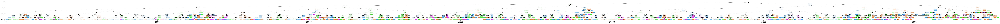

# Decision Tree Classification

Configure the project. Indeed you create a dataset in csv format.


```python
! rm -rf *.csv
! unzip ./dataset/archive.zip
! mv *.csv data.csv

```

    Archive:  ./dataset/archive.zip
      inflating: Factors_ affecting_ university_student_grades_dataset.csv  


Import needed libraries


```python
import matplotlib.pyplot as plt
import pandas as pd
import numpy as np
from sklearn.model_selection import train_test_split
from sklearn.preprocessing import LabelEncoder
from sklearn.tree import DecisionTreeClassifier, plot_tree
from sklearn import metrics


%matplotlib inline
```

Read data from data.csv using pandas and store in data frame structure. Also shuffle data to have uniform distribution. 


```python
df = pd.read_csv("data.csv")
df.head()
df = df.sample(frac=1.0, random_state=42).reset_index(drop=True)
df.head()
```


<div>
<style scoped>
    .dataframe tbody tr th:only-of-type {
        vertical-align: middle;
    }

    .dataframe tbody tr th {
        vertical-align: top;
    }

    .dataframe thead th {
        text-align: right;
    }
</style>
<table border="1" class="dataframe">
  <thead>
    <tr style="text-align: right;">
      <th></th>
      <th>Age</th>
      <th>Gender</th>
      <th>Parental_Education</th>
      <th>Family_Income</th>
      <th>Previous_Grades</th>
      <th>Attendance</th>
      <th>Class_Participation</th>
      <th>Study_Hours</th>
      <th>Major</th>
      <th>School_Type</th>
      <th>...</th>
      <th>Peer_Group</th>
      <th>Bullying</th>
      <th>Study_Space</th>
      <th>Learning_Style</th>
      <th>Tutoring</th>
      <th>Mentoring</th>
      <th>Lack_of_Interest</th>
      <th>Time_Wasted_on_Social_Media</th>
      <th>Sports_Participation</th>
      <th>Grades</th>
    </tr>
  </thead>
  <tbody>
    <tr>
      <th>0</th>
      <td>20.0</td>
      <td>M</td>
      <td>High School</td>
      <td>60000.0</td>
      <td>A</td>
      <td>NaN</td>
      <td>Medium</td>
      <td>6.0</td>
      <td>Business</td>
      <td>NaN</td>
      <td>...</td>
      <td>Negative</td>
      <td>Yes</td>
      <td>Yes</td>
      <td>NaN</td>
      <td>No</td>
      <td>No</td>
      <td>Medium</td>
      <td>1.0</td>
      <td>Low</td>
      <td>A</td>
    </tr>
    <tr>
      <th>1</th>
      <td>21.0</td>
      <td>M</td>
      <td>Some College</td>
      <td>NaN</td>
      <td>A</td>
      <td>NaN</td>
      <td>Low</td>
      <td>NaN</td>
      <td>Law</td>
      <td>Public</td>
      <td>...</td>
      <td>Negative</td>
      <td>No</td>
      <td>No</td>
      <td>Auditory</td>
      <td>No</td>
      <td>No</td>
      <td>High</td>
      <td>6.0</td>
      <td>Medium</td>
      <td>B</td>
    </tr>
    <tr>
      <th>2</th>
      <td>18.0</td>
      <td>M</td>
      <td>Some College</td>
      <td>50000.0</td>
      <td>A</td>
      <td>81.0</td>
      <td>Medium</td>
      <td>6.0</td>
      <td>Medicine</td>
      <td>Public</td>
      <td>...</td>
      <td>Positive</td>
      <td>Yes</td>
      <td>No</td>
      <td>Kinesthetic</td>
      <td>NaN</td>
      <td>Yes</td>
      <td>NaN</td>
      <td>4.0</td>
      <td>Low</td>
      <td>C</td>
    </tr>
    <tr>
      <th>3</th>
      <td>NaN</td>
      <td>F</td>
      <td>Graduate</td>
      <td>30000.0</td>
      <td>A</td>
      <td>90.0</td>
      <td>Low</td>
      <td>18.0</td>
      <td>Business</td>
      <td>NaN</td>
      <td>...</td>
      <td>Negative</td>
      <td>Yes</td>
      <td>No</td>
      <td>Visual</td>
      <td>Yes</td>
      <td>No</td>
      <td>High</td>
      <td>6.0</td>
      <td>High</td>
      <td>B</td>
    </tr>
    <tr>
      <th>4</th>
      <td>18.0</td>
      <td>F</td>
      <td>Graduate</td>
      <td>40000.0</td>
      <td>B</td>
      <td>75.0</td>
      <td>NaN</td>
      <td>8.0</td>
      <td>Medicine</td>
      <td>Public</td>
      <td>...</td>
      <td>Positive</td>
      <td>Yes</td>
      <td>Yes</td>
      <td>Auditory</td>
      <td>No</td>
      <td>Yes</td>
      <td>High</td>
      <td>6.0</td>
      <td>Low</td>
      <td>A</td>
    </tr>
  </tbody>
</table>
<p>5 rows × 35 columns</p>
</div>


## Preprocessing


```python
print(df.shape)
print(df.columns)
```

    (10064, 35)
    Index(['Age', 'Gender', 'Parental_Education', 'Family_Income',
           'Previous_Grades', 'Attendance', 'Class_Participation', 'Study_Hours',
           'Major', 'School_Type', 'Financial_Status', 'Parental_Involvement',
           'Educational_Resources', 'Motivation', 'Self_Esteem', 'Stress_Levels',
           'School_Environment', 'Professor_Quality', 'Class_Size',
           'Extracurricular_Activities', 'Sleep_Patterns', 'Nutrition',
           'Physical_Activity', 'Screen_Time', 'Educational_Tech_Use',
           'Peer_Group', 'Bullying', 'Study_Space', 'Learning_Style', 'Tutoring',
           'Mentoring', 'Lack_of_Interest', 'Time_Wasted_on_Social_Media',
           'Sports_Participation', 'Grades'],
          dtype='object')


```python
categorical_attr = ['Gender', 'Parental_Education', 'Previous_Grades', 'Class_Participation', 'Major', 'School_Type', 'Financial_Status', 'Parental_Involvement', 'Educational_Resources', 'Motivation', 'Self_Esteem', 'Stress_Levels', 'School_Environment', 'Professor_Quality', 'Class_Size', 'Extracurricular_Activities', 'Nutrition', 'Physical_Activity', 'Educational_Tech_Use', 'Peer_Group', 'Bullying', 'Study_Space', 'Learning_Style', 'Tutoring', 'Mentoring', 'Lack_of_Interest', 'Sports_Participation', 'Grades']

le = LabelEncoder()
df[categorical_attr] = df[categorical_attr].apply(le.fit_transform, axis=0)
df.head()
```


<div>
<style scoped>
    .dataframe tbody tr th:only-of-type {
        vertical-align: middle;
    }

    .dataframe tbody tr th {
        vertical-align: top;
    }

    .dataframe thead th {
        text-align: right;
    }
</style>
<table border="1" class="dataframe">
  <thead>
    <tr style="text-align: right;">
      <th></th>
      <th>Age</th>
      <th>Gender</th>
      <th>Parental_Education</th>
      <th>Family_Income</th>
      <th>Previous_Grades</th>
      <th>Attendance</th>
      <th>Class_Participation</th>
      <th>Study_Hours</th>
      <th>Major</th>
      <th>School_Type</th>
      <th>...</th>
      <th>Peer_Group</th>
      <th>Bullying</th>
      <th>Study_Space</th>
      <th>Learning_Style</th>
      <th>Tutoring</th>
      <th>Mentoring</th>
      <th>Lack_of_Interest</th>
      <th>Time_Wasted_on_Social_Media</th>
      <th>Sports_Participation</th>
      <th>Grades</th>
    </tr>
  </thead>
  <tbody>
    <tr>
      <th>0</th>
      <td>20.0</td>
      <td>1</td>
      <td>2</td>
      <td>60000.0</td>
      <td>0</td>
      <td>NaN</td>
      <td>2</td>
      <td>6.0</td>
      <td>1</td>
      <td>2</td>
      <td>...</td>
      <td>0</td>
      <td>1</td>
      <td>1</td>
      <td>3</td>
      <td>0</td>
      <td>0</td>
      <td>2</td>
      <td>1.0</td>
      <td>1</td>
      <td>0</td>
    </tr>
    <tr>
      <th>1</th>
      <td>21.0</td>
      <td>1</td>
      <td>3</td>
      <td>NaN</td>
      <td>0</td>
      <td>NaN</td>
      <td>1</td>
      <td>NaN</td>
      <td>3</td>
      <td>1</td>
      <td>...</td>
      <td>0</td>
      <td>0</td>
      <td>0</td>
      <td>0</td>
      <td>0</td>
      <td>0</td>
      <td>0</td>
      <td>6.0</td>
      <td>2</td>
      <td>1</td>
    </tr>
    <tr>
      <th>2</th>
      <td>18.0</td>
      <td>1</td>
      <td>3</td>
      <td>50000.0</td>
      <td>0</td>
      <td>81.0</td>
      <td>2</td>
      <td>6.0</td>
      <td>4</td>
      <td>1</td>
      <td>...</td>
      <td>2</td>
      <td>1</td>
      <td>0</td>
      <td>1</td>
      <td>2</td>
      <td>1</td>
      <td>3</td>
      <td>4.0</td>
      <td>1</td>
      <td>2</td>
    </tr>
    <tr>
      <th>3</th>
      <td>NaN</td>
      <td>0</td>
      <td>1</td>
      <td>30000.0</td>
      <td>0</td>
      <td>90.0</td>
      <td>1</td>
      <td>18.0</td>
      <td>1</td>
      <td>2</td>
      <td>...</td>
      <td>0</td>
      <td>1</td>
      <td>0</td>
      <td>2</td>
      <td>1</td>
      <td>0</td>
      <td>0</td>
      <td>6.0</td>
      <td>0</td>
      <td>1</td>
    </tr>
    <tr>
      <th>4</th>
      <td>18.0</td>
      <td>0</td>
      <td>1</td>
      <td>40000.0</td>
      <td>1</td>
      <td>75.0</td>
      <td>3</td>
      <td>8.0</td>
      <td>4</td>
      <td>1</td>
      <td>...</td>
      <td>2</td>
      <td>1</td>
      <td>1</td>
      <td>0</td>
      <td>0</td>
      <td>1</td>
      <td>0</td>
      <td>6.0</td>
      <td>1</td>
      <td>0</td>
    </tr>
  </tbody>
</table>
<p>5 rows × 35 columns</p>
</div>


```python
for column, dtype in df.dtypes.items():
    if dtype not in ['int64', 'float64']:
        print(f"Column: {column}, Type: {dtype}")
```

    Column: Family_Income, Type: object


```python
df['Family_Income'] = pd.to_numeric(df['Family_Income'], errors='coerce')

# Now convert the column to float
df['Family_Income'] = df['Family_Income'].astype(float)
```


```python
df.fillna(df.mean(numeric_only=True), inplace=True)
df.head()
```


<div>
<style scoped>
    .dataframe tbody tr th:only-of-type {
        vertical-align: middle;
    }

    .dataframe tbody tr th {
        vertical-align: top;
    }

    .dataframe thead th {
        text-align: right;
    }
</style>
<table border="1" class="dataframe">
  <thead>
    <tr style="text-align: right;">
      <th></th>
      <th>Age</th>
      <th>Gender</th>
      <th>Parental_Education</th>
      <th>Family_Income</th>
      <th>Previous_Grades</th>
      <th>Attendance</th>
      <th>Class_Participation</th>
      <th>Study_Hours</th>
      <th>Major</th>
      <th>School_Type</th>
      <th>...</th>
      <th>Peer_Group</th>
      <th>Bullying</th>
      <th>Study_Space</th>
      <th>Learning_Style</th>
      <th>Tutoring</th>
      <th>Mentoring</th>
      <th>Lack_of_Interest</th>
      <th>Time_Wasted_on_Social_Media</th>
      <th>Sports_Participation</th>
      <th>Grades</th>
    </tr>
  </thead>
  <tbody>
    <tr>
      <th>0</th>
      <td>20.000000</td>
      <td>1</td>
      <td>2</td>
      <td>60000.000000</td>
      <td>0</td>
      <td>84.908499</td>
      <td>2</td>
      <td>6.000000</td>
      <td>1</td>
      <td>2</td>
      <td>...</td>
      <td>0</td>
      <td>1</td>
      <td>1</td>
      <td>3</td>
      <td>0</td>
      <td>0</td>
      <td>2</td>
      <td>1.0</td>
      <td>1</td>
      <td>0</td>
    </tr>
    <tr>
      <th>1</th>
      <td>21.000000</td>
      <td>1</td>
      <td>3</td>
      <td>50953.166227</td>
      <td>0</td>
      <td>84.908499</td>
      <td>1</td>
      <td>12.467761</td>
      <td>3</td>
      <td>1</td>
      <td>...</td>
      <td>0</td>
      <td>0</td>
      <td>0</td>
      <td>0</td>
      <td>0</td>
      <td>0</td>
      <td>0</td>
      <td>6.0</td>
      <td>2</td>
      <td>1</td>
    </tr>
    <tr>
      <th>2</th>
      <td>18.000000</td>
      <td>1</td>
      <td>3</td>
      <td>50000.000000</td>
      <td>0</td>
      <td>81.000000</td>
      <td>2</td>
      <td>6.000000</td>
      <td>4</td>
      <td>1</td>
      <td>...</td>
      <td>2</td>
      <td>1</td>
      <td>0</td>
      <td>1</td>
      <td>2</td>
      <td>1</td>
      <td>3</td>
      <td>4.0</td>
      <td>1</td>
      <td>2</td>
    </tr>
    <tr>
      <th>3</th>
      <td>19.996703</td>
      <td>0</td>
      <td>1</td>
      <td>30000.000000</td>
      <td>0</td>
      <td>90.000000</td>
      <td>1</td>
      <td>18.000000</td>
      <td>1</td>
      <td>2</td>
      <td>...</td>
      <td>0</td>
      <td>1</td>
      <td>0</td>
      <td>2</td>
      <td>1</td>
      <td>0</td>
      <td>0</td>
      <td>6.0</td>
      <td>0</td>
      <td>1</td>
    </tr>
    <tr>
      <th>4</th>
      <td>18.000000</td>
      <td>0</td>
      <td>1</td>
      <td>40000.000000</td>
      <td>1</td>
      <td>75.000000</td>
      <td>3</td>
      <td>8.000000</td>
      <td>4</td>
      <td>1</td>
      <td>...</td>
      <td>2</td>
      <td>1</td>
      <td>1</td>
      <td>0</td>
      <td>0</td>
      <td>1</td>
      <td>0</td>
      <td>6.0</td>
      <td>1</td>
      <td>0</td>
    </tr>
  </tbody>
</table>
<p>5 rows × 35 columns</p>
</div>


```python
# summarize data
df.describe() 
```


<div>
<style scoped>
    .dataframe tbody tr th:only-of-type {
        vertical-align: middle;
    }

    .dataframe tbody tr th {
        vertical-align: top;
    }

    .dataframe thead th {
        text-align: right;
    }
</style>
<table border="1" class="dataframe">
  <thead>
    <tr style="text-align: right;">
      <th></th>
      <th>Age</th>
      <th>Gender</th>
      <th>Parental_Education</th>
      <th>Family_Income</th>
      <th>Previous_Grades</th>
      <th>Attendance</th>
      <th>Class_Participation</th>
      <th>Study_Hours</th>
      <th>Major</th>
      <th>School_Type</th>
      <th>...</th>
      <th>Peer_Group</th>
      <th>Bullying</th>
      <th>Study_Space</th>
      <th>Learning_Style</th>
      <th>Tutoring</th>
      <th>Mentoring</th>
      <th>Lack_of_Interest</th>
      <th>Time_Wasted_on_Social_Media</th>
      <th>Sports_Participation</th>
      <th>Grades</th>
    </tr>
  </thead>
  <tbody>
    <tr>
      <th>count</th>
      <td>10064.000000</td>
      <td>10064.000000</td>
      <td>10064.000000</td>
      <td>10064.000000</td>
      <td>10064.000000</td>
      <td>10064.000000</td>
      <td>10064.000000</td>
      <td>10064.000000</td>
      <td>10064.000000</td>
      <td>10064.000000</td>
      <td>...</td>
      <td>10064.000000</td>
      <td>10064.000000</td>
      <td>10064.000000</td>
      <td>10064.000000</td>
      <td>10064.000000</td>
      <td>10064.000000</td>
      <td>10064.00000</td>
      <td>10064.000000</td>
      <td>10064.000000</td>
      <td>10064.000000</td>
    </tr>
    <tr>
      <th>mean</th>
      <td>19.996703</td>
      <td>0.644475</td>
      <td>1.746423</td>
      <td>50953.166227</td>
      <td>1.193661</td>
      <td>84.908499</td>
      <td>1.194157</td>
      <td>12.467761</td>
      <td>2.812997</td>
      <td>0.643680</td>
      <td>...</td>
      <td>1.180644</td>
      <td>0.655604</td>
      <td>0.651630</td>
      <td>1.207969</td>
      <td>0.640898</td>
      <td>0.643979</td>
      <td>1.18124</td>
      <td>3.489329</td>
      <td>1.193661</td>
      <td>1.210056</td>
    </tr>
    <tr>
      <th>std</th>
      <td>1.337728</td>
      <td>0.650941</td>
      <td>1.293809</td>
      <td>14846.212370</td>
      <td>0.973236</td>
      <td>8.525212</td>
      <td>0.974515</td>
      <td>4.380774</td>
      <td>1.916058</td>
      <td>0.646522</td>
      <td>...</td>
      <td>0.974972</td>
      <td>0.647757</td>
      <td>0.653583</td>
      <td>0.978946</td>
      <td>0.644364</td>
      <td>0.645994</td>
      <td>0.97231</td>
      <td>1.623672</td>
      <td>0.970373</td>
      <td>0.981896</td>
    </tr>
    <tr>
      <th>min</th>
      <td>18.000000</td>
      <td>0.000000</td>
      <td>0.000000</td>
      <td>30000.000000</td>
      <td>0.000000</td>
      <td>70.000000</td>
      <td>0.000000</td>
      <td>5.000000</td>
      <td>0.000000</td>
      <td>0.000000</td>
      <td>...</td>
      <td>0.000000</td>
      <td>0.000000</td>
      <td>0.000000</td>
      <td>0.000000</td>
      <td>0.000000</td>
      <td>0.000000</td>
      <td>0.00000</td>
      <td>1.000000</td>
      <td>0.000000</td>
      <td>0.000000</td>
    </tr>
    <tr>
      <th>25%</th>
      <td>19.000000</td>
      <td>0.000000</td>
      <td>1.000000</td>
      <td>40000.000000</td>
      <td>0.000000</td>
      <td>78.000000</td>
      <td>0.000000</td>
      <td>9.000000</td>
      <td>1.000000</td>
      <td>0.000000</td>
      <td>...</td>
      <td>0.000000</td>
      <td>0.000000</td>
      <td>0.000000</td>
      <td>0.000000</td>
      <td>0.000000</td>
      <td>0.000000</td>
      <td>0.00000</td>
      <td>2.000000</td>
      <td>0.000000</td>
      <td>0.000000</td>
    </tr>
    <tr>
      <th>50%</th>
      <td>20.000000</td>
      <td>1.000000</td>
      <td>2.000000</td>
      <td>50000.000000</td>
      <td>1.000000</td>
      <td>84.908499</td>
      <td>1.000000</td>
      <td>12.467761</td>
      <td>3.000000</td>
      <td>1.000000</td>
      <td>...</td>
      <td>1.000000</td>
      <td>1.000000</td>
      <td>1.000000</td>
      <td>1.000000</td>
      <td>1.000000</td>
      <td>1.000000</td>
      <td>1.00000</td>
      <td>3.489329</td>
      <td>1.000000</td>
      <td>1.000000</td>
    </tr>
    <tr>
      <th>75%</th>
      <td>21.000000</td>
      <td>1.000000</td>
      <td>3.000000</td>
      <td>60000.000000</td>
      <td>2.000000</td>
      <td>92.000000</td>
      <td>2.000000</td>
      <td>16.000000</td>
      <td>4.000000</td>
      <td>1.000000</td>
      <td>...</td>
      <td>2.000000</td>
      <td>1.000000</td>
      <td>1.000000</td>
      <td>2.000000</td>
      <td>1.000000</td>
      <td>1.000000</td>
      <td>2.00000</td>
      <td>5.000000</td>
      <td>2.000000</td>
      <td>2.000000</td>
    </tr>
    <tr>
      <th>max</th>
      <td>22.000000</td>
      <td>2.000000</td>
      <td>4.000000</td>
      <td>75000.000000</td>
      <td>3.000000</td>
      <td>100.000000</td>
      <td>3.000000</td>
      <td>20.000000</td>
      <td>6.000000</td>
      <td>2.000000</td>
      <td>...</td>
      <td>3.000000</td>
      <td>2.000000</td>
      <td>2.000000</td>
      <td>3.000000</td>
      <td>2.000000</td>
      <td>2.000000</td>
      <td>3.00000</td>
      <td>6.000000</td>
      <td>3.000000</td>
      <td>3.000000</td>
    </tr>
  </tbody>
</table>
<p>8 rows × 35 columns</p>
</div>


Print the histogram chart of data


```python
print(df.columns)
```

    Index(['Age', 'Gender', 'Parental_Education', 'Family_Income',
           'Previous_Grades', 'Attendance', 'Class_Participation', 'Study_Hours',
           'Major', 'School_Type', 'Financial_Status', 'Parental_Involvement',
           'Educational_Resources', 'Motivation', 'Self_Esteem', 'Stress_Levels',
           'School_Environment', 'Professor_Quality', 'Class_Size',
           'Extracurricular_Activities', 'Sleep_Patterns', 'Nutrition',
           'Physical_Activity', 'Screen_Time', 'Educational_Tech_Use',
           'Peer_Group', 'Bullying', 'Study_Space', 'Learning_Style', 'Tutoring',
           'Mentoring', 'Lack_of_Interest', 'Time_Wasted_on_Social_Media',
           'Sports_Participation', 'Grades'],
          dtype='object')


```python
viz = df[['Age', 'Gender', 'Parental_Education', 'Family_Income', 'Previous_Grades', 'Attendance', 'Class_Participation', 'Study_Hours', 'Major', 'School_Type', 'Financial_Status', 'Parental_Involvement', 'Educational_Resources', 'Motivation', 'Self_Esteem', 'Stress_Levels', 'School_Environment', 'Professor_Quality', 'Class_Size', 'Extracurricular_Activities', 'Sleep_Patterns', 'Nutrition', 'Physical_Activity', 'Screen_Time', 'Educational_Tech_Use', 'Peer_Group', 'Bullying', 'Study_Space', 'Learning_Style', 'Tutoring', 'Mentoring', 'Lack_of_Interest', 'Time_Wasted_on_Social_Media', 'Sports_Participation', 'Grades']]
fig, axes = plt.subplots(nrows=5, ncols=7, figsize=(20, 10))

axes = axes.flatten()

for i, column in enumerate(viz.columns):
    viz[column].hist(ax=axes[i])
    axes[i].set_title(column)

plt.tight_layout()
plt.show()
```


    

    


```python
# print(df)
train, test = train_test_split(df, test_size=0.20, random_state=42)
# test, evaluate = train_test_split(test, test_size=0.5, random_state=42)
```

## Fit model based on data. 


```python
train_x = np.asanyarray(train[['Age', 'Gender', 'Parental_Education', 'Family_Income', 'Previous_Grades', 'Attendance', 'Class_Participation', 'Study_Hours', 'Major', 'School_Type', 'Financial_Status', 'Parental_Involvement', 'Educational_Resources', 'Motivation', 'Self_Esteem', 'Stress_Levels', 'School_Environment', 'Professor_Quality', 'Class_Size', 'Extracurricular_Activities', 'Sleep_Patterns', 'Nutrition', 'Physical_Activity', 'Screen_Time', 'Educational_Tech_Use', 'Peer_Group', 'Bullying', 'Study_Space', 'Learning_Style', 'Tutoring', 'Mentoring', 'Lack_of_Interest', 'Time_Wasted_on_Social_Media', 'Sports_Participation']])
train_y = np.asanyarray(train[['Grades']])
GradeTree = DecisionTreeClassifier(criterion="entropy" , max_depth = 10)
```


```python
test_x = np.asanyarray(test[['Age', 'Gender', 'Parental_Education', 'Family_Income', 'Previous_Grades', 'Attendance', 'Class_Participation', 'Study_Hours', 'Major', 'School_Type', 'Financial_Status', 'Parental_Involvement', 'Educational_Resources', 'Motivation', 'Self_Esteem', 'Stress_Levels', 'School_Environment', 'Professor_Quality', 'Class_Size', 'Extracurricular_Activities', 'Sleep_Patterns', 'Nutrition', 'Physical_Activity', 'Screen_Time', 'Educational_Tech_Use', 'Peer_Group', 'Bullying', 'Study_Space', 'Learning_Style', 'Tutoring', 'Mentoring', 'Lack_of_Interest', 'Time_Wasted_on_Social_Media', 'Sports_Participation']])
test_y = np.asanyarray(test[['Grades']])
```


```python
from sklearn.preprocessing import StandardScaler
scaler = StandardScaler()
train_x = scaler.fit_transform(train_x)
test_x = scaler.transform(test_x)
```


```python
GradeTree.fit(train_x, train_y)
PredTree = GradeTree.predict(test_x)
```


```python
print(test_y[0:10])
print(PredTree[0:10])
```

    [[0]
     [3]
     [3]
     [1]
     [0]
     [0]
     [1]
     [1]
     [2]
     [2]]
    [1 1 1 0 2 3 2 2 1 0]


```python
train_x_df = pd.DataFrame(train_x)
plt.figure(figsize=(20,10))
plot_tree(GradeTree, filled=True, feature_names=train_x_df.columns, class_names=True, rounded=True, fontsize=8)
plt.show()
```


    

    


```python
from  io import StringIO
import pydotplus
import matplotlib.image as mpimg
from sklearn import tree
%matplotlib inline 


class_names = list(map(str, np.unique(train_y)))

dot_data = StringIO()
filename = "Gradetree.png"
featureNames = df.columns[0:34]
out = tree.export_graphviz(GradeTree, feature_names=featureNames, out_file=dot_data, class_names=class_names, filled=True, special_characters=True, rotate=False)  
graph = pydotplus.graph_from_dot_data(dot_data.getvalue())  
graph.write_png(filename)
img = mpimg.imread(filename)
plt.figure(figsize=(100, 200))
plt.imshow(img, interpolation='nearest')
```

    dot: graph is too large for cairo-renderer bitmaps. Scaling by 0.362519 to fit
    


    <matplotlib.image.AxesImage at 0x7f3c9ead3110>


    

    


## Evaluation


```python
print("Accuracy: " , metrics.accuracy_score(PredTree, test_y))
```

    Accuracy:  0.2886239443616493


<hr>
<hr>
<hr>
<hr>


```python
from sklearn.model_selection import GridSearchCV

parameters = {'criterion': ['gini', 'entropy'], 'max_depth': [5, 10, 15, 20, 25, 30, 35], 'min_samples_split': [2, 4, 6, 8, 10, 12, 14, 20, 30, 40, 50]}
GradeTree = GridSearchCV(DecisionTreeClassifier(), parameters, cv=5)
GradeTree.fit(train_x, train_y)

print(GradeTree.best_params_)

GradeTree = GradeTree.best_estimator_

```

    {'criterion': 'gini', 'max_depth': 5, 'min_samples_split': 50}


```python
GradeTree.fit(train_x, train_y)
PredTree = GradeTree.predict(test_x)
```


```python
print("Accuracy: " , metrics.accuracy_score(PredTree, test_y))
```

    Accuracy:  0.3035270740188773


<font size="5" color="red">

** It can be usual for decision trees to have lower accuracy compared to other models. This is because: **

1. Overfitting: Decision trees tend to overfit the training data, especially if they're deep.
2. Bias-Variance Tradeoff: They often have high variance and lower bias.
3. Data Sensitivity: Small changes in data can significantly affect the structure of the tree.

</font>

<hr>
<hr>
<hr>
<hr>


<font size="5" color="red">

Let's try it one more time, although I don't expect we will get remarkably good results.

</font>


```python
from sklearn.model_selection import train_test_split, GridSearchCV
from sklearn.tree import DecisionTreeClassifier
from sklearn import metrics

df = pd.read_csv("data.csv")
df = df.sample(frac=1.0, random_state=42).reset_index(drop=True)

df = df.dropna()

categorical_attr = ['Gender', 'Parental_Education', 'Previous_Grades', 'Class_Participation', 'Major', 'School_Type', 'Financial_Status', 'Parental_Involvement', 'Educational_Resources', 'Motivation', 'Self_Esteem', 'Stress_Levels', 'School_Environment', 'Professor_Quality', 'Class_Size', 'Extracurricular_Activities', 'Nutrition', 'Physical_Activity', 'Educational_Tech_Use', 'Peer_Group', 'Bullying', 'Study_Space', 'Learning_Style', 'Tutoring', 'Mentoring', 'Lack_of_Interest', 'Sports_Participation', 'Grades']

le = LabelEncoder()
df[categorical_attr] = df[categorical_attr].apply(le.fit_transform, axis=0)

# Separate features and target
X = df.drop('Grades', axis=1)
y = df['Grades']


X = preprocessor.fit_transform(X)
X_train, X_test, y_train, y_test = train_test_split(X, y, test_size=0.3, random_state=42)
model = DecisionTreeClassifier(random_state=42)

# Hyperparameter tuning
param_grid = {
    'criterion': ['gini', 'entropy'], 
    'max_depth': [None, 10, 20, 30, 40, 50],
    'min_samples_split': [2, 10, 20, 30],
    'min_samples_leaf': [1, 5, 10, 20]
}

grid_search = GridSearchCV(model, param_grid, cv=5, scoring='accuracy')
grid_search.fit(X_train, y_train)

best_model = grid_search.best_estimator_
y_pred = best_model.predict(X_test)
print("Accuracy:", metrics.accuracy_score(y_test, y_pred))

from sklearn.model_selection import cross_val_score

# Evaluate the model with cross-validation
cv_scores = cross_val_score(best_model, X, y, cv=5, scoring='accuracy')
print("Cross-Validation Accuracy Scores:", cv_scores)
print("Mean Cross-Validation Accuracy:", cv_scores.mean())

```

    Accuracy: 0.4111111111111111
    Cross-Validation Accuracy Scores: [0.31666667 0.25       0.36666667 0.28813559 0.40677966]
    Mean Cross-Validation Accuracy: 0.3256497175141243


<font size="5" color="Yellow">

OK! So for this dataset Decision Tree is not good choice... Try it with other methods (Neural network recommended)

</font>
