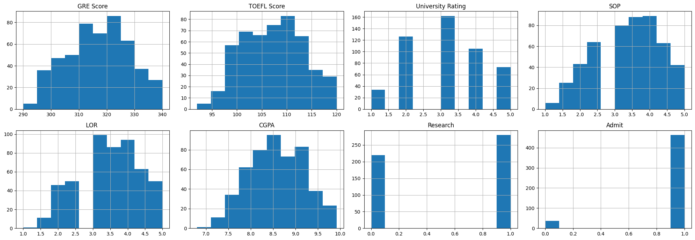
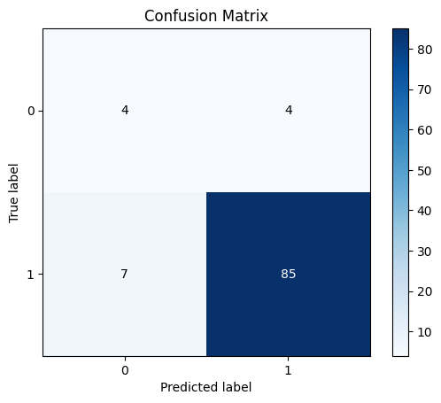

# Random Forest Classification

Configure the project. Indeed you create a dataset in csv format.


```python
! rm -rf *.csv
! unzip ./dataset/archive.zip
! rm play.csv
! mv Graduate.csv data.csv
```

    Archive:  ./dataset/archive.zip
      inflating: Graduate.csv            
      inflating: play.csv                


Import needed libraries


```python
import pandas as pd
import numpy as np
from sklearn.model_selection import train_test_split
from sklearn.preprocessing import StandardScaler
from imblearn.over_sampling import SMOTE
from sklearn.ensemble import RandomForestClassifier
from sklearn.metrics import classification_report, confusion_matrix, accuracy_score, precision_score, recall_score, jaccard_score
import scikitplot as skplt
import matplotlib.pyplot as plt
from sklearn.preprocessing import LabelEncoder

%matplotlib inline
```

Read data from data.csv using pandas and store in data frame structure. Also shuffle data to have uniform distribution. 


```python
df = pd.read_csv("data.csv")
df.head()
df = df.sample(frac=1.0, random_state=42).reset_index(drop=True)
df.head()
```


<div>
<style scoped>
    .dataframe tbody tr th:only-of-type {
        vertical-align: middle;
    }

    .dataframe tbody tr th {
        vertical-align: top;
    }

    .dataframe thead th {
        text-align: right;
    }
</style>
<table border="1" class="dataframe">
  <thead>
    <tr style="text-align: right;">
      <th></th>
      <th>Serial No.</th>
      <th>GRE Score</th>
      <th>TOEFL Score</th>
      <th>University Rating</th>
      <th>SOP</th>
      <th>LOR</th>
      <th>CGPA</th>
      <th>Research</th>
      <th>Admit</th>
    </tr>
  </thead>
  <tbody>
    <tr>
      <th>0</th>
      <td>362</td>
      <td>334</td>
      <td>116</td>
      <td>4</td>
      <td>4.0</td>
      <td>3.5</td>
      <td>9.54</td>
      <td>1</td>
      <td>1</td>
    </tr>
    <tr>
      <th>1</th>
      <td>74</td>
      <td>314</td>
      <td>108</td>
      <td>4</td>
      <td>4.5</td>
      <td>4.0</td>
      <td>9.04</td>
      <td>1</td>
      <td>1</td>
    </tr>
    <tr>
      <th>2</th>
      <td>375</td>
      <td>315</td>
      <td>105</td>
      <td>2</td>
      <td>2.0</td>
      <td>2.5</td>
      <td>7.65</td>
      <td>0</td>
      <td>0</td>
    </tr>
    <tr>
      <th>3</th>
      <td>156</td>
      <td>312</td>
      <td>109</td>
      <td>3</td>
      <td>3.0</td>
      <td>3.0</td>
      <td>8.69</td>
      <td>0</td>
      <td>1</td>
    </tr>
    <tr>
      <th>4</th>
      <td>105</td>
      <td>326</td>
      <td>112</td>
      <td>3</td>
      <td>3.5</td>
      <td>3.0</td>
      <td>9.05</td>
      <td>1</td>
      <td>1</td>
    </tr>
  </tbody>
</table>
</div>


## Preprocessing


```python
print(df.shape)
print(df.columns)
print(df.dtypes)
```

    (500, 9)
    Index(['Serial No.', 'GRE Score', 'TOEFL Score', 'University Rating', 'SOP',
           'LOR ', 'CGPA', 'Research', 'Admit'],
          dtype='object')
    Serial No.             int64
    GRE Score              int64
    TOEFL Score            int64
    University Rating      int64
    SOP                  float64
    LOR                  float64
    CGPA                 float64
    Research               int64
    Admit                  int64
    dtype: object


```python
df['Admit'].value_counts()
```


    Admit
    1    463
    0     37
    Name: count, dtype: int64


```python
df = df.drop('Serial No.', axis=1)
categorical_attr = ['Admit']

le = LabelEncoder()
df[categorical_attr] = df[categorical_attr].apply(le.fit_transform, axis=0)
df.head()
```


<div>
<style scoped>
    .dataframe tbody tr th:only-of-type {
        vertical-align: middle;
    }

    .dataframe tbody tr th {
        vertical-align: top;
    }

    .dataframe thead th {
        text-align: right;
    }
</style>
<table border="1" class="dataframe">
  <thead>
    <tr style="text-align: right;">
      <th></th>
      <th>GRE Score</th>
      <th>TOEFL Score</th>
      <th>University Rating</th>
      <th>SOP</th>
      <th>LOR</th>
      <th>CGPA</th>
      <th>Research</th>
      <th>Admit</th>
    </tr>
  </thead>
  <tbody>
    <tr>
      <th>0</th>
      <td>334</td>
      <td>116</td>
      <td>4</td>
      <td>4.0</td>
      <td>3.5</td>
      <td>9.54</td>
      <td>1</td>
      <td>1</td>
    </tr>
    <tr>
      <th>1</th>
      <td>314</td>
      <td>108</td>
      <td>4</td>
      <td>4.5</td>
      <td>4.0</td>
      <td>9.04</td>
      <td>1</td>
      <td>1</td>
    </tr>
    <tr>
      <th>2</th>
      <td>315</td>
      <td>105</td>
      <td>2</td>
      <td>2.0</td>
      <td>2.5</td>
      <td>7.65</td>
      <td>0</td>
      <td>0</td>
    </tr>
    <tr>
      <th>3</th>
      <td>312</td>
      <td>109</td>
      <td>3</td>
      <td>3.0</td>
      <td>3.0</td>
      <td>8.69</td>
      <td>0</td>
      <td>1</td>
    </tr>
    <tr>
      <th>4</th>
      <td>326</td>
      <td>112</td>
      <td>3</td>
      <td>3.5</td>
      <td>3.0</td>
      <td>9.05</td>
      <td>1</td>
      <td>1</td>
    </tr>
  </tbody>
</table>
</div>


```python
# summarize data
df.describe() 
```


<div>
<style scoped>
    .dataframe tbody tr th:only-of-type {
        vertical-align: middle;
    }

    .dataframe tbody tr th {
        vertical-align: top;
    }

    .dataframe thead th {
        text-align: right;
    }
</style>
<table border="1" class="dataframe">
  <thead>
    <tr style="text-align: right;">
      <th></th>
      <th>GRE Score</th>
      <th>TOEFL Score</th>
      <th>University Rating</th>
      <th>SOP</th>
      <th>LOR</th>
      <th>CGPA</th>
      <th>Research</th>
      <th>Admit</th>
    </tr>
  </thead>
  <tbody>
    <tr>
      <th>count</th>
      <td>500.000000</td>
      <td>500.000000</td>
      <td>500.000000</td>
      <td>500.000000</td>
      <td>500.00000</td>
      <td>500.000000</td>
      <td>500.000000</td>
      <td>500.000000</td>
    </tr>
    <tr>
      <th>mean</th>
      <td>316.472000</td>
      <td>107.192000</td>
      <td>3.114000</td>
      <td>3.374000</td>
      <td>3.48400</td>
      <td>8.576440</td>
      <td>0.560000</td>
      <td>0.926000</td>
    </tr>
    <tr>
      <th>std</th>
      <td>11.295148</td>
      <td>6.081868</td>
      <td>1.143512</td>
      <td>0.991004</td>
      <td>0.92545</td>
      <td>0.604813</td>
      <td>0.496884</td>
      <td>0.262033</td>
    </tr>
    <tr>
      <th>min</th>
      <td>290.000000</td>
      <td>92.000000</td>
      <td>1.000000</td>
      <td>1.000000</td>
      <td>1.00000</td>
      <td>6.800000</td>
      <td>0.000000</td>
      <td>0.000000</td>
    </tr>
    <tr>
      <th>25%</th>
      <td>308.000000</td>
      <td>103.000000</td>
      <td>2.000000</td>
      <td>2.500000</td>
      <td>3.00000</td>
      <td>8.127500</td>
      <td>0.000000</td>
      <td>1.000000</td>
    </tr>
    <tr>
      <th>50%</th>
      <td>317.000000</td>
      <td>107.000000</td>
      <td>3.000000</td>
      <td>3.500000</td>
      <td>3.50000</td>
      <td>8.560000</td>
      <td>1.000000</td>
      <td>1.000000</td>
    </tr>
    <tr>
      <th>75%</th>
      <td>325.000000</td>
      <td>112.000000</td>
      <td>4.000000</td>
      <td>4.000000</td>
      <td>4.00000</td>
      <td>9.040000</td>
      <td>1.000000</td>
      <td>1.000000</td>
    </tr>
    <tr>
      <th>max</th>
      <td>340.000000</td>
      <td>120.000000</td>
      <td>5.000000</td>
      <td>5.000000</td>
      <td>5.00000</td>
      <td>9.920000</td>
      <td>1.000000</td>
      <td>1.000000</td>
    </tr>
  </tbody>
</table>
</div>


Print the histogram chart of data


```python
print(df.columns)
```

    Index(['GRE Score', 'TOEFL Score', 'University Rating', 'SOP', 'LOR ', 'CGPA',
           'Research', 'Admit'],
          dtype='object')


```python
viz = df[['GRE Score', 'TOEFL Score', 'University Rating', 'SOP', 'LOR ', 'CGPA', 'Research', 'Admit']]
fig, axes = plt.subplots(nrows=2, ncols=4, figsize=(20, 7))

axes = axes.flatten()

for i, column in enumerate(viz.columns):
    viz[column].hist(ax=axes[i])
    axes[i].set_title(column)

plt.tight_layout()
plt.show()
```


    

    


```python
# print(df)
train, test = train_test_split(df, test_size=0.20, random_state=42)
# test, evaluate = train_test_split(test, test_size=0.5, random_state=42)
```

## Fit model based on data. 


```python
train_x = np.asanyarray(train[['GRE Score', 'TOEFL Score', 'University Rating', 'SOP', 'LOR ', 'CGPA', 'Research']])
train_y = np.asanyarray(train[['Admit']])
```


```python
test_x = np.asanyarray(test[['GRE Score', 'TOEFL Score', 'University Rating', 'SOP', 'LOR ', 'CGPA', 'Research']])
test_y = np.asanyarray(test[['Admit']])
```


```python
# Scale features
scaler = StandardScaler()
train_x = scaler.fit_transform(train_x)
test_x = scaler.transform(test_x)

# Handle class imbalance with SMOTE
smote = SMOTE(random_state=42)
train_x_resampled, train_y_resampled = smote.fit_resample(train_x, train_y)
```


```python
model = RandomForestClassifier(random_state=42)
model.fit(train_x_resampled, train_y_resampled.ravel())
test_y_ = model.predict(test_x)

```

## Evaluation


```python
print("The jaccard score for 0's:")
print(jaccard_score(test_y, test_y_, pos_label=0))
print("\nThe jaccard score for 1's:")
print(jaccard_score(test_y, test_y_, pos_label=1))
```

    The jaccard score for 0's:
    0.26666666666666666
    
    The jaccard score for 1's:
    0.8854166666666666


```python
accuracy = accuracy_score(test_y, test_y_)
precision = precision_score(test_y, test_y_)
recall = recall_score(test_y, test_y_)

print(f"\nAccuracy: {accuracy:.2f}")
print(f"Precision: {precision:.2f}")
print(f"Recall: {recall:.2f}")

# Classification report and confusion matrix
print("\nNaive Bayes Classification Report:")
print(classification_report(test_y, test_y_))

print("\nNaive Bayes Confusion Matrix:")
print(confusion_matrix(test_y, test_y_))

# Plot Confusion Matrix
skplt.metrics.plot_confusion_matrix(test_y, test_y_)
```

    
    Accuracy: 0.89
    Precision: 0.96
    Recall: 0.92
    
    Naive Bayes Classification Report:
                  precision    recall  f1-score   support
    
               0       0.36      0.50      0.42         8
               1       0.96      0.92      0.94        92
    
        accuracy                           0.89       100
       macro avg       0.66      0.71      0.68       100
    weighted avg       0.91      0.89      0.90       100
    
    
    Naive Bayes Confusion Matrix:
    [[ 4  4]
     [ 7 85]]


    <Axes: title={'center': 'Confusion Matrix'}, xlabel='Predicted label', ylabel='True label'>


    

    

