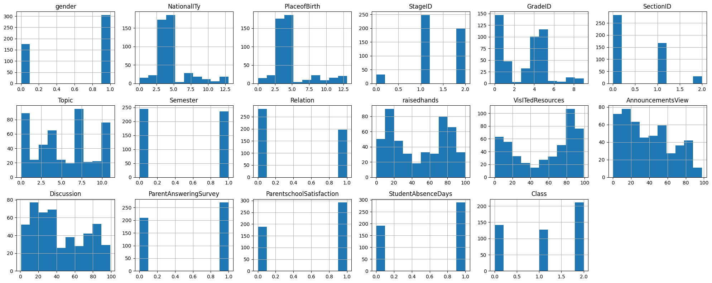

# DBSCAN Regression

Configure the project. Indeed you create a dataset in csv format.


```python
! rm -rf *.csv
! unzip ./dataset/archive.zip
! mv dataset.csv data.csv

```

    Archive:  ./dataset/archive.zip
      inflating: dataset.csv             


Import needed libraries


```python
import matplotlib.pyplot as plt
import pandas as pd
import numpy as np
from sklearn.datasets import make_moons, make_circles, make_blobs
from sklearn.preprocessing import LabelEncoder
from sklearn.preprocessing import StandardScaler
from sklearn.cluster import DBSCAN

%matplotlib inline
```

# Make Sample to practice on DBSCAN


```python
datasets = [StandardScaler().fit_transform(data[0]) for data in [
    make_moons(n_samples=1500, noise=0.05),
    make_circles(n_samples=1500, factor=0.5, noise=0.05),
    make_blobs(n_samples=1500, centers=3, cluster_std=[1.0, 2.5, 0.5], random_state=42)
]]
```


```python
titles = ['Moons', 'Circles', 'Blobs']
plt.figure(figsize=(10, 3))

for i, (X, title) in enumerate(zip(datasets, titles), 1):
    plt.subplot(1, 3, i)
    plt.scatter(X[:, 0], X[:, 1], marker='.')
    plt.title(title)

plt.show()
```


    

    


```python
eps = 0.15
min_samples = 10

fig, axes = plt.subplots(1, 3, figsize=(10, 3))

for i, dataset in enumerate(datasets):
    model = DBSCAN(eps=eps, min_samples=min_samples).fit(dataset)
    
    axes[i].scatter(dataset[:, 0], dataset[:, 1], c=model.labels_, s=5)
    axes[i].set_title(f"Dataset {i+1}")

plt.show()
```


    

    


<font color="red" size=6>
The dark purple points are noisy points that are not in any cluster
</font>

# Real Data

Read data from data.csv using pandas and store in data frame structure. Also shuffle data to have uniform distribution. 


```python
df = pd.read_csv("data.csv")
df.head()
df = df.sample(frac=1.0, random_state=42).reset_index(drop=True)
df.head()
```


<div>
<style scoped>
    .dataframe tbody tr th:only-of-type {
        vertical-align: middle;
    }

    .dataframe tbody tr th {
        vertical-align: top;
    }

    .dataframe thead th {
        text-align: right;
    }
</style>
<table border="1" class="dataframe">
  <thead>
    <tr style="text-align: right;">
      <th></th>
      <th>gender</th>
      <th>NationalITy</th>
      <th>PlaceofBirth</th>
      <th>StageID</th>
      <th>GradeID</th>
      <th>SectionID</th>
      <th>Topic</th>
      <th>Semester</th>
      <th>Relation</th>
      <th>raisedhands</th>
      <th>VisITedResources</th>
      <th>AnnouncementsView</th>
      <th>Discussion</th>
      <th>ParentAnsweringSurvey</th>
      <th>ParentschoolSatisfaction</th>
      <th>StudentAbsenceDays</th>
      <th>Class</th>
    </tr>
  </thead>
  <tbody>
    <tr>
      <th>0</th>
      <td>F</td>
      <td>KW</td>
      <td>KuwaIT</td>
      <td>MiddleSchool</td>
      <td>G-07</td>
      <td>A</td>
      <td>English</td>
      <td>F</td>
      <td>Father</td>
      <td>19</td>
      <td>30</td>
      <td>26</td>
      <td>19</td>
      <td>Yes</td>
      <td>Bad</td>
      <td>Above-7</td>
      <td>M</td>
    </tr>
    <tr>
      <th>1</th>
      <td>F</td>
      <td>Lybia</td>
      <td>Lybia</td>
      <td>MiddleSchool</td>
      <td>G-07</td>
      <td>B</td>
      <td>Biology</td>
      <td>F</td>
      <td>Mum</td>
      <td>10</td>
      <td>9</td>
      <td>2</td>
      <td>1</td>
      <td>No</td>
      <td>Good</td>
      <td>Above-7</td>
      <td>L</td>
    </tr>
    <tr>
      <th>2</th>
      <td>M</td>
      <td>Jordan</td>
      <td>Palestine</td>
      <td>MiddleSchool</td>
      <td>G-07</td>
      <td>A</td>
      <td>Biology</td>
      <td>F</td>
      <td>Mum</td>
      <td>78</td>
      <td>91</td>
      <td>50</td>
      <td>40</td>
      <td>Yes</td>
      <td>Good</td>
      <td>Under-7</td>
      <td>H</td>
    </tr>
    <tr>
      <th>3</th>
      <td>M</td>
      <td>Palestine</td>
      <td>Jordan</td>
      <td>MiddleSchool</td>
      <td>G-06</td>
      <td>A</td>
      <td>English</td>
      <td>S</td>
      <td>Mum</td>
      <td>92</td>
      <td>31</td>
      <td>42</td>
      <td>27</td>
      <td>Yes</td>
      <td>Good</td>
      <td>Under-7</td>
      <td>H</td>
    </tr>
    <tr>
      <th>4</th>
      <td>M</td>
      <td>Palestine</td>
      <td>Palestine</td>
      <td>MiddleSchool</td>
      <td>G-07</td>
      <td>A</td>
      <td>Biology</td>
      <td>S</td>
      <td>Father</td>
      <td>89</td>
      <td>92</td>
      <td>89</td>
      <td>83</td>
      <td>Yes</td>
      <td>Good</td>
      <td>Under-7</td>
      <td>H</td>
    </tr>
  </tbody>
</table>
</div>


```python
categorical_attr = ['gender', 'NationalITy', 'PlaceofBirth', 'StageID', 'GradeID', 'SectionID', 'Topic', 'Semester', 'Relation', 'ParentAnsweringSurvey', 'ParentschoolSatisfaction', 'StudentAbsenceDays', 'Class']

le = LabelEncoder()
df[categorical_attr] = df[categorical_attr].apply(le.fit_transform, axis=0)
df.head()
```


<div>
<style scoped>
    .dataframe tbody tr th:only-of-type {
        vertical-align: middle;
    }

    .dataframe tbody tr th {
        vertical-align: top;
    }

    .dataframe thead th {
        text-align: right;
    }
</style>
<table border="1" class="dataframe">
  <thead>
    <tr style="text-align: right;">
      <th></th>
      <th>gender</th>
      <th>NationalITy</th>
      <th>PlaceofBirth</th>
      <th>StageID</th>
      <th>GradeID</th>
      <th>SectionID</th>
      <th>Topic</th>
      <th>Semester</th>
      <th>Relation</th>
      <th>raisedhands</th>
      <th>VisITedResources</th>
      <th>AnnouncementsView</th>
      <th>Discussion</th>
      <th>ParentAnsweringSurvey</th>
      <th>ParentschoolSatisfaction</th>
      <th>StudentAbsenceDays</th>
      <th>Class</th>
    </tr>
  </thead>
  <tbody>
    <tr>
      <th>0</th>
      <td>0</td>
      <td>4</td>
      <td>4</td>
      <td>1</td>
      <td>4</td>
      <td>0</td>
      <td>3</td>
      <td>0</td>
      <td>0</td>
      <td>19</td>
      <td>30</td>
      <td>26</td>
      <td>19</td>
      <td>1</td>
      <td>0</td>
      <td>0</td>
      <td>2</td>
    </tr>
    <tr>
      <th>1</th>
      <td>0</td>
      <td>5</td>
      <td>5</td>
      <td>1</td>
      <td>4</td>
      <td>1</td>
      <td>1</td>
      <td>0</td>
      <td>1</td>
      <td>10</td>
      <td>9</td>
      <td>2</td>
      <td>1</td>
      <td>0</td>
      <td>1</td>
      <td>0</td>
      <td>1</td>
    </tr>
    <tr>
      <th>2</th>
      <td>1</td>
      <td>3</td>
      <td>7</td>
      <td>1</td>
      <td>4</td>
      <td>0</td>
      <td>1</td>
      <td>0</td>
      <td>1</td>
      <td>78</td>
      <td>91</td>
      <td>50</td>
      <td>40</td>
      <td>1</td>
      <td>1</td>
      <td>1</td>
      <td>0</td>
    </tr>
    <tr>
      <th>3</th>
      <td>1</td>
      <td>7</td>
      <td>3</td>
      <td>1</td>
      <td>3</td>
      <td>0</td>
      <td>3</td>
      <td>1</td>
      <td>1</td>
      <td>92</td>
      <td>31</td>
      <td>42</td>
      <td>27</td>
      <td>1</td>
      <td>1</td>
      <td>1</td>
      <td>0</td>
    </tr>
    <tr>
      <th>4</th>
      <td>1</td>
      <td>7</td>
      <td>7</td>
      <td>1</td>
      <td>4</td>
      <td>0</td>
      <td>1</td>
      <td>1</td>
      <td>0</td>
      <td>89</td>
      <td>92</td>
      <td>89</td>
      <td>83</td>
      <td>1</td>
      <td>1</td>
      <td>1</td>
      <td>0</td>
    </tr>
  </tbody>
</table>
</div>


```python
# summarize data
df.describe() 
```


<div>
<style scoped>
    .dataframe tbody tr th:only-of-type {
        vertical-align: middle;
    }

    .dataframe tbody tr th {
        vertical-align: top;
    }

    .dataframe thead th {
        text-align: right;
    }
</style>
<table border="1" class="dataframe">
  <thead>
    <tr style="text-align: right;">
      <th></th>
      <th>gender</th>
      <th>NationalITy</th>
      <th>PlaceofBirth</th>
      <th>StageID</th>
      <th>GradeID</th>
      <th>SectionID</th>
      <th>Topic</th>
      <th>Semester</th>
      <th>Relation</th>
      <th>raisedhands</th>
      <th>VisITedResources</th>
      <th>AnnouncementsView</th>
      <th>Discussion</th>
      <th>ParentAnsweringSurvey</th>
      <th>ParentschoolSatisfaction</th>
      <th>StudentAbsenceDays</th>
      <th>Class</th>
    </tr>
  </thead>
  <tbody>
    <tr>
      <th>count</th>
      <td>480.000000</td>
      <td>480.000000</td>
      <td>480.000000</td>
      <td>480.000000</td>
      <td>480.000000</td>
      <td>480.000000</td>
      <td>480.000000</td>
      <td>480.000000</td>
      <td>480.000000</td>
      <td>480.000000</td>
      <td>480.000000</td>
      <td>480.000000</td>
      <td>480.000000</td>
      <td>480.000000</td>
      <td>480.000000</td>
      <td>480.000000</td>
      <td>480.000000</td>
    </tr>
    <tr>
      <th>mean</th>
      <td>0.635417</td>
      <td>4.345833</td>
      <td>4.397917</td>
      <td>1.345833</td>
      <td>2.906250</td>
      <td>0.472917</td>
      <td>5.256250</td>
      <td>0.489583</td>
      <td>0.410417</td>
      <td>46.775000</td>
      <td>54.797917</td>
      <td>37.918750</td>
      <td>43.283333</td>
      <td>0.562500</td>
      <td>0.608333</td>
      <td>0.602083</td>
      <td>1.143750</td>
    </tr>
    <tr>
      <th>std</th>
      <td>0.481815</td>
      <td>2.469265</td>
      <td>2.628334</td>
      <td>0.603732</td>
      <td>2.464267</td>
      <td>0.612411</td>
      <td>3.388388</td>
      <td>0.500413</td>
      <td>0.492423</td>
      <td>30.779223</td>
      <td>33.080007</td>
      <td>26.611244</td>
      <td>27.637735</td>
      <td>0.496596</td>
      <td>0.488632</td>
      <td>0.489979</td>
      <td>0.846312</td>
    </tr>
    <tr>
      <th>min</th>
      <td>0.000000</td>
      <td>0.000000</td>
      <td>0.000000</td>
      <td>0.000000</td>
      <td>0.000000</td>
      <td>0.000000</td>
      <td>0.000000</td>
      <td>0.000000</td>
      <td>0.000000</td>
      <td>0.000000</td>
      <td>0.000000</td>
      <td>0.000000</td>
      <td>1.000000</td>
      <td>0.000000</td>
      <td>0.000000</td>
      <td>0.000000</td>
      <td>0.000000</td>
    </tr>
    <tr>
      <th>25%</th>
      <td>0.000000</td>
      <td>3.000000</td>
      <td>3.000000</td>
      <td>1.000000</td>
      <td>0.000000</td>
      <td>0.000000</td>
      <td>3.000000</td>
      <td>0.000000</td>
      <td>0.000000</td>
      <td>15.750000</td>
      <td>20.000000</td>
      <td>14.000000</td>
      <td>20.000000</td>
      <td>0.000000</td>
      <td>0.000000</td>
      <td>0.000000</td>
      <td>0.000000</td>
    </tr>
    <tr>
      <th>50%</th>
      <td>1.000000</td>
      <td>4.000000</td>
      <td>4.000000</td>
      <td>1.000000</td>
      <td>4.000000</td>
      <td>0.000000</td>
      <td>5.000000</td>
      <td>0.000000</td>
      <td>0.000000</td>
      <td>50.000000</td>
      <td>65.000000</td>
      <td>33.000000</td>
      <td>39.000000</td>
      <td>1.000000</td>
      <td>1.000000</td>
      <td>1.000000</td>
      <td>1.000000</td>
    </tr>
    <tr>
      <th>75%</th>
      <td>1.000000</td>
      <td>4.000000</td>
      <td>4.000000</td>
      <td>2.000000</td>
      <td>5.000000</td>
      <td>1.000000</td>
      <td>7.000000</td>
      <td>1.000000</td>
      <td>1.000000</td>
      <td>75.000000</td>
      <td>84.000000</td>
      <td>58.000000</td>
      <td>70.000000</td>
      <td>1.000000</td>
      <td>1.000000</td>
      <td>1.000000</td>
      <td>2.000000</td>
    </tr>
    <tr>
      <th>max</th>
      <td>1.000000</td>
      <td>13.000000</td>
      <td>13.000000</td>
      <td>2.000000</td>
      <td>9.000000</td>
      <td>2.000000</td>
      <td>11.000000</td>
      <td>1.000000</td>
      <td>1.000000</td>
      <td>100.000000</td>
      <td>99.000000</td>
      <td>98.000000</td>
      <td>99.000000</td>
      <td>1.000000</td>
      <td>1.000000</td>
      <td>1.000000</td>
      <td>2.000000</td>
    </tr>
  </tbody>
</table>
</div>


Print the histogram chart of data


```python
print(df.columns)
```

    Index(['gender', 'NationalITy', 'PlaceofBirth', 'StageID', 'GradeID',
           'SectionID', 'Topic', 'Semester', 'Relation', 'raisedhands',
           'VisITedResources', 'AnnouncementsView', 'Discussion',
           'ParentAnsweringSurvey', 'ParentschoolSatisfaction',
           'StudentAbsenceDays', 'Class'],
          dtype='object')


```python
viz = df[['gender', 'NationalITy', 'PlaceofBirth', 'StageID', 'GradeID', 'SectionID', 'Topic', 'Semester', 'Relation', 'raisedhands', 'VisITedResources', 'AnnouncementsView', 'Discussion', 'ParentAnsweringSurvey', 'ParentschoolSatisfaction', 'StudentAbsenceDays', 'Class']]
fig, axes = plt.subplots(nrows=3, ncols=6, figsize=(20, 8))

axes = axes.flatten()

for i, column in enumerate(viz.columns):
    viz[column].hist(ax=axes[i])
    axes[i].set_title(column)

fig.delaxes(axes[17])
plt.tight_layout()
plt.show()
```


    

    


Print scatter chart of data to recognize the patterns of data. I draw them based on VisITedResources parameter.


```python
fig, axs = plt.subplots(3, 6, figsize=(15, 7))
fig.delaxes(axs[2, 4])
fig.delaxes(axs[2, 5])  # To remove extra empty plots since 3x6 = 18 but we only need 16 plots

columns = df.columns.drop('AnnouncementsView')
row, col = 0, 0

for column in columns:
    if col == 6:
        col = 0
        row += 1
    axs[row, col].scatter(df[column], df['AnnouncementsView'], color="blue")
    axs[row, col].set_ylabel(column)
    axs[row, col].set_xlabel('AnnouncementsView')
    col += 1

fig.suptitle("Each parameter Vs AnnouncementsView", fontsize=22)

plt.tight_layout()
plt.show()
```


    

    


Make the dataset minimal to work with it more easily


```python
X = df.values
normal_x = StandardScaler().fit_transform(X)
```


```python
model = DBSCAN(eps=2.5, min_samples=5)
model.fit(normal_x)
```


<style>#sk-container-id-1 {
  /* Definition of color scheme common for light and dark mode */
  --sklearn-color-text: black;
  --sklearn-color-line: gray;
  /* Definition of color scheme for unfitted estimators */
  --sklearn-color-unfitted-level-0: #fff5e6;
  --sklearn-color-unfitted-level-1: #f6e4d2;
  --sklearn-color-unfitted-level-2: #ffe0b3;
  --sklearn-color-unfitted-level-3: chocolate;
  /* Definition of color scheme for fitted estimators */
  --sklearn-color-fitted-level-0: #f0f8ff;
  --sklearn-color-fitted-level-1: #d4ebff;
  --sklearn-color-fitted-level-2: #b3dbfd;
  --sklearn-color-fitted-level-3: cornflowerblue;

  /* Specific color for light theme */
  --sklearn-color-text-on-default-background: var(--sg-text-color, var(--theme-code-foreground, var(--jp-content-font-color1, black)));
  --sklearn-color-background: var(--sg-background-color, var(--theme-background, var(--jp-layout-color0, white)));
  --sklearn-color-border-box: var(--sg-text-color, var(--theme-code-foreground, var(--jp-content-font-color1, black)));
  --sklearn-color-icon: #696969;

  @media (prefers-color-scheme: dark) {
    /* Redefinition of color scheme for dark theme */
    --sklearn-color-text-on-default-background: var(--sg-text-color, var(--theme-code-foreground, var(--jp-content-font-color1, white)));
    --sklearn-color-background: var(--sg-background-color, var(--theme-background, var(--jp-layout-color0, #111)));
    --sklearn-color-border-box: var(--sg-text-color, var(--theme-code-foreground, var(--jp-content-font-color1, white)));
    --sklearn-color-icon: #878787;
  }
}

#sk-container-id-1 {
  color: var(--sklearn-color-text);
}

#sk-container-id-1 pre {
  padding: 0;
}

#sk-container-id-1 input.sk-hidden--visually {
  border: 0;
  clip: rect(1px 1px 1px 1px);
  clip: rect(1px, 1px, 1px, 1px);
  height: 1px;
  margin: -1px;
  overflow: hidden;
  padding: 0;
  position: absolute;
  width: 1px;
}

#sk-container-id-1 div.sk-dashed-wrapped {
  border: 1px dashed var(--sklearn-color-line);
  margin: 0 0.4em 0.5em 0.4em;
  box-sizing: border-box;
  padding-bottom: 0.4em;
  background-color: var(--sklearn-color-background);
}

#sk-container-id-1 div.sk-container {
  /* jupyter's `normalize.less` sets `[hidden] { display: none; }`
     but bootstrap.min.css set `[hidden] { display: none !important; }`
     so we also need the `!important` here to be able to override the
     default hidden behavior on the sphinx rendered scikit-learn.org.
     See: https://github.com/scikit-learn/scikit-learn/issues/21755 */
  display: inline-block !important;
  position: relative;
}

#sk-container-id-1 div.sk-text-repr-fallback {
  display: none;
}

div.sk-parallel-item,
div.sk-serial,
div.sk-item {
  /* draw centered vertical line to link estimators */
  background-image: linear-gradient(var(--sklearn-color-text-on-default-background), var(--sklearn-color-text-on-default-background));
  background-size: 2px 100%;
  background-repeat: no-repeat;
  background-position: center center;
}

/* Parallel-specific style estimator block */

#sk-container-id-1 div.sk-parallel-item::after {
  content: "";
  width: 100%;
  border-bottom: 2px solid var(--sklearn-color-text-on-default-background);
  flex-grow: 1;
}

#sk-container-id-1 div.sk-parallel {
  display: flex;
  align-items: stretch;
  justify-content: center;
  background-color: var(--sklearn-color-background);
  position: relative;
}

#sk-container-id-1 div.sk-parallel-item {
  display: flex;
  flex-direction: column;
}

#sk-container-id-1 div.sk-parallel-item:first-child::after {
  align-self: flex-end;
  width: 50%;
}

#sk-container-id-1 div.sk-parallel-item:last-child::after {
  align-self: flex-start;
  width: 50%;
}

#sk-container-id-1 div.sk-parallel-item:only-child::after {
  width: 0;
}

/* Serial-specific style estimator block */

#sk-container-id-1 div.sk-serial {
  display: flex;
  flex-direction: column;
  align-items: center;
  background-color: var(--sklearn-color-background);
  padding-right: 1em;
  padding-left: 1em;
}


/* Toggleable style: style used for estimator/Pipeline/ColumnTransformer box that is
clickable and can be expanded/collapsed.
- Pipeline and ColumnTransformer use this feature and define the default style
- Estimators will overwrite some part of the style using the `sk-estimator` class
*/

/* Pipeline and ColumnTransformer style (default) */

#sk-container-id-1 div.sk-toggleable {
  /* Default theme specific background. It is overwritten whether we have a
  specific estimator or a Pipeline/ColumnTransformer */
  background-color: var(--sklearn-color-background);
}

/* Toggleable label */
#sk-container-id-1 label.sk-toggleable__label {
  cursor: pointer;
  display: block;
  width: 100%;
  margin-bottom: 0;
  padding: 0.5em;
  box-sizing: border-box;
  text-align: center;
}

#sk-container-id-1 label.sk-toggleable__label-arrow:before {
  /* Arrow on the left of the label */
  content: "▸";
  float: left;
  margin-right: 0.25em;
  color: var(--sklearn-color-icon);
}

#sk-container-id-1 label.sk-toggleable__label-arrow:hover:before {
  color: var(--sklearn-color-text);
}

/* Toggleable content - dropdown */

#sk-container-id-1 div.sk-toggleable__content {
  max-height: 0;
  max-width: 0;
  overflow: hidden;
  text-align: left;
  /* unfitted */
  background-color: var(--sklearn-color-unfitted-level-0);
}

#sk-container-id-1 div.sk-toggleable__content.fitted {
  /* fitted */
  background-color: var(--sklearn-color-fitted-level-0);
}

#sk-container-id-1 div.sk-toggleable__content pre {
  margin: 0.2em;
  border-radius: 0.25em;
  color: var(--sklearn-color-text);
  /* unfitted */
  background-color: var(--sklearn-color-unfitted-level-0);
}

#sk-container-id-1 div.sk-toggleable__content.fitted pre {
  /* unfitted */
  background-color: var(--sklearn-color-fitted-level-0);
}

#sk-container-id-1 input.sk-toggleable__control:checked~div.sk-toggleable__content {
  /* Expand drop-down */
  max-height: 200px;
  max-width: 100%;
  overflow: auto;
}

#sk-container-id-1 input.sk-toggleable__control:checked~label.sk-toggleable__label-arrow:before {
  content: "▾";
}

/* Pipeline/ColumnTransformer-specific style */

#sk-container-id-1 div.sk-label input.sk-toggleable__control:checked~label.sk-toggleable__label {
  color: var(--sklearn-color-text);
  background-color: var(--sklearn-color-unfitted-level-2);
}

#sk-container-id-1 div.sk-label.fitted input.sk-toggleable__control:checked~label.sk-toggleable__label {
  background-color: var(--sklearn-color-fitted-level-2);
}

/* Estimator-specific style */

/* Colorize estimator box */
#sk-container-id-1 div.sk-estimator input.sk-toggleable__control:checked~label.sk-toggleable__label {
  /* unfitted */
  background-color: var(--sklearn-color-unfitted-level-2);
}

#sk-container-id-1 div.sk-estimator.fitted input.sk-toggleable__control:checked~label.sk-toggleable__label {
  /* fitted */
  background-color: var(--sklearn-color-fitted-level-2);
}

#sk-container-id-1 div.sk-label label.sk-toggleable__label,
#sk-container-id-1 div.sk-label label {
  /* The background is the default theme color */
  color: var(--sklearn-color-text-on-default-background);
}

/* On hover, darken the color of the background */
#sk-container-id-1 div.sk-label:hover label.sk-toggleable__label {
  color: var(--sklearn-color-text);
  background-color: var(--sklearn-color-unfitted-level-2);
}

/* Label box, darken color on hover, fitted */
#sk-container-id-1 div.sk-label.fitted:hover label.sk-toggleable__label.fitted {
  color: var(--sklearn-color-text);
  background-color: var(--sklearn-color-fitted-level-2);
}

/* Estimator label */

#sk-container-id-1 div.sk-label label {
  font-family: monospace;
  font-weight: bold;
  display: inline-block;
  line-height: 1.2em;
}

#sk-container-id-1 div.sk-label-container {
  text-align: center;
}

/* Estimator-specific */
#sk-container-id-1 div.sk-estimator {
  font-family: monospace;
  border: 1px dotted var(--sklearn-color-border-box);
  border-radius: 0.25em;
  box-sizing: border-box;
  margin-bottom: 0.5em;
  /* unfitted */
  background-color: var(--sklearn-color-unfitted-level-0);
}

#sk-container-id-1 div.sk-estimator.fitted {
  /* fitted */
  background-color: var(--sklearn-color-fitted-level-0);
}

/* on hover */
#sk-container-id-1 div.sk-estimator:hover {
  /* unfitted */
  background-color: var(--sklearn-color-unfitted-level-2);
}

#sk-container-id-1 div.sk-estimator.fitted:hover {
  /* fitted */
  background-color: var(--sklearn-color-fitted-level-2);
}

/* Specification for estimator info (e.g. "i" and "?") */

/* Common style for "i" and "?" */

.sk-estimator-doc-link,
a:link.sk-estimator-doc-link,
a:visited.sk-estimator-doc-link {
  float: right;
  font-size: smaller;
  line-height: 1em;
  font-family: monospace;
  background-color: var(--sklearn-color-background);
  border-radius: 1em;
  height: 1em;
  width: 1em;
  text-decoration: none !important;
  margin-left: 1ex;
  /* unfitted */
  border: var(--sklearn-color-unfitted-level-1) 1pt solid;
  color: var(--sklearn-color-unfitted-level-1);
}

.sk-estimator-doc-link.fitted,
a:link.sk-estimator-doc-link.fitted,
a:visited.sk-estimator-doc-link.fitted {
  /* fitted */
  border: var(--sklearn-color-fitted-level-1) 1pt solid;
  color: var(--sklearn-color-fitted-level-1);
}

/* On hover */
div.sk-estimator:hover .sk-estimator-doc-link:hover,
.sk-estimator-doc-link:hover,
div.sk-label-container:hover .sk-estimator-doc-link:hover,
.sk-estimator-doc-link:hover {
  /* unfitted */
  background-color: var(--sklearn-color-unfitted-level-3);
  color: var(--sklearn-color-background);
  text-decoration: none;
}

div.sk-estimator.fitted:hover .sk-estimator-doc-link.fitted:hover,
.sk-estimator-doc-link.fitted:hover,
div.sk-label-container:hover .sk-estimator-doc-link.fitted:hover,
.sk-estimator-doc-link.fitted:hover {
  /* fitted */
  background-color: var(--sklearn-color-fitted-level-3);
  color: var(--sklearn-color-background);
  text-decoration: none;
}

/* Span, style for the box shown on hovering the info icon */
.sk-estimator-doc-link span {
  display: none;
  z-index: 9999;
  position: relative;
  font-weight: normal;
  right: .2ex;
  padding: .5ex;
  margin: .5ex;
  width: min-content;
  min-width: 20ex;
  max-width: 50ex;
  color: var(--sklearn-color-text);
  box-shadow: 2pt 2pt 4pt #999;
  /* unfitted */
  background: var(--sklearn-color-unfitted-level-0);
  border: .5pt solid var(--sklearn-color-unfitted-level-3);
}

.sk-estimator-doc-link.fitted span {
  /* fitted */
  background: var(--sklearn-color-fitted-level-0);
  border: var(--sklearn-color-fitted-level-3);
}

.sk-estimator-doc-link:hover span {
  display: block;
}

/* "?"-specific style due to the `<a>` HTML tag */

#sk-container-id-1 a.estimator_doc_link {
  float: right;
  font-size: 1rem;
  line-height: 1em;
  font-family: monospace;
  background-color: var(--sklearn-color-background);
  border-radius: 1rem;
  height: 1rem;
  width: 1rem;
  text-decoration: none;
  /* unfitted */
  color: var(--sklearn-color-unfitted-level-1);
  border: var(--sklearn-color-unfitted-level-1) 1pt solid;
}

#sk-container-id-1 a.estimator_doc_link.fitted {
  /* fitted */
  border: var(--sklearn-color-fitted-level-1) 1pt solid;
  color: var(--sklearn-color-fitted-level-1);
}

/* On hover */
#sk-container-id-1 a.estimator_doc_link:hover {
  /* unfitted */
  background-color: var(--sklearn-color-unfitted-level-3);
  color: var(--sklearn-color-background);
  text-decoration: none;
}

#sk-container-id-1 a.estimator_doc_link.fitted:hover {
  /* fitted */
  background-color: var(--sklearn-color-fitted-level-3);
}
</style><div id="sk-container-id-1" class="sk-top-container"><div class="sk-text-repr-fallback"><pre>DBSCAN(eps=2.5)</pre><b>In a Jupyter environment, please rerun this cell to show the HTML representation or trust the notebook. <br />On GitHub, the HTML representation is unable to render, please try loading this page with nbviewer.org.</b></div><div class="sk-container" hidden><div class="sk-item"><div class="sk-estimator fitted sk-toggleable"><input class="sk-toggleable__control sk-hidden--visually" id="sk-estimator-id-1" type="checkbox" checked><label for="sk-estimator-id-1" class="sk-toggleable__label fitted sk-toggleable__label-arrow fitted">&nbsp;&nbsp;DBSCAN<a class="sk-estimator-doc-link fitted" rel="noreferrer" target="_blank" href="https://scikit-learn.org/1.5/modules/generated/sklearn.cluster.DBSCAN.html">?<span>Documentation for DBSCAN</span></a><span class="sk-estimator-doc-link fitted">i<span>Fitted</span></span></label><div class="sk-toggleable__content fitted"><pre>DBSCAN(eps=2.5)</pre></div> </div></div></div></div>


```python
df["cluster"] = model.labels_
df.head()
```


<div>
<style scoped>
    .dataframe tbody tr th:only-of-type {
        vertical-align: middle;
    }

    .dataframe tbody tr th {
        vertical-align: top;
    }

    .dataframe thead th {
        text-align: right;
    }
</style>
<table border="1" class="dataframe">
  <thead>
    <tr style="text-align: right;">
      <th></th>
      <th>gender</th>
      <th>NationalITy</th>
      <th>PlaceofBirth</th>
      <th>StageID</th>
      <th>GradeID</th>
      <th>SectionID</th>
      <th>Topic</th>
      <th>Semester</th>
      <th>Relation</th>
      <th>raisedhands</th>
      <th>VisITedResources</th>
      <th>AnnouncementsView</th>
      <th>Discussion</th>
      <th>ParentAnsweringSurvey</th>
      <th>ParentschoolSatisfaction</th>
      <th>StudentAbsenceDays</th>
      <th>Class</th>
      <th>cluster</th>
    </tr>
  </thead>
  <tbody>
    <tr>
      <th>0</th>
      <td>0</td>
      <td>4</td>
      <td>4</td>
      <td>1</td>
      <td>4</td>
      <td>0</td>
      <td>3</td>
      <td>0</td>
      <td>0</td>
      <td>19</td>
      <td>30</td>
      <td>26</td>
      <td>19</td>
      <td>1</td>
      <td>0</td>
      <td>0</td>
      <td>2</td>
      <td>-1</td>
    </tr>
    <tr>
      <th>1</th>
      <td>0</td>
      <td>5</td>
      <td>5</td>
      <td>1</td>
      <td>4</td>
      <td>1</td>
      <td>1</td>
      <td>0</td>
      <td>1</td>
      <td>10</td>
      <td>9</td>
      <td>2</td>
      <td>1</td>
      <td>0</td>
      <td>1</td>
      <td>0</td>
      <td>1</td>
      <td>-1</td>
    </tr>
    <tr>
      <th>2</th>
      <td>1</td>
      <td>3</td>
      <td>7</td>
      <td>1</td>
      <td>4</td>
      <td>0</td>
      <td>1</td>
      <td>0</td>
      <td>1</td>
      <td>78</td>
      <td>91</td>
      <td>50</td>
      <td>40</td>
      <td>1</td>
      <td>1</td>
      <td>1</td>
      <td>0</td>
      <td>1</td>
    </tr>
    <tr>
      <th>3</th>
      <td>1</td>
      <td>7</td>
      <td>3</td>
      <td>1</td>
      <td>3</td>
      <td>0</td>
      <td>3</td>
      <td>1</td>
      <td>1</td>
      <td>92</td>
      <td>31</td>
      <td>42</td>
      <td>27</td>
      <td>1</td>
      <td>1</td>
      <td>1</td>
      <td>0</td>
      <td>1</td>
    </tr>
    <tr>
      <th>4</th>
      <td>1</td>
      <td>7</td>
      <td>7</td>
      <td>1</td>
      <td>4</td>
      <td>0</td>
      <td>1</td>
      <td>1</td>
      <td>0</td>
      <td>89</td>
      <td>92</td>
      <td>89</td>
      <td>83</td>
      <td>1</td>
      <td>1</td>
      <td>1</td>
      <td>0</td>
      <td>-1</td>
    </tr>
  </tbody>
</table>
</div>


```python
df['cluster'].value_counts()
```


    cluster
    -1    279
     0    105
     1     65
     5     10
     6      7
     3      5
     4      5
     2      4
    Name: count, dtype: int64


```python
fig, axs = plt.subplots(3, 6, figsize=(15, 7))
columns = df.columns.drop(['AnnouncementsView', 'cluster'])
row, col = 0, 0

unique_clusters = df["cluster"].unique()
colors = plt.cm.get_cmap("tab10", len(unique_clusters))

for column in columns:
    if col == 6:
        col = 0
        row += 1
    for cluster in unique_clusters:
        mask = df["cluster"] == cluster
        axs[row, col].scatter(df[mask][column], df[mask]['AnnouncementsView'], 
                              color=colors(cluster), label=f'Cluster {cluster}' if row == 0 and col == 0 else "", 
                              alpha=0.6)
    axs[row, col].set_ylabel(column)
    axs[row, col].set_xlabel('AnnouncementsView')
    col += 1

handles, labels = axs[0, 0].get_legend_handles_labels()
fig.legend(handles, labels, loc='lower right', bbox_to_anchor=(1, 0), bbox_transform=fig.transFigure, ncol=1)
fig.suptitle("Each parameter Vs AnnouncementsView", fontsize=22)

fig.delaxes(axs[2, 4])
fig.delaxes(axs[2, 5])
plt.tight_layout()
plt.show()
```

    /tmp/ipykernel_212736/1055311568.py:6: MatplotlibDeprecationWarning: The get_cmap function was deprecated in Matplotlib 3.7 and will be removed in 3.11. Use ``matplotlib.colormaps[name]`` or ``matplotlib.colormaps.get_cmap()`` or ``pyplot.get_cmap()`` instead.
      colors = plt.cm.get_cmap("tab10", len(unique_clusters))


    

    


> NOTE:
>
>  Note that our feature set is not 2D, so plotting the points in 2D is not appropriate, and some points overlap each other. Indeed, the points are clustered based on all features, not one by one, with AnnouncementsView.

## Lets print the clusters without noise points


```python
fig, axs = plt.subplots(3, 6, figsize=(15, 7))
columns = df.columns.drop(['AnnouncementsView', 'cluster'])
row, col = 0, 0

unique_clusters = df["cluster"].unique()
colors = plt.cm.get_cmap("tab10", len(unique_clusters))

for column in columns:
    if col == 6:
        col = 0
        row += 1
    for cluster in unique_clusters:
        if cluster == -1:
            continue  # Skip noise points
        mask = df["cluster"] == cluster
        axs[row, col].scatter(df[mask][column], df[mask]['AnnouncementsView'], 
                              color=colors(cluster), label=f'Cluster {cluster}' if row == 0 and col == 0 else "", 
                              alpha=0.6)
    axs[row, col].set_ylabel(column)
    axs[row, col].set_xlabel('AnnouncementsView')
    col += 1

handles, labels = axs[0, 0].get_legend_handles_labels()
fig.legend(handles, labels, loc='lower right', bbox_to_anchor=(1, 0), bbox_transform=fig.transFigure, ncol=1)
fig.suptitle("Each parameter Vs AnnouncementsView (without noise)", fontsize=22)

fig.delaxes(axs[2, 4])
fig.delaxes(axs[2, 5])
plt.tight_layout()
plt.show()
```

    /tmp/ipykernel_212736/3029513129.py:6: MatplotlibDeprecationWarning: The get_cmap function was deprecated in Matplotlib 3.7 and will be removed in 3.11. Use ``matplotlib.colormaps[name]`` or ``matplotlib.colormaps.get_cmap()`` or ``pyplot.get_cmap()`` instead.
      colors = plt.cm.get_cmap("tab10", len(unique_clusters))


    

    

