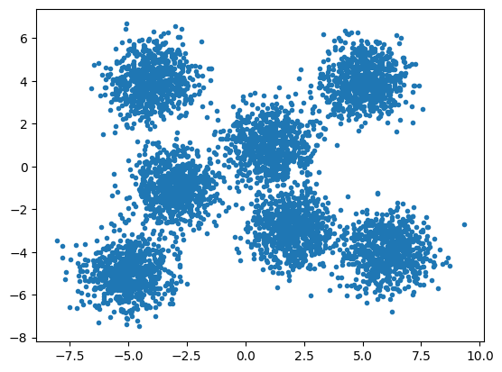
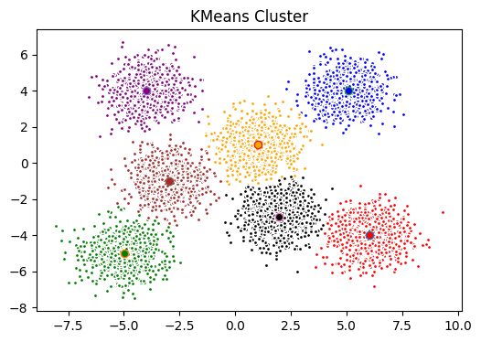
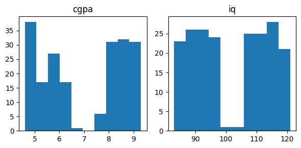
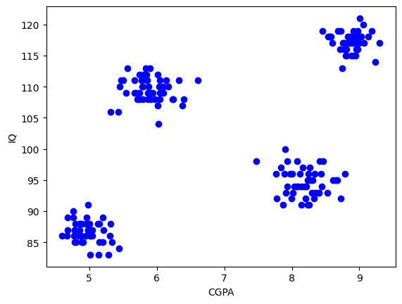
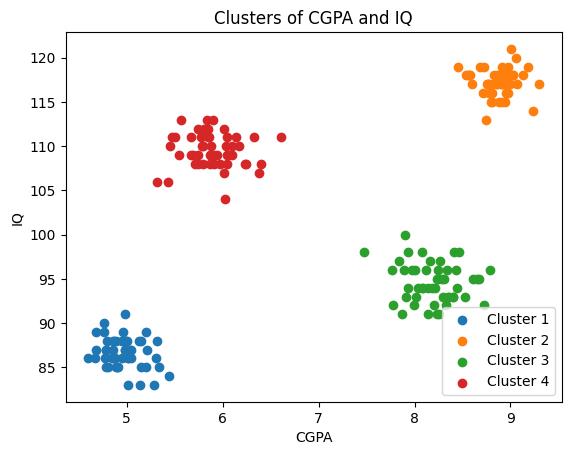
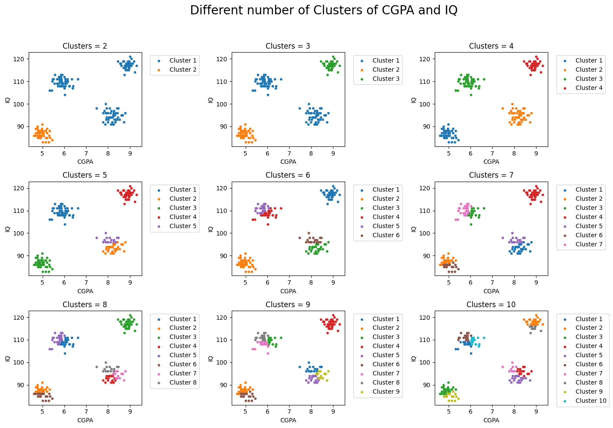

# K Means Clustering

Configure the project. Indeed you create a dataset in csv format.


```python
! rm -rf *.csv
! unzip ./dataset/archive.zip
! mv *.csv data.csv

```

    Archive:  ./dataset/archive.zip
      inflating: KMeans_student.csv      


Import needed libraries


```python
import matplotlib.pyplot as plt
import pandas as pd
import numpy as np
from sklearn.cluster import KMeans 
from sklearn.datasets import make_blobs 
from sklearn.preprocessing import StandardScaler

%matplotlib inline
```

# Make Sample to practice on K-Means


```python
clusters_head = [[-4, 4], [5, 4], [-3, -1], [6, -4], [2, -3], [1, 1], [-5, -5]]
X, y = make_blobs(n_samples=5000, centers=clusters_head, cluster_std=0.9)
plt.scatter(X[:, 0], X[:, 1], marker='.')

```


    <matplotlib.collections.PathCollection at 0x7fc4177408d0>


    

    


```python
num_cluster_heads = len(clusters_head)
model = KMeans(init = "k-means++", n_clusters = num_cluster_heads, n_init = 20)
```


```python
model.fit(X)
```


<style>#sk-container-id-1 {
  /* Definition of color scheme common for light and dark mode */
  --sklearn-color-text: black;
  --sklearn-color-line: gray;
  /* Definition of color scheme for unfitted estimators */
  --sklearn-color-unfitted-level-0: #fff5e6;
  --sklearn-color-unfitted-level-1: #f6e4d2;
  --sklearn-color-unfitted-level-2: #ffe0b3;
  --sklearn-color-unfitted-level-3: chocolate;
  /* Definition of color scheme for fitted estimators */
  --sklearn-color-fitted-level-0: #f0f8ff;
  --sklearn-color-fitted-level-1: #d4ebff;
  --sklearn-color-fitted-level-2: #b3dbfd;
  --sklearn-color-fitted-level-3: cornflowerblue;

  /* Specific color for light theme */
  --sklearn-color-text-on-default-background: var(--sg-text-color, var(--theme-code-foreground, var(--jp-content-font-color1, black)));
  --sklearn-color-background: var(--sg-background-color, var(--theme-background, var(--jp-layout-color0, white)));
  --sklearn-color-border-box: var(--sg-text-color, var(--theme-code-foreground, var(--jp-content-font-color1, black)));
  --sklearn-color-icon: #696969;

  @media (prefers-color-scheme: dark) {
    /* Redefinition of color scheme for dark theme */
    --sklearn-color-text-on-default-background: var(--sg-text-color, var(--theme-code-foreground, var(--jp-content-font-color1, white)));
    --sklearn-color-background: var(--sg-background-color, var(--theme-background, var(--jp-layout-color0, #111)));
    --sklearn-color-border-box: var(--sg-text-color, var(--theme-code-foreground, var(--jp-content-font-color1, white)));
    --sklearn-color-icon: #878787;
  }
}

#sk-container-id-1 {
  color: var(--sklearn-color-text);
}

#sk-container-id-1 pre {
  padding: 0;
}

#sk-container-id-1 input.sk-hidden--visually {
  border: 0;
  clip: rect(1px 1px 1px 1px);
  clip: rect(1px, 1px, 1px, 1px);
  height: 1px;
  margin: -1px;
  overflow: hidden;
  padding: 0;
  position: absolute;
  width: 1px;
}

#sk-container-id-1 div.sk-dashed-wrapped {
  border: 1px dashed var(--sklearn-color-line);
  margin: 0 0.4em 0.5em 0.4em;
  box-sizing: border-box;
  padding-bottom: 0.4em;
  background-color: var(--sklearn-color-background);
}

#sk-container-id-1 div.sk-container {
  /* jupyter's `normalize.less` sets `[hidden] { display: none; }`
     but bootstrap.min.css set `[hidden] { display: none !important; }`
     so we also need the `!important` here to be able to override the
     default hidden behavior on the sphinx rendered scikit-learn.org.
     See: https://github.com/scikit-learn/scikit-learn/issues/21755 */
  display: inline-block !important;
  position: relative;
}

#sk-container-id-1 div.sk-text-repr-fallback {
  display: none;
}

div.sk-parallel-item,
div.sk-serial,
div.sk-item {
  /* draw centered vertical line to link estimators */
  background-image: linear-gradient(var(--sklearn-color-text-on-default-background), var(--sklearn-color-text-on-default-background));
  background-size: 2px 100%;
  background-repeat: no-repeat;
  background-position: center center;
}

/* Parallel-specific style estimator block */

#sk-container-id-1 div.sk-parallel-item::after {
  content: "";
  width: 100%;
  border-bottom: 2px solid var(--sklearn-color-text-on-default-background);
  flex-grow: 1;
}

#sk-container-id-1 div.sk-parallel {
  display: flex;
  align-items: stretch;
  justify-content: center;
  background-color: var(--sklearn-color-background);
  position: relative;
}

#sk-container-id-1 div.sk-parallel-item {
  display: flex;
  flex-direction: column;
}

#sk-container-id-1 div.sk-parallel-item:first-child::after {
  align-self: flex-end;
  width: 50%;
}

#sk-container-id-1 div.sk-parallel-item:last-child::after {
  align-self: flex-start;
  width: 50%;
}

#sk-container-id-1 div.sk-parallel-item:only-child::after {
  width: 0;
}

/* Serial-specific style estimator block */

#sk-container-id-1 div.sk-serial {
  display: flex;
  flex-direction: column;
  align-items: center;
  background-color: var(--sklearn-color-background);
  padding-right: 1em;
  padding-left: 1em;
}


/* Toggleable style: style used for estimator/Pipeline/ColumnTransformer box that is
clickable and can be expanded/collapsed.
- Pipeline and ColumnTransformer use this feature and define the default style
- Estimators will overwrite some part of the style using the `sk-estimator` class
*/

/* Pipeline and ColumnTransformer style (default) */

#sk-container-id-1 div.sk-toggleable {
  /* Default theme specific background. It is overwritten whether we have a
  specific estimator or a Pipeline/ColumnTransformer */
  background-color: var(--sklearn-color-background);
}

/* Toggleable label */
#sk-container-id-1 label.sk-toggleable__label {
  cursor: pointer;
  display: block;
  width: 100%;
  margin-bottom: 0;
  padding: 0.5em;
  box-sizing: border-box;
  text-align: center;
}

#sk-container-id-1 label.sk-toggleable__label-arrow:before {
  /* Arrow on the left of the label */
  content: "▸";
  float: left;
  margin-right: 0.25em;
  color: var(--sklearn-color-icon);
}

#sk-container-id-1 label.sk-toggleable__label-arrow:hover:before {
  color: var(--sklearn-color-text);
}

/* Toggleable content - dropdown */

#sk-container-id-1 div.sk-toggleable__content {
  max-height: 0;
  max-width: 0;
  overflow: hidden;
  text-align: left;
  /* unfitted */
  background-color: var(--sklearn-color-unfitted-level-0);
}

#sk-container-id-1 div.sk-toggleable__content.fitted {
  /* fitted */
  background-color: var(--sklearn-color-fitted-level-0);
}

#sk-container-id-1 div.sk-toggleable__content pre {
  margin: 0.2em;
  border-radius: 0.25em;
  color: var(--sklearn-color-text);
  /* unfitted */
  background-color: var(--sklearn-color-unfitted-level-0);
}

#sk-container-id-1 div.sk-toggleable__content.fitted pre {
  /* unfitted */
  background-color: var(--sklearn-color-fitted-level-0);
}

#sk-container-id-1 input.sk-toggleable__control:checked~div.sk-toggleable__content {
  /* Expand drop-down */
  max-height: 200px;
  max-width: 100%;
  overflow: auto;
}

#sk-container-id-1 input.sk-toggleable__control:checked~label.sk-toggleable__label-arrow:before {
  content: "▾";
}

/* Pipeline/ColumnTransformer-specific style */

#sk-container-id-1 div.sk-label input.sk-toggleable__control:checked~label.sk-toggleable__label {
  color: var(--sklearn-color-text);
  background-color: var(--sklearn-color-unfitted-level-2);
}

#sk-container-id-1 div.sk-label.fitted input.sk-toggleable__control:checked~label.sk-toggleable__label {
  background-color: var(--sklearn-color-fitted-level-2);
}

/* Estimator-specific style */

/* Colorize estimator box */
#sk-container-id-1 div.sk-estimator input.sk-toggleable__control:checked~label.sk-toggleable__label {
  /* unfitted */
  background-color: var(--sklearn-color-unfitted-level-2);
}

#sk-container-id-1 div.sk-estimator.fitted input.sk-toggleable__control:checked~label.sk-toggleable__label {
  /* fitted */
  background-color: var(--sklearn-color-fitted-level-2);
}

#sk-container-id-1 div.sk-label label.sk-toggleable__label,
#sk-container-id-1 div.sk-label label {
  /* The background is the default theme color */
  color: var(--sklearn-color-text-on-default-background);
}

/* On hover, darken the color of the background */
#sk-container-id-1 div.sk-label:hover label.sk-toggleable__label {
  color: var(--sklearn-color-text);
  background-color: var(--sklearn-color-unfitted-level-2);
}

/* Label box, darken color on hover, fitted */
#sk-container-id-1 div.sk-label.fitted:hover label.sk-toggleable__label.fitted {
  color: var(--sklearn-color-text);
  background-color: var(--sklearn-color-fitted-level-2);
}

/* Estimator label */

#sk-container-id-1 div.sk-label label {
  font-family: monospace;
  font-weight: bold;
  display: inline-block;
  line-height: 1.2em;
}

#sk-container-id-1 div.sk-label-container {
  text-align: center;
}

/* Estimator-specific */
#sk-container-id-1 div.sk-estimator {
  font-family: monospace;
  border: 1px dotted var(--sklearn-color-border-box);
  border-radius: 0.25em;
  box-sizing: border-box;
  margin-bottom: 0.5em;
  /* unfitted */
  background-color: var(--sklearn-color-unfitted-level-0);
}

#sk-container-id-1 div.sk-estimator.fitted {
  /* fitted */
  background-color: var(--sklearn-color-fitted-level-0);
}

/* on hover */
#sk-container-id-1 div.sk-estimator:hover {
  /* unfitted */
  background-color: var(--sklearn-color-unfitted-level-2);
}

#sk-container-id-1 div.sk-estimator.fitted:hover {
  /* fitted */
  background-color: var(--sklearn-color-fitted-level-2);
}

/* Specification for estimator info (e.g. "i" and "?") */

/* Common style for "i" and "?" */

.sk-estimator-doc-link,
a:link.sk-estimator-doc-link,
a:visited.sk-estimator-doc-link {
  float: right;
  font-size: smaller;
  line-height: 1em;
  font-family: monospace;
  background-color: var(--sklearn-color-background);
  border-radius: 1em;
  height: 1em;
  width: 1em;
  text-decoration: none !important;
  margin-left: 1ex;
  /* unfitted */
  border: var(--sklearn-color-unfitted-level-1) 1pt solid;
  color: var(--sklearn-color-unfitted-level-1);
}

.sk-estimator-doc-link.fitted,
a:link.sk-estimator-doc-link.fitted,
a:visited.sk-estimator-doc-link.fitted {
  /* fitted */
  border: var(--sklearn-color-fitted-level-1) 1pt solid;
  color: var(--sklearn-color-fitted-level-1);
}

/* On hover */
div.sk-estimator:hover .sk-estimator-doc-link:hover,
.sk-estimator-doc-link:hover,
div.sk-label-container:hover .sk-estimator-doc-link:hover,
.sk-estimator-doc-link:hover {
  /* unfitted */
  background-color: var(--sklearn-color-unfitted-level-3);
  color: var(--sklearn-color-background);
  text-decoration: none;
}

div.sk-estimator.fitted:hover .sk-estimator-doc-link.fitted:hover,
.sk-estimator-doc-link.fitted:hover,
div.sk-label-container:hover .sk-estimator-doc-link.fitted:hover,
.sk-estimator-doc-link.fitted:hover {
  /* fitted */
  background-color: var(--sklearn-color-fitted-level-3);
  color: var(--sklearn-color-background);
  text-decoration: none;
}

/* Span, style for the box shown on hovering the info icon */
.sk-estimator-doc-link span {
  display: none;
  z-index: 9999;
  position: relative;
  font-weight: normal;
  right: .2ex;
  padding: .5ex;
  margin: .5ex;
  width: min-content;
  min-width: 20ex;
  max-width: 50ex;
  color: var(--sklearn-color-text);
  box-shadow: 2pt 2pt 4pt #999;
  /* unfitted */
  background: var(--sklearn-color-unfitted-level-0);
  border: .5pt solid var(--sklearn-color-unfitted-level-3);
}

.sk-estimator-doc-link.fitted span {
  /* fitted */
  background: var(--sklearn-color-fitted-level-0);
  border: var(--sklearn-color-fitted-level-3);
}

.sk-estimator-doc-link:hover span {
  display: block;
}

/* "?"-specific style due to the `<a>` HTML tag */

#sk-container-id-1 a.estimator_doc_link {
  float: right;
  font-size: 1rem;
  line-height: 1em;
  font-family: monospace;
  background-color: var(--sklearn-color-background);
  border-radius: 1rem;
  height: 1rem;
  width: 1rem;
  text-decoration: none;
  /* unfitted */
  color: var(--sklearn-color-unfitted-level-1);
  border: var(--sklearn-color-unfitted-level-1) 1pt solid;
}

#sk-container-id-1 a.estimator_doc_link.fitted {
  /* fitted */
  border: var(--sklearn-color-fitted-level-1) 1pt solid;
  color: var(--sklearn-color-fitted-level-1);
}

/* On hover */
#sk-container-id-1 a.estimator_doc_link:hover {
  /* unfitted */
  background-color: var(--sklearn-color-unfitted-level-3);
  color: var(--sklearn-color-background);
  text-decoration: none;
}

#sk-container-id-1 a.estimator_doc_link.fitted:hover {
  /* fitted */
  background-color: var(--sklearn-color-fitted-level-3);
}
</style><div id="sk-container-id-1" class="sk-top-container"><div class="sk-text-repr-fallback"><pre>KMeans(n_clusters=7, n_init=20)</pre><b>In a Jupyter environment, please rerun this cell to show the HTML representation or trust the notebook. <br />On GitHub, the HTML representation is unable to render, please try loading this page with nbviewer.org.</b></div><div class="sk-container" hidden><div class="sk-item"><div class="sk-estimator fitted sk-toggleable"><input class="sk-toggleable__control sk-hidden--visually" id="sk-estimator-id-1" type="checkbox" checked><label for="sk-estimator-id-1" class="sk-toggleable__label fitted sk-toggleable__label-arrow fitted">&nbsp;&nbsp;KMeans<a class="sk-estimator-doc-link fitted" rel="noreferrer" target="_blank" href="https://scikit-learn.org/1.5/modules/generated/sklearn.cluster.KMeans.html">?<span>Documentation for KMeans</span></a><span class="sk-estimator-doc-link fitted">i<span>Fitted</span></span></label><div class="sk-toggleable__content fitted"><pre>KMeans(n_clusters=7, n_init=20)</pre></div> </div></div></div></div>


```python
fig, ax = plt.subplots(figsize=(6, 4))

colors = [
    'red', 'green', 'blue', 'orange', 'purple', 'brown', 
    'black', 'red', 'green', 'blue', 'yellow', 'pink', 
    'cyan', 'magenta', 'lime', 'indigo', 'violet', 'gold', 
    'silver', 'bronze', 'teal', 'olive', 'maroon', 'navy',
    'peach', 'beige', 'turquoise', 'lavender', 'coral', 'salmon'
]
colors = colors[:num_cluster_heads]

for idx, col in enumerate(colors):
    cluster_members = (model.labels_ == idx)
    cluster_center = model.cluster_centers_[idx]
    
    ax.plot(X[cluster_members, 0], X[cluster_members, 1], 'w', markerfacecolor=col, marker='.')
    ax.plot(cluster_center[0], cluster_center[1], 'o', markerfacecolor=col)

ax.set_title('KMeans Cluster')
plt.show()
```


    

    


# Real Data

Read data from data.csv using pandas and store in data frame structure. Also shuffle data to have uniform distribution. 


```python
df = pd.read_csv("data.csv")
df.head()
df = df.sample(frac=1.0, random_state=42).reset_index(drop=True)
df.head()
```


<div>
<style scoped>
    .dataframe tbody tr th:only-of-type {
        vertical-align: middle;
    }

    .dataframe tbody tr th {
        vertical-align: top;
    }

    .dataframe thead th {
        text-align: right;
    }
</style>
<table border="1" class="dataframe">
  <thead>
    <tr style="text-align: right;">
      <th></th>
      <th>cgpa</th>
      <th>iq</th>
    </tr>
  </thead>
  <tbody>
    <tr>
      <th>0</th>
      <td>8.18</td>
      <td>94</td>
    </tr>
    <tr>
      <th>1</th>
      <td>8.31</td>
      <td>95</td>
    </tr>
    <tr>
      <th>2</th>
      <td>8.86</td>
      <td>117</td>
    </tr>
    <tr>
      <th>3</th>
      <td>6.04</td>
      <td>110</td>
    </tr>
    <tr>
      <th>4</th>
      <td>5.05</td>
      <td>87</td>
    </tr>
  </tbody>
</table>
</div>


```python
# summarize data
df.describe() 
```


<div>
<style scoped>
    .dataframe tbody tr th:only-of-type {
        vertical-align: middle;
    }

    .dataframe tbody tr th {
        vertical-align: top;
    }

    .dataframe thead th {
        text-align: right;
    }
</style>
<table border="1" class="dataframe">
  <thead>
    <tr style="text-align: right;">
      <th></th>
      <th>cgpa</th>
      <th>iq</th>
    </tr>
  </thead>
  <tbody>
    <tr>
      <th>count</th>
      <td>200.000000</td>
      <td>200.000000</td>
    </tr>
    <tr>
      <th>mean</th>
      <td>6.983400</td>
      <td>101.995000</td>
    </tr>
    <tr>
      <th>std</th>
      <td>1.624101</td>
      <td>12.161599</td>
    </tr>
    <tr>
      <th>min</th>
      <td>4.600000</td>
      <td>83.000000</td>
    </tr>
    <tr>
      <th>25%</th>
      <td>5.407500</td>
      <td>91.000000</td>
    </tr>
    <tr>
      <th>50%</th>
      <td>7.040000</td>
      <td>102.000000</td>
    </tr>
    <tr>
      <th>75%</th>
      <td>8.585000</td>
      <td>113.000000</td>
    </tr>
    <tr>
      <th>max</th>
      <td>9.300000</td>
      <td>121.000000</td>
    </tr>
  </tbody>
</table>
</div>


Print the histogram chart of data


```python
viz = df[['cgpa', 'iq']]
fig, axes = plt.subplots(nrows=1, ncols=2, figsize=(6, 3))

axes[0].hist(viz['cgpa'])
axes[0].set_title('cgpa')

axes[1].hist(viz['iq'])
axes[1].set_title('iq')

plt.tight_layout()
plt.show()

```


    

    


```python
plt.scatter(df.cgpa, df.iq, color="blue")
plt.ylabel("IQ")
plt.xlabel("CGPA")
plt.show()
```


    

    


```python
X = df.values
normal_x = StandardScaler().fit_transform(X)
```


```python
num_clusters = 4
model = KMeans(init = "k-means++", n_clusters = num_clusters, n_init = 20)
model.fit(normal_x)
```


<style>#sk-container-id-2 {
  /* Definition of color scheme common for light and dark mode */
  --sklearn-color-text: black;
  --sklearn-color-line: gray;
  /* Definition of color scheme for unfitted estimators */
  --sklearn-color-unfitted-level-0: #fff5e6;
  --sklearn-color-unfitted-level-1: #f6e4d2;
  --sklearn-color-unfitted-level-2: #ffe0b3;
  --sklearn-color-unfitted-level-3: chocolate;
  /* Definition of color scheme for fitted estimators */
  --sklearn-color-fitted-level-0: #f0f8ff;
  --sklearn-color-fitted-level-1: #d4ebff;
  --sklearn-color-fitted-level-2: #b3dbfd;
  --sklearn-color-fitted-level-3: cornflowerblue;

  /* Specific color for light theme */
  --sklearn-color-text-on-default-background: var(--sg-text-color, var(--theme-code-foreground, var(--jp-content-font-color1, black)));
  --sklearn-color-background: var(--sg-background-color, var(--theme-background, var(--jp-layout-color0, white)));
  --sklearn-color-border-box: var(--sg-text-color, var(--theme-code-foreground, var(--jp-content-font-color1, black)));
  --sklearn-color-icon: #696969;

  @media (prefers-color-scheme: dark) {
    /* Redefinition of color scheme for dark theme */
    --sklearn-color-text-on-default-background: var(--sg-text-color, var(--theme-code-foreground, var(--jp-content-font-color1, white)));
    --sklearn-color-background: var(--sg-background-color, var(--theme-background, var(--jp-layout-color0, #111)));
    --sklearn-color-border-box: var(--sg-text-color, var(--theme-code-foreground, var(--jp-content-font-color1, white)));
    --sklearn-color-icon: #878787;
  }
}

#sk-container-id-2 {
  color: var(--sklearn-color-text);
}

#sk-container-id-2 pre {
  padding: 0;
}

#sk-container-id-2 input.sk-hidden--visually {
  border: 0;
  clip: rect(1px 1px 1px 1px);
  clip: rect(1px, 1px, 1px, 1px);
  height: 1px;
  margin: -1px;
  overflow: hidden;
  padding: 0;
  position: absolute;
  width: 1px;
}

#sk-container-id-2 div.sk-dashed-wrapped {
  border: 1px dashed var(--sklearn-color-line);
  margin: 0 0.4em 0.5em 0.4em;
  box-sizing: border-box;
  padding-bottom: 0.4em;
  background-color: var(--sklearn-color-background);
}

#sk-container-id-2 div.sk-container {
  /* jupyter's `normalize.less` sets `[hidden] { display: none; }`
     but bootstrap.min.css set `[hidden] { display: none !important; }`
     so we also need the `!important` here to be able to override the
     default hidden behavior on the sphinx rendered scikit-learn.org.
     See: https://github.com/scikit-learn/scikit-learn/issues/21755 */
  display: inline-block !important;
  position: relative;
}

#sk-container-id-2 div.sk-text-repr-fallback {
  display: none;
}

div.sk-parallel-item,
div.sk-serial,
div.sk-item {
  /* draw centered vertical line to link estimators */
  background-image: linear-gradient(var(--sklearn-color-text-on-default-background), var(--sklearn-color-text-on-default-background));
  background-size: 2px 100%;
  background-repeat: no-repeat;
  background-position: center center;
}

/* Parallel-specific style estimator block */

#sk-container-id-2 div.sk-parallel-item::after {
  content: "";
  width: 100%;
  border-bottom: 2px solid var(--sklearn-color-text-on-default-background);
  flex-grow: 1;
}

#sk-container-id-2 div.sk-parallel {
  display: flex;
  align-items: stretch;
  justify-content: center;
  background-color: var(--sklearn-color-background);
  position: relative;
}

#sk-container-id-2 div.sk-parallel-item {
  display: flex;
  flex-direction: column;
}

#sk-container-id-2 div.sk-parallel-item:first-child::after {
  align-self: flex-end;
  width: 50%;
}

#sk-container-id-2 div.sk-parallel-item:last-child::after {
  align-self: flex-start;
  width: 50%;
}

#sk-container-id-2 div.sk-parallel-item:only-child::after {
  width: 0;
}

/* Serial-specific style estimator block */

#sk-container-id-2 div.sk-serial {
  display: flex;
  flex-direction: column;
  align-items: center;
  background-color: var(--sklearn-color-background);
  padding-right: 1em;
  padding-left: 1em;
}


/* Toggleable style: style used for estimator/Pipeline/ColumnTransformer box that is
clickable and can be expanded/collapsed.
- Pipeline and ColumnTransformer use this feature and define the default style
- Estimators will overwrite some part of the style using the `sk-estimator` class
*/

/* Pipeline and ColumnTransformer style (default) */

#sk-container-id-2 div.sk-toggleable {
  /* Default theme specific background. It is overwritten whether we have a
  specific estimator or a Pipeline/ColumnTransformer */
  background-color: var(--sklearn-color-background);
}

/* Toggleable label */
#sk-container-id-2 label.sk-toggleable__label {
  cursor: pointer;
  display: block;
  width: 100%;
  margin-bottom: 0;
  padding: 0.5em;
  box-sizing: border-box;
  text-align: center;
}

#sk-container-id-2 label.sk-toggleable__label-arrow:before {
  /* Arrow on the left of the label */
  content: "▸";
  float: left;
  margin-right: 0.25em;
  color: var(--sklearn-color-icon);
}

#sk-container-id-2 label.sk-toggleable__label-arrow:hover:before {
  color: var(--sklearn-color-text);
}

/* Toggleable content - dropdown */

#sk-container-id-2 div.sk-toggleable__content {
  max-height: 0;
  max-width: 0;
  overflow: hidden;
  text-align: left;
  /* unfitted */
  background-color: var(--sklearn-color-unfitted-level-0);
}

#sk-container-id-2 div.sk-toggleable__content.fitted {
  /* fitted */
  background-color: var(--sklearn-color-fitted-level-0);
}

#sk-container-id-2 div.sk-toggleable__content pre {
  margin: 0.2em;
  border-radius: 0.25em;
  color: var(--sklearn-color-text);
  /* unfitted */
  background-color: var(--sklearn-color-unfitted-level-0);
}

#sk-container-id-2 div.sk-toggleable__content.fitted pre {
  /* unfitted */
  background-color: var(--sklearn-color-fitted-level-0);
}

#sk-container-id-2 input.sk-toggleable__control:checked~div.sk-toggleable__content {
  /* Expand drop-down */
  max-height: 200px;
  max-width: 100%;
  overflow: auto;
}

#sk-container-id-2 input.sk-toggleable__control:checked~label.sk-toggleable__label-arrow:before {
  content: "▾";
}

/* Pipeline/ColumnTransformer-specific style */

#sk-container-id-2 div.sk-label input.sk-toggleable__control:checked~label.sk-toggleable__label {
  color: var(--sklearn-color-text);
  background-color: var(--sklearn-color-unfitted-level-2);
}

#sk-container-id-2 div.sk-label.fitted input.sk-toggleable__control:checked~label.sk-toggleable__label {
  background-color: var(--sklearn-color-fitted-level-2);
}

/* Estimator-specific style */

/* Colorize estimator box */
#sk-container-id-2 div.sk-estimator input.sk-toggleable__control:checked~label.sk-toggleable__label {
  /* unfitted */
  background-color: var(--sklearn-color-unfitted-level-2);
}

#sk-container-id-2 div.sk-estimator.fitted input.sk-toggleable__control:checked~label.sk-toggleable__label {
  /* fitted */
  background-color: var(--sklearn-color-fitted-level-2);
}

#sk-container-id-2 div.sk-label label.sk-toggleable__label,
#sk-container-id-2 div.sk-label label {
  /* The background is the default theme color */
  color: var(--sklearn-color-text-on-default-background);
}

/* On hover, darken the color of the background */
#sk-container-id-2 div.sk-label:hover label.sk-toggleable__label {
  color: var(--sklearn-color-text);
  background-color: var(--sklearn-color-unfitted-level-2);
}

/* Label box, darken color on hover, fitted */
#sk-container-id-2 div.sk-label.fitted:hover label.sk-toggleable__label.fitted {
  color: var(--sklearn-color-text);
  background-color: var(--sklearn-color-fitted-level-2);
}

/* Estimator label */

#sk-container-id-2 div.sk-label label {
  font-family: monospace;
  font-weight: bold;
  display: inline-block;
  line-height: 1.2em;
}

#sk-container-id-2 div.sk-label-container {
  text-align: center;
}

/* Estimator-specific */
#sk-container-id-2 div.sk-estimator {
  font-family: monospace;
  border: 1px dotted var(--sklearn-color-border-box);
  border-radius: 0.25em;
  box-sizing: border-box;
  margin-bottom: 0.5em;
  /* unfitted */
  background-color: var(--sklearn-color-unfitted-level-0);
}

#sk-container-id-2 div.sk-estimator.fitted {
  /* fitted */
  background-color: var(--sklearn-color-fitted-level-0);
}

/* on hover */
#sk-container-id-2 div.sk-estimator:hover {
  /* unfitted */
  background-color: var(--sklearn-color-unfitted-level-2);
}

#sk-container-id-2 div.sk-estimator.fitted:hover {
  /* fitted */
  background-color: var(--sklearn-color-fitted-level-2);
}

/* Specification for estimator info (e.g. "i" and "?") */

/* Common style for "i" and "?" */

.sk-estimator-doc-link,
a:link.sk-estimator-doc-link,
a:visited.sk-estimator-doc-link {
  float: right;
  font-size: smaller;
  line-height: 1em;
  font-family: monospace;
  background-color: var(--sklearn-color-background);
  border-radius: 1em;
  height: 1em;
  width: 1em;
  text-decoration: none !important;
  margin-left: 1ex;
  /* unfitted */
  border: var(--sklearn-color-unfitted-level-1) 1pt solid;
  color: var(--sklearn-color-unfitted-level-1);
}

.sk-estimator-doc-link.fitted,
a:link.sk-estimator-doc-link.fitted,
a:visited.sk-estimator-doc-link.fitted {
  /* fitted */
  border: var(--sklearn-color-fitted-level-1) 1pt solid;
  color: var(--sklearn-color-fitted-level-1);
}

/* On hover */
div.sk-estimator:hover .sk-estimator-doc-link:hover,
.sk-estimator-doc-link:hover,
div.sk-label-container:hover .sk-estimator-doc-link:hover,
.sk-estimator-doc-link:hover {
  /* unfitted */
  background-color: var(--sklearn-color-unfitted-level-3);
  color: var(--sklearn-color-background);
  text-decoration: none;
}

div.sk-estimator.fitted:hover .sk-estimator-doc-link.fitted:hover,
.sk-estimator-doc-link.fitted:hover,
div.sk-label-container:hover .sk-estimator-doc-link.fitted:hover,
.sk-estimator-doc-link.fitted:hover {
  /* fitted */
  background-color: var(--sklearn-color-fitted-level-3);
  color: var(--sklearn-color-background);
  text-decoration: none;
}

/* Span, style for the box shown on hovering the info icon */
.sk-estimator-doc-link span {
  display: none;
  z-index: 9999;
  position: relative;
  font-weight: normal;
  right: .2ex;
  padding: .5ex;
  margin: .5ex;
  width: min-content;
  min-width: 20ex;
  max-width: 50ex;
  color: var(--sklearn-color-text);
  box-shadow: 2pt 2pt 4pt #999;
  /* unfitted */
  background: var(--sklearn-color-unfitted-level-0);
  border: .5pt solid var(--sklearn-color-unfitted-level-3);
}

.sk-estimator-doc-link.fitted span {
  /* fitted */
  background: var(--sklearn-color-fitted-level-0);
  border: var(--sklearn-color-fitted-level-3);
}

.sk-estimator-doc-link:hover span {
  display: block;
}

/* "?"-specific style due to the `<a>` HTML tag */

#sk-container-id-2 a.estimator_doc_link {
  float: right;
  font-size: 1rem;
  line-height: 1em;
  font-family: monospace;
  background-color: var(--sklearn-color-background);
  border-radius: 1rem;
  height: 1rem;
  width: 1rem;
  text-decoration: none;
  /* unfitted */
  color: var(--sklearn-color-unfitted-level-1);
  border: var(--sklearn-color-unfitted-level-1) 1pt solid;
}

#sk-container-id-2 a.estimator_doc_link.fitted {
  /* fitted */
  border: var(--sklearn-color-fitted-level-1) 1pt solid;
  color: var(--sklearn-color-fitted-level-1);
}

/* On hover */
#sk-container-id-2 a.estimator_doc_link:hover {
  /* unfitted */
  background-color: var(--sklearn-color-unfitted-level-3);
  color: var(--sklearn-color-background);
  text-decoration: none;
}

#sk-container-id-2 a.estimator_doc_link.fitted:hover {
  /* fitted */
  background-color: var(--sklearn-color-fitted-level-3);
}
</style><div id="sk-container-id-2" class="sk-top-container"><div class="sk-text-repr-fallback"><pre>KMeans(n_clusters=4, n_init=20)</pre><b>In a Jupyter environment, please rerun this cell to show the HTML representation or trust the notebook. <br />On GitHub, the HTML representation is unable to render, please try loading this page with nbviewer.org.</b></div><div class="sk-container" hidden><div class="sk-item"><div class="sk-estimator fitted sk-toggleable"><input class="sk-toggleable__control sk-hidden--visually" id="sk-estimator-id-2" type="checkbox" checked><label for="sk-estimator-id-2" class="sk-toggleable__label fitted sk-toggleable__label-arrow fitted">&nbsp;&nbsp;KMeans<a class="sk-estimator-doc-link fitted" rel="noreferrer" target="_blank" href="https://scikit-learn.org/1.5/modules/generated/sklearn.cluster.KMeans.html">?<span>Documentation for KMeans</span></a><span class="sk-estimator-doc-link fitted">i<span>Fitted</span></span></label><div class="sk-toggleable__content fitted"><pre>KMeans(n_clusters=4, n_init=20)</pre></div> </div></div></div></div>


```python
df["cluster"] = model.labels_
df.head()
```


<div>
<style scoped>
    .dataframe tbody tr th:only-of-type {
        vertical-align: middle;
    }

    .dataframe tbody tr th {
        vertical-align: top;
    }

    .dataframe thead th {
        text-align: right;
    }
</style>
<table border="1" class="dataframe">
  <thead>
    <tr style="text-align: right;">
      <th></th>
      <th>cgpa</th>
      <th>iq</th>
      <th>cluster</th>
    </tr>
  </thead>
  <tbody>
    <tr>
      <th>0</th>
      <td>8.18</td>
      <td>94</td>
      <td>2</td>
    </tr>
    <tr>
      <th>1</th>
      <td>8.31</td>
      <td>95</td>
      <td>2</td>
    </tr>
    <tr>
      <th>2</th>
      <td>8.86</td>
      <td>117</td>
      <td>1</td>
    </tr>
    <tr>
      <th>3</th>
      <td>6.04</td>
      <td>110</td>
      <td>3</td>
    </tr>
    <tr>
      <th>4</th>
      <td>5.05</td>
      <td>87</td>
      <td>0</td>
    </tr>
  </tbody>
</table>
</div>


```python
df.groupby('cluster').mean()

```


<div>
<style scoped>
    .dataframe tbody tr th:only-of-type {
        vertical-align: middle;
    }

    .dataframe tbody tr th {
        vertical-align: top;
    }

    .dataframe thead th {
        text-align: right;
    }
</style>
<table border="1" class="dataframe">
  <thead>
    <tr style="text-align: right;">
      <th></th>
      <th>cgpa</th>
      <th>iq</th>
    </tr>
    <tr>
      <th>cluster</th>
      <th></th>
      <th></th>
    </tr>
  </thead>
  <tbody>
    <tr>
      <th>0</th>
      <td>4.9676</td>
      <td>86.70</td>
    </tr>
    <tr>
      <th>1</th>
      <td>8.8714</td>
      <td>117.16</td>
    </tr>
    <tr>
      <th>2</th>
      <td>8.1998</td>
      <td>94.60</td>
    </tr>
    <tr>
      <th>3</th>
      <td>5.8948</td>
      <td>109.52</td>
    </tr>
  </tbody>
</table>
</div>


```python
normal_x
```


    array([[ 0.73862559, -0.65904677],
           [ 0.81887072, -0.57661441],
           [ 1.15836936,  1.23689766],
           [-0.58233276,  0.6598711 ],
           [-1.19343032, -1.23607334],
           [ 1.17688747,  1.31933003],
           [ 0.80652532, -0.57661441],
           [ 1.28182342,  1.48419476],
           [-1.10083978, -1.07120861],
           [ 1.10898774,  1.1544653 ],
           [ 0.95467018, -0.74147914],
           [-0.50208763,  0.6598711 ],
           [-1.42799301, -1.31850571],
           [-1.13170329, -1.15364097],
           [ 0.57196262, -0.74147914],
           [-0.6872687 ,  0.49500636],
           [-0.69961411,  0.74230346],
           [ 1.10281504,  1.23689766],
           [-0.93417681,  0.74230346],
           [-0.74899573,  0.74230346],
           [ 0.5287537 , -0.41174967],
           [-0.9156587 ,  0.74230346],
           [-0.37246087,  0.412574  ],
           [-1.19343032, -1.31850571],
           [ 1.09046964,  0.9071682 ],
           [-0.59467817,  0.1652769 ],
           [ 1.22626909,  1.1544653 ],
           [-1.27984815, -1.40093807],
           [-1.10083978, -1.40093807],
           [-1.21812113, -1.56580281],
           [ 0.68307127, -0.65904677],
           [-0.57616006,  0.74230346],
           [-0.57616006,  0.49500636],
           [ 1.15836936,  1.31933003],
           [ 0.9978791 ,  1.23689766],
           [-1.24898464, -1.07120861],
           [ 1.20157828,  1.31933003],
           [-1.42182031, -1.23607334],
           [ 1.18923288,  1.23689766],
           [-0.72430492,  0.82473583],
           [ 1.07195153, -0.82391151],
           [-0.69961411,  0.82473583],
           [-0.95269491, -1.48337044],
           [-1.24898464, -1.15364097],
           [ 0.87442505, -0.74147914],
           [-1.42182031, -1.07120861],
           [-0.95886762,  0.33014163],
           [-0.70578681,  0.9071682 ],
           [-1.20577572, -1.23607334],
           [ 1.2447872 ,  1.23689766],
           [ 0.78800721, -0.90634387],
           [-1.30453896, -1.15364097],
           [-0.681096  ,  0.57743873],
           [ 0.67689856, -0.32931731],
           [-0.76751384,  0.49500636],
           [-1.05145816, -1.56580281],
           [ 0.7571437 , -0.65904677],
           [-1.23663923, -0.90634387],
           [ 1.18306017,  1.23689766],
           [ 1.26330531,  1.31933003],
           [ 1.04726072,  1.4017624 ],
           [ 1.0040518 , -0.57661441],
           [-0.60085087,  0.82473583],
           [ 0.72628018, -0.41174967],
           [ 0.62751694, -0.49418204],
           [-1.23663923, -1.23607334],
           [ 0.63986235, -0.74147914],
           [-0.40332439,  0.74230346],
           [ 1.10898774,  1.23689766],
           [-0.64405979,  0.57743873],
           [-1.25515734, -1.31850571],
           [-0.57616006,  0.57743873],
           [-0.45887871,  0.49500636],
           [ 0.89294315, -0.49418204],
           [ 1.22626909,  1.23689766],
           [-0.81072276,  0.74230346],
           [-1.31071166, -1.23607334],
           [ 0.60899884, -0.49418204],
           [-0.681096  ,  0.6598711 ],
           [ 1.15836936,  1.23689766],
           [ 0.84973424, -0.74147914],
           [ 1.42996828,  1.23689766],
           [ 0.71393478, -0.65904677],
           [ 0.7694891 , -0.90634387],
           [ 0.89911586, -0.65904677],
           [-1.29219356, -1.15364097],
           [ 1.22626909,  1.4017624 ],
           [ 0.97318829,  1.31933003],
           [ 0.87442505, -0.74147914],
           [ 0.83738883, -0.49418204],
           [ 0.49171749, -0.82391151],
           [-1.34157518, -1.40093807],
           [-1.21812113, -1.31850571],
           [-1.02676735,  0.33014163],
           [-0.54529655,  0.6598711 ],
           [ 1.11516045, -0.49418204],
           [ 0.84356153, -0.74147914],
           [ 0.88059775, -0.32931731],
           [ 1.35589585,  1.4017624 ],
           [-1.36009328, -1.23607334],
           [-0.94652221,  0.6598711 ],
           [ 1.13985126,  1.31933003],
           [-0.69344141,  0.74230346],
           [ 0.98553369,  1.31933003],
           [ 1.26330531,  1.31933003],
           [-1.23663923, -1.23607334],
           [-1.47120193, -1.31850571],
           [ 1.02874261, -0.57661441],
           [-0.66257789,  0.57743873],
           [-1.02676735, -1.15364097],
           [-0.54529655,  0.57743873],
           [-1.14404869, -1.15364097],
           [-0.46505141,  0.49500636],
           [ 1.12750585,  1.1544653 ],
           [-0.56998736,  0.57743873],
           [ 1.07195153,  1.4017624 ],
           [-1.09466707, -1.23607334],
           [ 1.22009639,  1.1544653 ],
           [ 0.83121613, -0.82391151],
           [ 0.65220775, -0.65904677],
           [-1.01442194, -1.40093807],
           [ 1.2324418 ,  1.31933003],
           [ 0.7694891 , -0.57661441],
           [-0.23048871,  0.74230346],
           [ 0.58430803, -0.32931731],
           [-1.36009328, -1.23607334],
           [ 0.55961722, -0.49418204],
           [ 1.20775099,  1.23689766],
           [ 1.2509599 ,  1.56662713],
           [-0.87244978,  0.9071682 ],
           [-1.24281194, -1.15364097],
           [-0.36011547,  0.49500636],
           [ 1.04108802, -0.57661441],
           [-1.29836626, -1.31850571],
           [-1.03294005, -1.31850571],
           [ 0.56578992, -0.16445257],
           [ 0.79417991, -0.41174967],
           [-1.31688437, -1.31850571],
           [ 0.70158937, -0.49418204],
           [-1.36626599, -1.31850571],
           [ 1.18923288,  1.23689766],
           [-1.23046653, -1.15364097],
           [-1.35392058, -1.15364097],
           [-0.81072276,  0.57743873],
           [ 0.71393478, -0.90634387],
           [ 0.48554478, -0.49418204],
           [ 1.12133315,  1.07203293],
           [ 0.67689856, -0.65904677],
           [ 1.38675936,  0.98960056],
           [-1.28602085, -1.40093807],
           [ 1.20775099,  1.07203293],
           [-0.62554168,  0.49500636],
           [-0.73047762,  0.49500636],
           [-0.73665032,  0.6598711 ],
           [-1.22429383, -1.15364097],
           [ 1.28799612,  1.23689766],
           [-0.73047762,  0.6598711 ],
           [-0.52060573,  0.74230346],
           [ 0.54727181, -0.90634387],
           [ 0.58430803, -0.65904677],
           [ 0.91146126, -0.32931731],
           [-0.76751384,  0.82473583],
           [-1.13170329, -1.40093807],
           [-0.60085087,  0.412574  ],
           [ 1.19540558,  1.31933003],
           [ 1.12750585,  1.07203293],
           [-1.37243869, -0.98877624],
           [-1.13787599, -1.56580281],
           [ 0.97936099,  1.31933003],
           [-0.6872687 ,  0.57743873],
           [ 0.90528856,  1.4017624 ],
           [ 1.09664234,  1.23689766],
           [-1.31071166, -1.31850571],
           [ 1.17071477,  1.07203293],
           [-1.21812113, -1.31850571],
           [-1.37243869, -1.07120861],
           [ 0.78183451, -0.49418204],
           [-0.66257789,  0.49500636],
           [ 0.96084288,  1.31933003],
           [-1.36009328, -1.40093807],
           [-0.6687506 ,  0.9071682 ],
           [ 1.11516045,  1.1544653 ],
           [-1.31071166, -1.15364097],
           [ 0.81269802, -0.74147914],
           [-1.29219356, -1.40093807],
           [ 1.18923288,  1.4017624 ],
           [ 1.32503233,  1.31933003],
           [ 0.78183451, -0.57661441],
           [-0.76751384,  0.57743873],
           [-0.88479519,  0.57743873],
           [-0.79837735,  0.57743873],
           [ 1.13367855,  1.23689766],
           [ 0.30036371, -0.32931731],
           [ 1.21392369,  1.1544653 ],
           [ 1.06577883,  1.1544653 ],
           [ 0.62134424, -0.82391151],
           [-0.78603195,  0.49500636],
           [ 0.75097099, -0.82391151],
           [ 1.18923288,  1.07203293],
           [-1.25515734, -1.15364097]])


```python
for cluster in range(num_clusters):
    cluster_data = df[df['cluster'] == cluster]
    plt.scatter(cluster_data.cgpa, cluster_data.iq, label=f'Cluster {cluster+1}')

plt.ylabel("IQ")
plt.xlabel("CGPA")
plt.legend()
plt.title("Clusters of CGPA and IQ")
plt.show()
```


    

    


```python
fig, axes = plt.subplots(nrows=3, ncols=3, figsize=(15, 10))

for i, num_clusters in enumerate(range(2, 11)):
    ax = axes[i // 3, i % 3]
    model = KMeans(init="k-means++", n_clusters=num_clusters, n_init=20)
    model.fit(normal_x)
    df['cluster'] = model.labels_
    
    for cluster in range(num_clusters):
        cluster_data = df[df['cluster'] == cluster]
        ax.scatter(cluster_data.cgpa, cluster_data.iq, label=f'Cluster {cluster+1}', s=10)
    
    ax.set_ylabel("IQ")
    ax.set_xlabel("CGPA")
    ax.set_title(f"Clusters = {num_clusters}")
    
    ax.legend(bbox_to_anchor=(1.05, 1), loc='upper left')


fig.suptitle("Different number of Clusters of CGPA and IQ", fontsize=20)
fig.tight_layout(rect=[0, 0, 0.95, 0.95])
plt.show()
```


    

    

