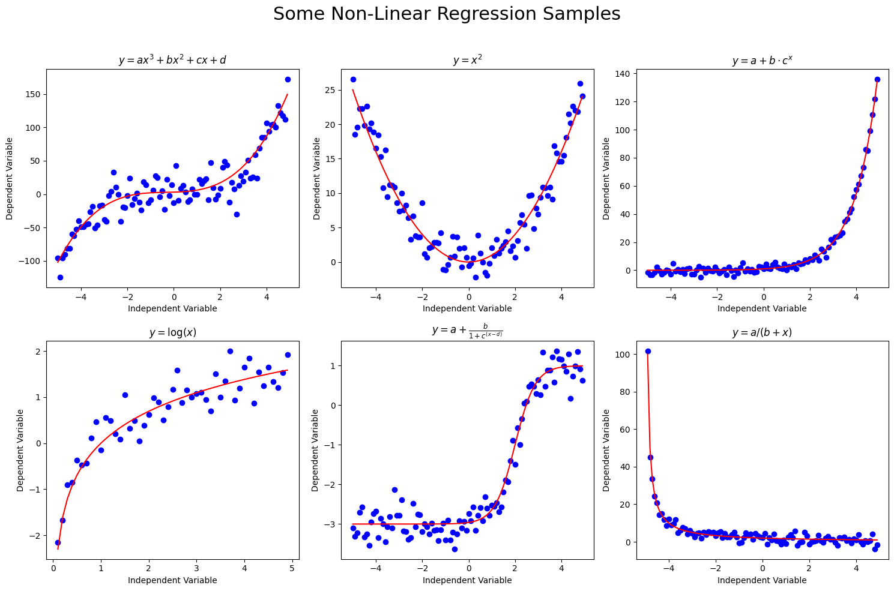
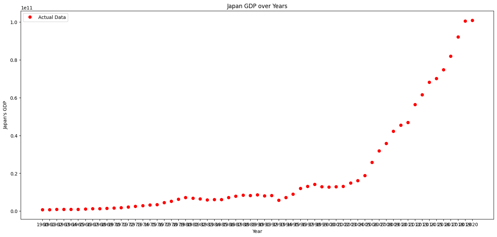
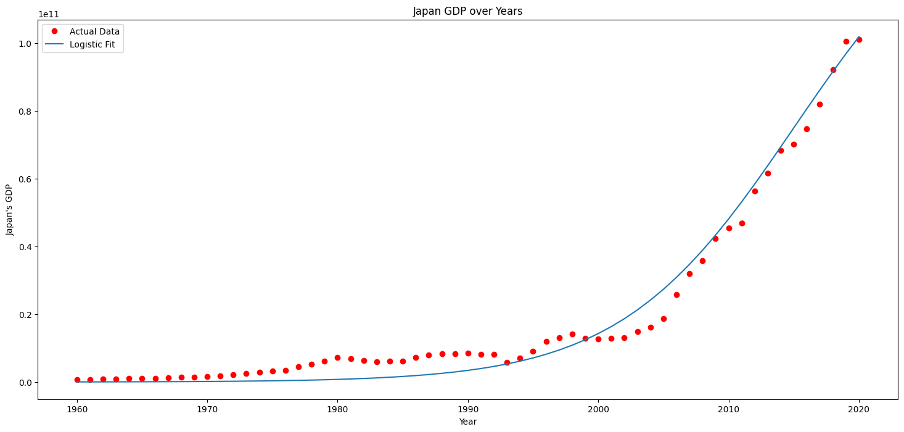
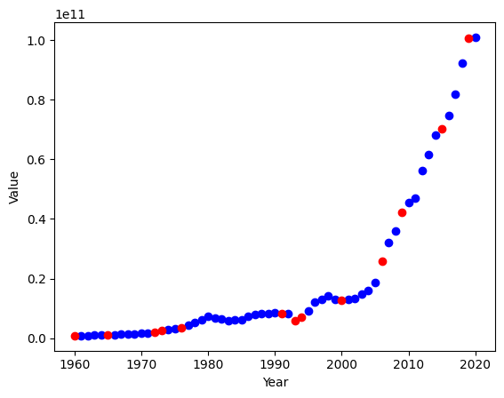
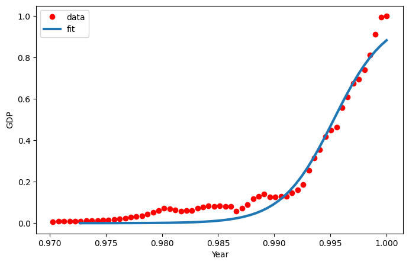

# Non Linear Regression

Configure the project. Indeed you create a dataset in csv format.


```python
! rm -rf *.csv
! unzip ./dataset/archive.zip
! mv gdp.csv data.csv
```

    Archive:  ./dataset/archive.zip
      inflating: gdp.csv                 
      inflating: gdp_growth.csv          
      inflating: gdp_per_capita.csv      
      inflating: gdp_per_capita_growth.csv  
      inflating: gdp_ppp.csv             
      inflating: gdp_ppp_per_capita.csv  


Import needed libraries


```python
import matplotlib.pyplot as plt
import pandas as pd
import numpy as np
from sklearn.model_selection import train_test_split
from scipy.optimize import curve_fit

%matplotlib inline
```

Read data from data.csv using pandas and store in data frame structure. Also shuffle data to have uniform distribution. 


```python
df = pd.read_csv("data.csv")
# df = df.sample(frac=1.0, random_state=42).reset_index(drop=True)
df.head(10)
```


<div>
<style scoped>
    .dataframe tbody tr th:only-of-type {
        vertical-align: middle;
    }

    .dataframe tbody tr th {
        vertical-align: top;
    }

    .dataframe thead th {
        text-align: right;
    }
</style>
<table border="1" class="dataframe">
  <thead>
    <tr style="text-align: right;">
      <th></th>
      <th>Country Name</th>
      <th>Code</th>
      <th>1960</th>
      <th>1961</th>
      <th>1962</th>
      <th>1963</th>
      <th>1964</th>
      <th>1965</th>
      <th>1966</th>
      <th>1967</th>
      <th>...</th>
      <th>2012</th>
      <th>2013</th>
      <th>2014</th>
      <th>2015</th>
      <th>2016</th>
      <th>2017</th>
      <th>2018</th>
      <th>2019</th>
      <th>2020</th>
      <th>Unnamed: 65</th>
    </tr>
  </thead>
  <tbody>
    <tr>
      <th>0</th>
      <td>Aruba</td>
      <td>ABW</td>
      <td>NaN</td>
      <td>NaN</td>
      <td>NaN</td>
      <td>NaN</td>
      <td>NaN</td>
      <td>NaN</td>
      <td>NaN</td>
      <td>NaN</td>
      <td>...</td>
      <td>2.534637e+09</td>
      <td>2.727850e+09</td>
      <td>2.790849e+09</td>
      <td>2.962905e+09</td>
      <td>2.983637e+09</td>
      <td>3.092430e+09</td>
      <td>3.202189e+09</td>
      <td>NaN</td>
      <td>NaN</td>
      <td>NaN</td>
    </tr>
    <tr>
      <th>1</th>
      <td>Africa Eastern and Southern</td>
      <td>AFE</td>
      <td>1.931311e+10</td>
      <td>1.972349e+10</td>
      <td>2.149392e+10</td>
      <td>2.573321e+10</td>
      <td>2.352744e+10</td>
      <td>2.681057e+10</td>
      <td>2.915216e+10</td>
      <td>3.017317e+10</td>
      <td>...</td>
      <td>9.505214e+11</td>
      <td>9.642424e+11</td>
      <td>9.848071e+11</td>
      <td>9.199300e+11</td>
      <td>8.733549e+11</td>
      <td>9.853557e+11</td>
      <td>1.012853e+12</td>
      <td>1.009910e+12</td>
      <td>9.207923e+11</td>
      <td>NaN</td>
    </tr>
    <tr>
      <th>2</th>
      <td>Afghanistan</td>
      <td>AFG</td>
      <td>5.377778e+08</td>
      <td>5.488889e+08</td>
      <td>5.466667e+08</td>
      <td>7.511112e+08</td>
      <td>8.000000e+08</td>
      <td>1.006667e+09</td>
      <td>1.400000e+09</td>
      <td>1.673333e+09</td>
      <td>...</td>
      <td>1.990732e+10</td>
      <td>2.014640e+10</td>
      <td>2.049713e+10</td>
      <td>1.913421e+10</td>
      <td>1.811656e+10</td>
      <td>1.875347e+10</td>
      <td>1.805323e+10</td>
      <td>1.879945e+10</td>
      <td>2.011614e+10</td>
      <td>NaN</td>
    </tr>
    <tr>
      <th>3</th>
      <td>Africa Western and Central</td>
      <td>AFW</td>
      <td>1.040428e+10</td>
      <td>1.112805e+10</td>
      <td>1.194335e+10</td>
      <td>1.267652e+10</td>
      <td>1.383858e+10</td>
      <td>1.486247e+10</td>
      <td>1.583285e+10</td>
      <td>1.442643e+10</td>
      <td>...</td>
      <td>7.275714e+11</td>
      <td>8.207876e+11</td>
      <td>8.649666e+11</td>
      <td>7.607297e+11</td>
      <td>6.905430e+11</td>
      <td>6.837416e+11</td>
      <td>7.416916e+11</td>
      <td>7.945725e+11</td>
      <td>7.845876e+11</td>
      <td>NaN</td>
    </tr>
    <tr>
      <th>4</th>
      <td>Angola</td>
      <td>AGO</td>
      <td>NaN</td>
      <td>NaN</td>
      <td>NaN</td>
      <td>NaN</td>
      <td>NaN</td>
      <td>NaN</td>
      <td>NaN</td>
      <td>NaN</td>
      <td>...</td>
      <td>1.280529e+11</td>
      <td>1.367099e+11</td>
      <td>1.457122e+11</td>
      <td>1.161936e+11</td>
      <td>1.011239e+11</td>
      <td>1.221238e+11</td>
      <td>1.013532e+11</td>
      <td>8.941719e+10</td>
      <td>5.837598e+10</td>
      <td>NaN</td>
    </tr>
    <tr>
      <th>5</th>
      <td>Albania</td>
      <td>ALB</td>
      <td>NaN</td>
      <td>NaN</td>
      <td>NaN</td>
      <td>NaN</td>
      <td>NaN</td>
      <td>NaN</td>
      <td>NaN</td>
      <td>NaN</td>
      <td>...</td>
      <td>1.231983e+10</td>
      <td>1.277622e+10</td>
      <td>1.322815e+10</td>
      <td>1.138685e+10</td>
      <td>1.186120e+10</td>
      <td>1.301969e+10</td>
      <td>1.515643e+10</td>
      <td>1.540024e+10</td>
      <td>1.488763e+10</td>
      <td>NaN</td>
    </tr>
    <tr>
      <th>6</th>
      <td>Andorra</td>
      <td>AND</td>
      <td>NaN</td>
      <td>NaN</td>
      <td>NaN</td>
      <td>NaN</td>
      <td>NaN</td>
      <td>NaN</td>
      <td>NaN</td>
      <td>NaN</td>
      <td>...</td>
      <td>3.188809e+09</td>
      <td>3.193704e+09</td>
      <td>3.271808e+09</td>
      <td>2.789870e+09</td>
      <td>2.896679e+09</td>
      <td>3.000181e+09</td>
      <td>3.218316e+09</td>
      <td>3.155065e+09</td>
      <td>NaN</td>
      <td>NaN</td>
    </tr>
    <tr>
      <th>7</th>
      <td>Arab World</td>
      <td>ARB</td>
      <td>NaN</td>
      <td>NaN</td>
      <td>NaN</td>
      <td>NaN</td>
      <td>NaN</td>
      <td>NaN</td>
      <td>NaN</td>
      <td>NaN</td>
      <td>...</td>
      <td>2.740553e+12</td>
      <td>2.799579e+12</td>
      <td>2.831681e+12</td>
      <td>2.463580e+12</td>
      <td>2.411981e+12</td>
      <td>2.466443e+12</td>
      <td>2.730780e+12</td>
      <td>2.776469e+12</td>
      <td>2.447584e+12</td>
      <td>NaN</td>
    </tr>
    <tr>
      <th>8</th>
      <td>United Arab Emirates</td>
      <td>ARE</td>
      <td>NaN</td>
      <td>NaN</td>
      <td>NaN</td>
      <td>NaN</td>
      <td>NaN</td>
      <td>NaN</td>
      <td>NaN</td>
      <td>NaN</td>
      <td>...</td>
      <td>3.745906e+11</td>
      <td>3.901076e+11</td>
      <td>4.031371e+11</td>
      <td>3.581351e+11</td>
      <td>3.570451e+11</td>
      <td>3.856055e+11</td>
      <td>4.222150e+11</td>
      <td>4.172156e+11</td>
      <td>3.588688e+11</td>
      <td>NaN</td>
    </tr>
    <tr>
      <th>9</th>
      <td>Argentina</td>
      <td>ARG</td>
      <td>NaN</td>
      <td>NaN</td>
      <td>2.445060e+10</td>
      <td>1.827212e+10</td>
      <td>2.560525e+10</td>
      <td>2.834471e+10</td>
      <td>2.863047e+10</td>
      <td>2.425667e+10</td>
      <td>...</td>
      <td>5.459824e+11</td>
      <td>5.520251e+11</td>
      <td>5.263197e+11</td>
      <td>5.947493e+11</td>
      <td>5.575314e+11</td>
      <td>6.436287e+11</td>
      <td>5.248197e+11</td>
      <td>4.519324e+11</td>
      <td>3.892881e+11</td>
      <td>NaN</td>
    </tr>
  </tbody>
</table>
<p>10 rows × 64 columns</p>
</div>


### Extract the japan GDP from the table 


```python
df = df.drop(df.columns[:2], axis=1)
df = df.iloc[[121]]
df = df.transpose()
df = df.reset_index()
df.columns = ['Year', "Japan's GDP"]
df.head(10)

```


<div>
<style scoped>
    .dataframe tbody tr th:only-of-type {
        vertical-align: middle;
    }

    .dataframe tbody tr th {
        vertical-align: top;
    }

    .dataframe thead th {
        text-align: right;
    }
</style>
<table border="1" class="dataframe">
  <thead>
    <tr style="text-align: right;">
      <th></th>
      <th>Year</th>
      <th>Japan's GDP</th>
    </tr>
  </thead>
  <tbody>
    <tr>
      <th>0</th>
      <td>1960</td>
      <td>7.912655e+08</td>
    </tr>
    <tr>
      <th>1</th>
      <td>1961</td>
      <td>7.929595e+08</td>
    </tr>
    <tr>
      <th>2</th>
      <td>1962</td>
      <td>8.681114e+08</td>
    </tr>
    <tr>
      <th>3</th>
      <td>1963</td>
      <td>9.265893e+08</td>
    </tr>
    <tr>
      <th>4</th>
      <td>1964</td>
      <td>9.987593e+08</td>
    </tr>
    <tr>
      <th>5</th>
      <td>1965</td>
      <td>9.979193e+08</td>
    </tr>
    <tr>
      <th>6</th>
      <td>1966</td>
      <td>1.164520e+09</td>
    </tr>
    <tr>
      <th>7</th>
      <td>1967</td>
      <td>1.232560e+09</td>
    </tr>
    <tr>
      <th>8</th>
      <td>1968</td>
      <td>1.353295e+09</td>
    </tr>
    <tr>
      <th>9</th>
      <td>1969</td>
      <td>1.458379e+09</td>
    </tr>
  </tbody>
</table>
</div>


```python
df.tail(10)
df = df.drop(df.index[-1])
df.tail(10)

```


<div>
<style scoped>
    .dataframe tbody tr th:only-of-type {
        vertical-align: middle;
    }

    .dataframe tbody tr th {
        vertical-align: top;
    }

    .dataframe thead th {
        text-align: right;
    }
</style>
<table border="1" class="dataframe">
  <thead>
    <tr style="text-align: right;">
      <th></th>
      <th>Year</th>
      <th>Japan's GDP</th>
    </tr>
  </thead>
  <tbody>
    <tr>
      <th>51</th>
      <td>2011</td>
      <td>4.686946e+10</td>
    </tr>
    <tr>
      <th>52</th>
      <td>2012</td>
      <td>5.639671e+10</td>
    </tr>
    <tr>
      <th>53</th>
      <td>2013</td>
      <td>6.167143e+10</td>
    </tr>
    <tr>
      <th>54</th>
      <td>2014</td>
      <td>6.828577e+10</td>
    </tr>
    <tr>
      <th>55</th>
      <td>2015</td>
      <td>7.012041e+10</td>
    </tr>
    <tr>
      <th>56</th>
      <td>2016</td>
      <td>7.481512e+10</td>
    </tr>
    <tr>
      <th>57</th>
      <td>2017</td>
      <td>8.203580e+10</td>
    </tr>
    <tr>
      <th>58</th>
      <td>2018</td>
      <td>9.220296e+10</td>
    </tr>
    <tr>
      <th>59</th>
      <td>2019</td>
      <td>1.005555e+11</td>
    </tr>
    <tr>
      <th>60</th>
      <td>2020</td>
      <td>1.010137e+11</td>
    </tr>
  </tbody>
</table>
</div>


```python
# summarize data
df.describe() 
```


<div>
<style scoped>
    .dataframe tbody tr th:only-of-type {
        vertical-align: middle;
    }

    .dataframe tbody tr th {
        vertical-align: top;
    }

    .dataframe thead th {
        text-align: right;
    }
</style>
<table border="1" class="dataframe">
  <thead>
    <tr style="text-align: right;">
      <th></th>
      <th>Japan's GDP</th>
    </tr>
  </thead>
  <tbody>
    <tr>
      <th>count</th>
      <td>6.100000e+01</td>
    </tr>
    <tr>
      <th>mean</th>
      <td>2.029558e+10</td>
    </tr>
    <tr>
      <th>std</th>
      <td>2.728069e+10</td>
    </tr>
    <tr>
      <th>min</th>
      <td>7.912655e+08</td>
    </tr>
    <tr>
      <th>25%</th>
      <td>3.259345e+09</td>
    </tr>
    <tr>
      <th>50%</th>
      <td>8.151479e+09</td>
    </tr>
    <tr>
      <th>75%</th>
      <td>1.873790e+10</td>
    </tr>
    <tr>
      <th>max</th>
      <td>1.010137e+11</td>
    </tr>
  </tbody>
</table>
</div>


## Print Some histogram chart example


```python
fig, axs = plt.subplots(2, 3, figsize=(15, 10))

# Plot 1: Cubic with noise
x = np.arange(-5.0, 5.0, 0.1)
y = 1*(x**3) + 1*(x**2) + 1*x + 3
y_noise = 20 * np.random.normal(size=x.size)
ydata = y + y_noise
axs[0, 0].plot(x, ydata, 'bo')
axs[0, 0].plot(x, y, 'r')
axs[0, 0].set_title("$y = ax^3 + bx^2 + cx + d$")
axs[0, 0].set_xlabel('Independent Variable')
axs[0, 0].set_ylabel('Dependent Variable')

# Plot 2: Quadratic with noise
x = np.arange(-5.0, 5.0, 0.1)
y = np.power(x, 2)
y_noise = 2 * np.random.normal(size=x.size)
ydata = y + y_noise
axs[0, 1].plot(x, ydata, 'bo')
axs[0, 1].plot(x, y, 'r')
axs[0, 1].set_title("$y = x^2$")
axs[0, 1].set_xlabel('Independent Variable')
axs[0, 1].set_ylabel('Dependent Variable')

# Plot 3: Exponential with noise
x = np.arange(-5.0, 5.0, 0.1)
y = np.exp(x)
y_noise = 2 * np.random.normal(size=x.size)
ydata = y + y_noise
axs[0, 2].plot(x, ydata, 'bo')
axs[0, 2].plot(x, y, 'r')
axs[0, 2].set_title("$y = a + b \cdot c^x$")
axs[0, 2].set_xlabel('Independent Variable')
axs[0, 2].set_ylabel('Dependent Variable')

# Plot 4: Logarithmic with noise
x = np.arange(0.1, 5.0, 0.1)  # logarithm is defined for x > 0
y = np.log(x)
y_noise = 0.3 * np.random.normal(size=x.size)
ydata = y + y_noise
axs[1, 0].plot(x, ydata, 'bo')
axs[1, 0].plot(x, y, 'r')
axs[1, 0].set_title("$y = \log(x)$")
axs[1, 0].set_xlabel('Independent Variable')
axs[1, 0].set_ylabel('Dependent Variable')

# Plot 5: Logistic with noise
x = np.arange(-5.0, 5.0, 0.1)
y = 1-4/(1+np.power(10, x-2))
y_noise = 0.3 * np.random.normal(size=x.size)
ydata = y + y_noise
axs[1, 1].plot(x, ydata, 'bo')
axs[1, 1].plot(x, y, 'r')
axs[1, 1].set_title("$y = a + \\frac{b}{1+c^{(x-d)}}$")
axs[1, 1].set_xlabel('Independent Variable')
axs[1, 1].set_ylabel('Dependent Variable')

# Plot 6: Hyperbolic with noise
x = np.arange(-5.0, 5.0, 0.1)
y = 10/(5+x)
y_noise = 2 * np.random.normal(size=x.size)
ydata = y + y_noise
axs[1, 2].plot(x, ydata, 'bo')
axs[1, 2].plot(x, y, 'r')
axs[1, 2].set_title("$y = a / (b+x) $")
axs[1, 2].set_xlabel('Independent Variable')
axs[1, 2].set_ylabel('Dependent Variable')

fig.suptitle("Some Non-Linear Regression Samples", fontsize=22)

plt.tight_layout(rect=[0, 0, 1, 0.96])
plt.show()
```

    /tmp/ipykernel_82524/3080679515.py:60: RuntimeWarning: divide by zero encountered in divide
      y = 10/(5+x)


    

    


Print scatter chart of data to recognize the patterns of data.


```python
x_data, y_data = (df["Year"].values, df["Japan's GDP"].values)
plt.figure(figsize=(18, 8))  # Adjust the size as needed, e.g., (12, 8))
plt.plot(x_data, y_data, 'ro', label="Actual Data")

plt.xlabel('Year')
plt.ylabel("Japan's GDP")
plt.title('Japan GDP over Years')
plt.legend()
plt.show()
```


    

    


## Define sigmoid (S-curve) function


```python
def sigmoid(x, Beta_1, Beta_2):
     y = 1 / (1 + np.exp(-Beta_1*(x-Beta_2)))
     return y
```


```python
beta_1 = 0.15
beta_2 = 2015.0

df['Year'] = pd.to_numeric(df['Year'], errors='coerce')
x_data, y_data = (df["Year"].values, df["Japan's GDP"].values)

# Calculate predictions
Y_pred = sigmoid(df["Year"], beta_1, beta_2)

# Plot with a larger figure size
plt.figure(figsize=(18, 8))  # Adjust the size as needed, e.g., (12, 8))
plt.plot(x_data, y_data, 'ro', label="Actual Data")

# Plot the logistic function prediction
plt.plot(x_data, Y_pred * 150000000000., label="Logistic Fit")  # Adjust scaling factor as needed

plt.xlabel('Year')
plt.ylabel("Japan's GDP")
plt.title('Japan GDP over Years')
plt.legend()
plt.show()
```


    

    


## Split dataset into train and test parts


```python
# print(df)
train, test = train_test_split(df, test_size=0.20, random_state=42)
# test, evaluate = train_test_split(test, test_size=0.5, random_state=42)
```


```python
fig = plt.figure()
ax1 = fig.add_subplot()
ax1.scatter(train.Year, train["Japan's GDP"], color="blue")
ax1.scatter(test.Year, test["Japan's GDP"], color="red")
plt.ylabel("Value")
plt.xlabel("Year")
plt.show()
```


    

    


## Data Normalization:


```python
xdata = x_data/max(x_data)
ydata = y_data/max(y_data)

xdata
```


    array([0.97029703, 0.97079208, 0.97128713, 0.97178218, 0.97227723,
           0.97277228, 0.97326733, 0.97376238, 0.97425743, 0.97475248,
           0.97524752, 0.97574257, 0.97623762, 0.97673267, 0.97722772,
           0.97772277, 0.97821782, 0.97871287, 0.97920792, 0.97970297,
           0.98019802, 0.98069307, 0.98118812, 0.98168317, 0.98217822,
           0.98267327, 0.98316832, 0.98366337, 0.98415842, 0.98465347,
           0.98514851, 0.98564356, 0.98613861, 0.98663366, 0.98712871,
           0.98762376, 0.98811881, 0.98861386, 0.98910891, 0.98960396,
           0.99009901, 0.99059406, 0.99108911, 0.99158416, 0.99207921,
           0.99257426, 0.99306931, 0.99356436, 0.99405941, 0.99455446,
           0.9950495 , 0.99554455, 0.9960396 , 0.99653465, 0.9970297 ,
           0.99752475, 0.9980198 , 0.99851485, 0.9990099 , 0.99950495,
           1.        ])


```python
popt, pcov = curve_fit(sigmoid, xdata, ydata)
print("beta_1 = %f, beta_2 = %f" % (popt[0], popt[1]))
```

    beta_1 = 430.034235, beta_2 = 0.995297


## Draw fitted sigmoid diagram based on data 


```python
x = np.linspace(1960, 2015, 55)
x = x/max(x)
plt.figure(figsize=(8,5))
y = sigmoid(x, *popt)
plt.plot(xdata, ydata, 'ro', label='data')
plt.plot(x,y, linewidth=3.0, label='fit')
plt.legend(loc='best')
plt.ylabel('GDP')
plt.xlabel('Year')
plt.show()
```


    

    


Testing model based on Test data. Measure the R2 and MSE.


```python
msk = np.random.rand(len(df)) < 0.8
train_x = xdata[msk]
test_x = xdata[~msk]
train_y = ydata[msk]
test_y = ydata[~msk]

# build the model using train set

print("beta_1 = %f, beta_2 = %f" % (popt[0], popt[1]))
# predict using test set
y_hat = sigmoid(test_x, *popt)

# evaluation
print("Mean absolute error: %.2f" % np.mean(np.absolute(y_hat - test_y)))
print("Residual sum of squares (MSE): %.2f" % np.mean((y_hat - test_y) ** 2))
from sklearn.metrics import r2_score
print("R2-score: %.2f" % r2_score(y_hat , test_y) )
```

    beta_1 = 430.034235, beta_2 = 0.995297
    Mean absolute error: 0.02
    Residual sum of squares (MSE): 0.00
    R2-score: 0.99


```python

```
