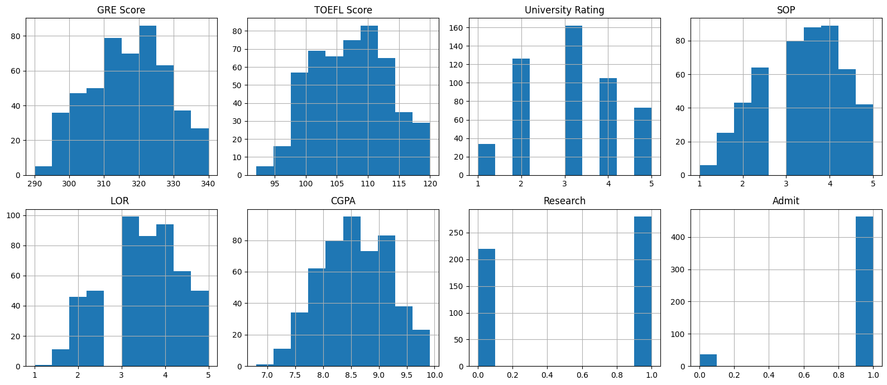
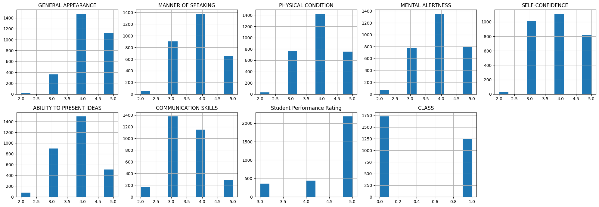
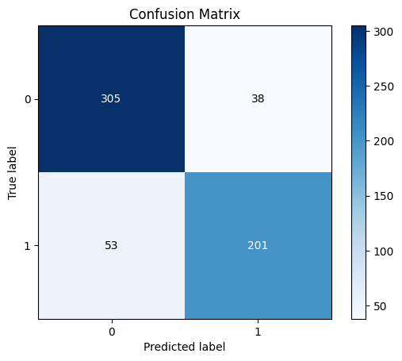
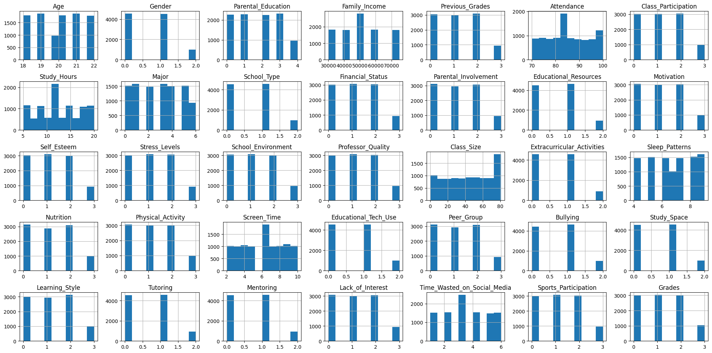
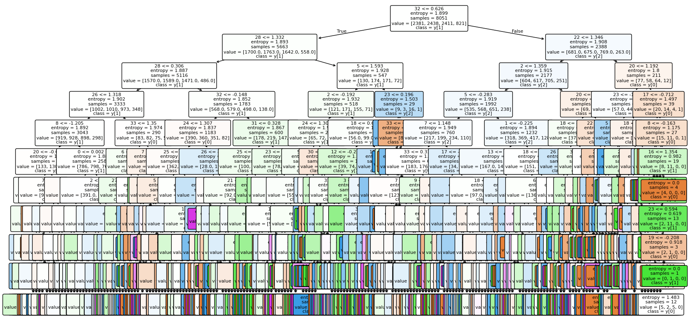
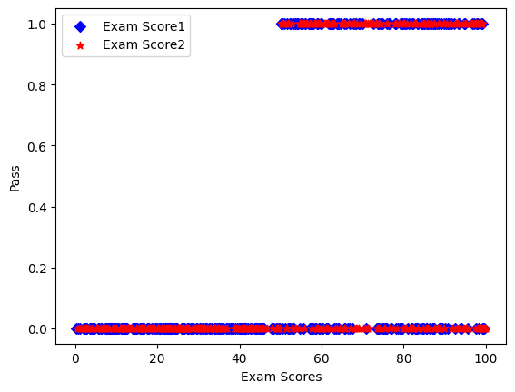
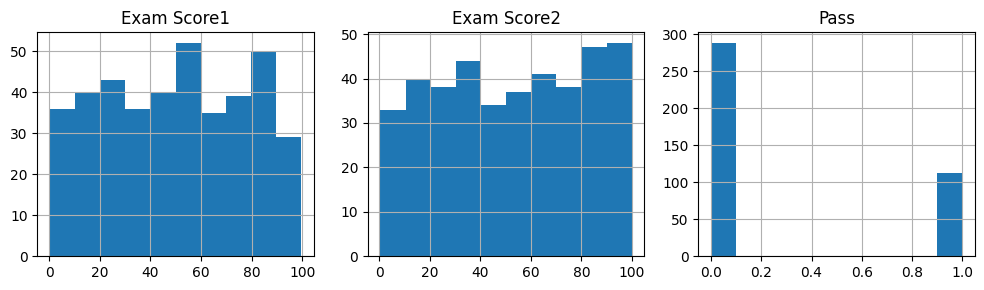
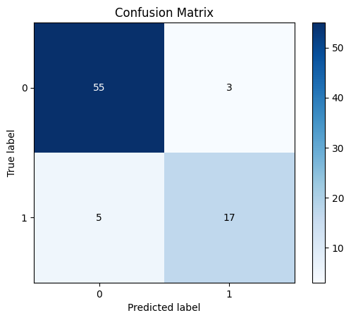
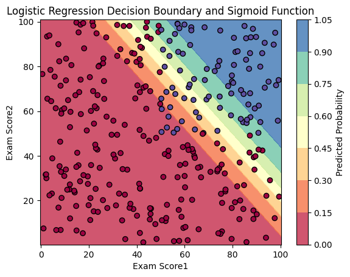
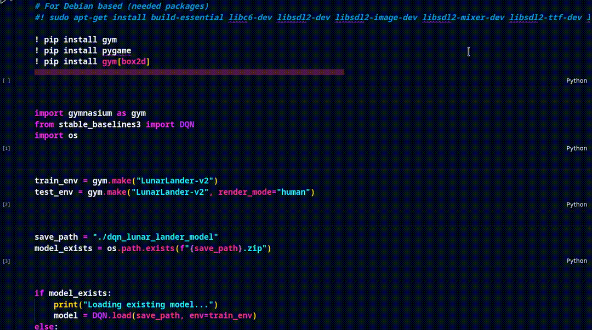

# Artificial Intelligence Exercises

In this GitHub repository, I have worked on various aspects of artificial intelligence, organized into four main folders.

The [Machine Learning (ML)](ML) section covers fundamental techniques such as classification, clustering, recommender systems, and regression.

The [Deep Learning (DL)](DL) folder includes projects like digit classification, a recommender system using neural networks, and both binary and multi-class classification with Fastai.

Additionally, the [Reinforcement Learning (RL)](RL) section features a project utilizing Deep Q-Networks (DQN) for the Lunar Lander environment.

Lastly, there is a [web scraper](web_scraper) for data collection purposes.

<hr>

### Projects:
*(Click on each section to see the list of units)*

<details>
    <summary>ML Projects:</summary>
    <ul>
    <br>
      <li>
        KNN: <a href="ML/classification/KNN/knn.ipynb">Jupyter Source Code</a>
        <br>
        This project implements a K-Nearest Neighbors (KNN) classifier to predict university admission outcomes based on various academic scores.
        <br><br>
        The shape of data:<br>
        
        <br><br>
        The result:<br>
        
      </li>
      <br><br>
      <li>
        SVM: <a href="ML/classification/SVM/svm.ipynb">Jupyter Source Code</a>
        <br>
        This project focuses on evaluating student performance using various factors such as General Appearance, Manner of Speaking, and Communication Skills.
        <br><br>
        The shape of data:<br>
        
        <br><br>
        The result:<br>
        
      </li>
      <br><br>
      <li>
        decision_tree: <a href="ML/classification/decision_tree/decision_tree.ipynb">Jupyter Source Code</a>
        <br>
        This project implements a Decision Tree Classifier to predict student grades based on various educational factors.
      <br><br>
        The shape of data:<br>
        
        <br><br>
        The result:<br>
        
      </li>
      <br><br>
      <li>
        logistic_regression: <a href="ML/classification/logistic_regression/logistic_regression.ipynb">Jupyter Source Code</a>
        <br>
        This project implements a logistic regression model to classify data based on two exam scores. 
        <br><br>
        The shape of data:<br>
        
        
        
        <br><br>
        The result:<br>
        
        
      </li>
    </ul>
</details>

<details>
    <summary>DL Projects:</summary>
    <ul>
    <br>
      <li>
        Cat-Dog Binary Classification: <a href="DL/fastai_Binary_Classification/cat_dog_classification.ipynb">Jupyter Source Code</a>
        <br>
        This project utilizes FastAI to develop a binary classification model, leveraging the power of ResNet34 architecture. By implementing fine-tuning techniques, we achieved an impressive error rate of 0.004736
      </li>
      <br><br>
      <li>
         Multi Class Classification: <a href="DL/fastai_multi_class_Classification/image_classification.ipynb">Jupyter Source Code</a>
        <br>
         This project utilizes FastAI for multi-class classification by fine-tuning a ResNet34 model to achieve over 95% accuracy on new images. To enhance the dataset, a web scraper was implemented to automatically download images of new classes directly from Google Search, ensuring a diverse and comprehensive training set. 
        </li>
      <br><br>
      <li>
        Digit Classification: <a href="DL/digit_Classification/digit_classification.ipynb">Jupyter Source Code</a>
        <br>
        This project focuses on classifying handwritten digits from the MNIST dataset. Initially, a baseline model was developed, where simple objects representing each digit class were created based on their average features. Each test sample was then compared against these baseline classes for classification. Building upon this, a Neural Network (NN) model was implemented using a fine-tuning approach, enhancing the accuracy of digit classification. Finally, an NN model was constructed from scratch, showcasing a deep understanding of the architecture and training processes. The culmination of these efforts resulted in an impressive accuracy of over 99% for each digit class, demonstrating the effectiveness of the implemented methods.
      </li>
      <br><br>
    </ul>
</details>

<details>
    <summary>RL Project:</summary>
    <ul>
    <br>
      <li>
        DQN_LunarLander-v2: <a href="RL/DQN_LunarLander-v2/DQN_LunarLander-v2.ipynb">Jupyter Source Code</a>
        <br>
         This project implements a Deep Q-Network (DQN) to solve the LunarLander-v2 environment using OpenAI's Gym and Stable Baselines3. The agent is trained over 2,000,000 timesteps to learn optimal landing strategies, achieving an average reward of approximately 267 across 10 test episodes. 
         <br><br>
         The reesult:
         
      </li>
    </ul>
</details>

<details>
    <summary>The Web Scraper Script:</summary>
    <ul>
      <li>
          <a href="DL/fastai_Binary_Classification/cat_dog_classification.ipynb">Python Source Code</a>
      <br>
This Python script allows you to download images from Google Image Search based on a specified search term. It uses popular libraries such as requests, BeautifulSoup, and Pillow to fetch and save images efficiently. 

### Requirements
Make sure to have the following libraries installed:
```bash
pip install requests beautifulsoup4 pillow
```

### Features
- Customizable Image Search: Specify the search term and the number of images to download.
- Error Handling: Retries downloading each image up to five times if an error occurs.
- Configurable Sleep Time: Set a delay between image downloads to avoid overwhelming the server.
- Organized Storage: Downloads are saved in a specified directory, which is created if it doesn't exist.

The features default parameters

```python
  def download_images(search_term: str, num_images: int = 5, sleep_time: float = 1.0,
                       target_path: str = "downloaded_images")
```
</details>

<hr>

Also my ML and DL courses assignments are available in [Sharif-University-ML-DL-RayanCourse_Assignments](https://github.com/arsalanyavari/Sharif-University-ML-DL-RayanCourse_Assignments) repository that includes:
<details>
    <summary>
      Exploratory Data Analysis (EDA), Data Preprocessing, Logistic Regression and Unsupervised Image Segmentation using Clustering
      <a href="https://github.com/arsalanyavari/Sharif-University-ML-DL-RayanCourse_Assignments/blob/main/Homework_1_Student_Version.ipynb">Jupyter Source Code</a>
    </summary>
    <ul>
      <li>
  <br>
  The main image:
  <br>
  
  <br><br>
  The classes:
  <br>
    
    
  <br><br>
  The result:
  <br>
    
  <br>
      </li>
    </ul>
</details>

<details>
    <summary>
      Nural Network, Binary Classification, Image Classification and data transformation & normalization
      <a href="https://github.com/arsalanyavari/Sharif-University-ML-DL-RayanCourse_Assignments/blob/main/Homework_2_Student_Version.ipynb">Jupyter Source Code</a>
    </summary>
    <ul>
      <li>
  The Binary Classification Data Plot:
  <br>
  
  <br>
  The classes:
  <br>
    
  <br>
  Data Transformation and Normalization:
  <br>
    
    
    
    
    
    
    
  <br>
  The CNN Model Performance:
    
    
      </li>
    </ul>
</details>

<details>
    <summary>
      Variational Autoencoder (VAE) Implementation and Stable Diffusion
      <a href="https://github.com/arsalanyavari/Sharif-University-ML-DL-RayanCourse_Assignments/blob/main/Homework_3_Student_Version.ipynb">Jupyter Source Code</a>
    </summary>
    <ul>
      <li>
  <br>
  The VAE original image: 
  <br>
  
  <br><br>
  The VAE reconstruction:
  <br>
    
  <br><br>
  2D Latent Space:
  <br>
    
  <br><br>
  The Stable Diffusion rsult based on "a photograph of an astronaut riding a horse" prompt:
  <br>
    
  <br>    
      </li>
    </ul>
</details>
