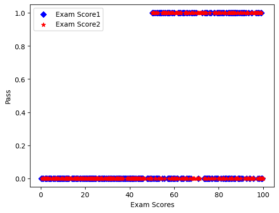
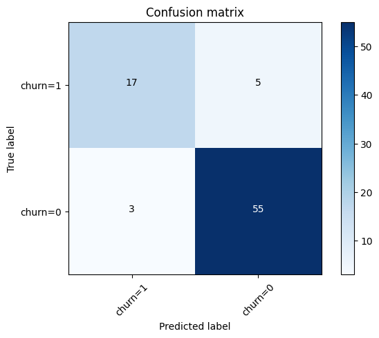
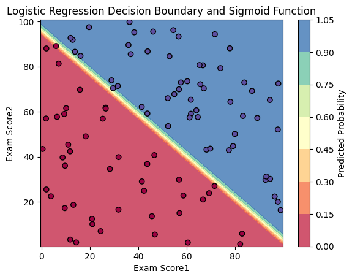

# Non Linear Regression

Configure the project. Indeed you create a dataset in csv format.


```python
! rm -rf *.csv
! unzip ./dataset/archive.zip
! head -n 1 *.csv | head -n 2 | tail -n 1 > data.csv && for file in *.csv; do (tail -n +2 "$file"; echo) >> data.csv; done && sed -i '/^$/d' data.csv
```

    Archive:  ./dataset/archive.zip
      inflating: exam_scores (1).csv     


Import needed libraries


```python
import matplotlib.pyplot as plt
import pandas as pd
import numpy as np
from sklearn.model_selection import train_test_split
from sklearn import linear_model
from sklearn.metrics import confusion_matrix, jaccard_score, accuracy_score

%matplotlib inline
```

Read data from data.csv using pandas and store in data frame structure. Also shuffle data to have uniform distribution. 


```python
df = pd.read_csv("data.csv")
df = df.sample(frac=1.0, random_state=42).reset_index(drop=True)
df.head()
```


<div>
<style scoped>
    .dataframe tbody tr th:only-of-type {
        vertical-align: middle;
    }

    .dataframe tbody tr th {
        vertical-align: top;
    }

    .dataframe thead th {
        text-align: right;
    }
</style>
<table border="1" class="dataframe">
  <thead>
    <tr style="text-align: right;">
      <th></th>
      <th>Exam Score1</th>
      <th>Exam Score2</th>
      <th>Pass</th>
    </tr>
  </thead>
  <tbody>
    <tr>
      <th>0</th>
      <td>86.40</td>
      <td>9.94</td>
      <td>0</td>
    </tr>
    <tr>
      <th>1</th>
      <td>74.60</td>
      <td>66.55</td>
      <td>1</td>
    </tr>
    <tr>
      <th>2</th>
      <td>14.13</td>
      <td>23.67</td>
      <td>0</td>
    </tr>
    <tr>
      <th>3</th>
      <td>36.05</td>
      <td>33.85</td>
      <td>0</td>
    </tr>
    <tr>
      <th>4</th>
      <td>37.02</td>
      <td>16.80</td>
      <td>0</td>
    </tr>
  </tbody>
</table>
</div>


```python
# summarize data
df.describe() 
```


<div>
<style scoped>
    .dataframe tbody tr th:only-of-type {
        vertical-align: middle;
    }

    .dataframe tbody tr th {
        vertical-align: top;
    }

    .dataframe thead th {
        text-align: right;
    }
</style>
<table border="1" class="dataframe">
  <thead>
    <tr style="text-align: right;">
      <th></th>
      <th>Exam Score1</th>
      <th>Exam Score2</th>
      <th>Pass</th>
    </tr>
  </thead>
  <tbody>
    <tr>
      <th>count</th>
      <td>400.000000</td>
      <td>400.000000</td>
      <td>400.000000</td>
    </tr>
    <tr>
      <th>mean</th>
      <td>49.812650</td>
      <td>52.264925</td>
      <td>0.280000</td>
    </tr>
    <tr>
      <th>std</th>
      <td>28.141381</td>
      <td>29.348627</td>
      <td>0.449561</td>
    </tr>
    <tr>
      <th>min</th>
      <td>0.240000</td>
      <td>0.460000</td>
      <td>0.000000</td>
    </tr>
    <tr>
      <th>25%</th>
      <td>24.010000</td>
      <td>27.070000</td>
      <td>0.000000</td>
    </tr>
    <tr>
      <th>50%</th>
      <td>50.735000</td>
      <td>53.180000</td>
      <td>0.000000</td>
    </tr>
    <tr>
      <th>75%</th>
      <td>75.442500</td>
      <td>78.900000</td>
      <td>1.000000</td>
    </tr>
    <tr>
      <th>max</th>
      <td>99.640000</td>
      <td>99.990000</td>
      <td>1.000000</td>
    </tr>
  </tbody>
</table>
</div>


Print the histogram chart of data


```python
viz = df[["Exam Score1", "Exam Score2", "Pass"]]

fig, axes = plt.subplots(1, 3, figsize=(10, 3))

viz["Exam Score1"].hist(ax=axes[0])
axes[0].set_title('Exam Score1')
viz["Exam Score2"].hist(ax=axes[1])
axes[1].set_title('Exam Score2')
viz["Pass"].hist(ax=axes[2])
axes[2].set_title('Pass')
plt.tight_layout()
plt.show()
```


    

    


Print scatter plot of data to recognize the patterns of data.


```python
plt.scatter(df["Exam Score1"], df.Pass, color="blue", label="Exam Score1", marker='D')
plt.scatter(df["Exam Score2"], df.Pass, color="red", label="Exam Score2", marker='*')
plt.ylabel("Pass")
plt.xlabel("Exam Scores")
plt.legend()
plt.show()
```


    

    


```python
# print(df)
train, test = train_test_split(df, test_size=0.20, random_state=42)
# test, evaluate = train_test_split(test, test_size=0.5, random_state=42)
```


```python
fig, (ax1, ax2) = plt.subplots(1, 2, figsize=(12, 5))

# First subplot for "Exam Score1" vs "Pass"
ax1.scatter(train["Exam Score1"], train.Pass, color="blue", label="Train", marker='o')
ax1.scatter(test["Exam Score1"], test.Pass, color="red", label="Test", marker='*')
ax1.set_ylabel("Pass")
ax1.set_xlabel("Exam Score1")
ax1.set_title("Exam Score1 vs Pass")

# Second subplot for "Exam Score2" vs "Pass"
ax2.scatter(train["Exam Score2"], train.Pass, color="blue", label="Train", marker='o')
ax2.scatter(test["Exam Score2"], test.Pass, color="red", label="Test", marker='*')
ax2.set_ylabel("Pass")
ax2.set_xlabel("Exam Score2")
ax2.set_title("Exam Score2 vs Pass")

# Display the plots
plt.tight_layout()
plt.show()
```


    

    


Find the best fitted line based on distribution of data. 


```python
train_x = np.asanyarray(train[['Exam Score1', 'Exam Score2']])
train_y = np.asanyarray(train[['Pass']])

# Converting to 1D array
train_y = train_y.ravel()  # or train_y = train_y.flatten()

reg = linear_model.LogisticRegression(C=1, solver="lbfgs")
reg.fit(train_x, train_y)

print("Coefficients:\t", reg.coef_)
print("Intercept:\t", reg.intercept_)
```

    Coefficients:	 [[0.12 0.1 ]]
    Intercept:	 [-14.03]


Compare predicted answers with real answers...


```python
test_x = np.asanyarray(test[['Exam Score1', 'Exam Score2']])
test_y = np.asanyarray(test[['Pass']])
test_y = test_y.ravel()  # or train_y = train_y.flatten()

test_y_ = reg.predict(test_x)
test_y_prob = reg.predict_proba(test_x)
test_y_prob = test_y_prob.ravel()

print("Predicted values:")
print(test_y_)
print("\nReal values:")
print(test_y)
print("\nProbability of each case:")
print(test_y_prob)
```

    Predicted values:
    [1 0 0 1 0 0 0 1 0 0 0 0 0 0 1 1 1 0 0 0 1 0 0 1 0 0 0 0 1 0 0 0 0 0 1 0 0
     1 0 0 1 1 0 1 0 0 0 1 0 0 0 0 0 0 0 0 1 1 0 0 0 0 0 0 0 0 1 0 1 0 0 0 0 0
     0 0 0 0 1 0]
    
    Real values:
    [1 0 0 1 0 0 0 1 1 0 0 0 0 0 1 0 0 0 0 0 0 0 0 1 0 0 0 0 1 0 0 0 0 0 1 1 0
     1 0 0 1 1 0 1 1 0 0 1 1 0 0 0 0 0 0 0 1 1 0 0 0 0 0 0 0 0 1 0 1 0 0 0 0 0
     0 0 1 0 1 0]
    
    Probability of each case:
    [3.48e-02 9.65e-01 9.63e-01 3.69e-02 9.28e-01 7.16e-02 2.86e-03 9.97e-01
     1.00e+00 1.14e-05 7.79e-01 2.21e-01 8.33e-01 1.67e-01 2.00e-03 9.98e-01
     6.84e-01 3.16e-01 1.00e+00 2.45e-04 1.00e+00 3.24e-05 9.79e-01 2.13e-02
     9.72e-01 2.76e-02 1.00e+00 2.64e-05 5.12e-02 9.49e-01 1.51e-01 8.49e-01
     3.21e-01 6.79e-01 9.87e-01 1.29e-02 9.99e-01 7.32e-04 8.65e-01 1.35e-01
     3.52e-01 6.48e-01 9.21e-01 7.94e-02 9.51e-01 4.93e-02 8.77e-03 9.91e-01
     9.42e-01 5.78e-02 8.98e-01 1.02e-01 6.76e-01 3.24e-01 9.64e-01 3.55e-02
     2.35e-02 9.77e-01 7.71e-01 2.29e-01 1.00e+00 1.25e-06 9.86e-01 1.38e-02
     1.00e+00 6.52e-05 1.00e+00 4.75e-04 3.91e-02 9.61e-01 7.68e-01 2.32e-01
     7.43e-01 2.57e-01 3.48e-02 9.65e-01 7.71e-01 2.29e-01 9.99e-01 1.02e-03
     1.64e-02 9.84e-01 4.70e-02 9.53e-01 9.79e-01 2.11e-02 2.37e-01 7.63e-01
     7.40e-01 2.60e-01 9.99e-01 8.49e-04 9.10e-01 9.04e-02 6.70e-03 9.93e-01
     8.56e-01 1.44e-01 9.91e-01 8.86e-03 9.99e-01 1.16e-03 9.99e-01 1.08e-03
     5.24e-01 4.76e-01 1.00e+00 4.61e-06 9.97e-01 2.55e-03 9.93e-01 7.18e-03
     1.20e-02 9.88e-01 5.94e-03 9.94e-01 1.00e+00 4.24e-04 5.82e-01 4.18e-01
     9.42e-01 5.76e-02 8.96e-01 1.04e-01 9.65e-01 3.49e-02 1.00e+00 1.61e-05
     5.49e-01 4.51e-01 5.14e-01 4.86e-01 2.36e-01 7.64e-01 1.00e+00 1.60e-04
     5.89e-02 9.41e-01 8.78e-01 1.22e-01 9.99e-01 9.84e-04 1.00e+00 1.06e-05
     9.56e-01 4.43e-02 9.91e-01 9.29e-03 1.00e+00 3.75e-04 9.60e-01 3.95e-02
     5.94e-01 4.06e-01 1.00e+00 4.21e-04 3.03e-01 6.97e-01 1.00e+00 2.42e-04]


### The jaccard score:


```python
print("The jaccard score for 0's:")
print(jaccard_score(test_y, test_y_, pos_label=0))
print("\nThe jaccard score for 1's:")
print(jaccard_score(test_y, test_y_, pos_label=1))
```

    The jaccard score for 0's:
    0.873015873015873
    
    The jaccard score for 1's:
    0.68


### Confusion Matrix: 


```python
from sklearn.metrics import classification_report, confusion_matrix
import itertools
def plot_confusion_matrix(cm, classes,
                          normalize=False,
                          title='Confusion matrix',
                          cmap=plt.cm.Blues):
    """
    This function prints and plots the confusion matrix.
    Normalization can be applied by setting `normalize=True`.
    """
    if normalize:
        cm = cm.astype('float') / cm.sum(axis=1)[:, np.newaxis]
        print("Normalized confusion matrix")
    else:
        print('Confusion matrix, without normalization')

    print(cm)

    plt.imshow(cm, interpolation='nearest', cmap=cmap)
    plt.title(title)
    plt.colorbar()
    tick_marks = np.arange(len(classes))
    plt.xticks(tick_marks, classes, rotation=45)
    plt.yticks(tick_marks, classes)

    fmt = '.2f' if normalize else 'd'
    thresh = cm.max() / 2.
    for i, j in itertools.product(range(cm.shape[0]), range(cm.shape[1])):
        plt.text(j, i, format(cm[i, j], fmt),
                 horizontalalignment="center",
                 color="white" if cm[i, j] > thresh else "black")

    plt.tight_layout()
    plt.ylabel('True label')
    plt.xlabel('Predicted label')
print(confusion_matrix(test_y, test_y_, labels=[1,0]))
```

    [[17  5]
     [ 3 55]]


Print confusion matrix


```python
cnf_matrix = confusion_matrix(test_y, test_y_, labels=[1,0])
np.set_printoptions(precision=2)


# Plot non-normalized confusion matrix
plt.figure()
plot_confusion_matrix(cnf_matrix, classes=['churn=1','churn=0'],normalize= False,  title='Confusion matrix')
```

    Confusion matrix, without normalization
    [[17  5]
     [ 3 55]]


    

    


```python
print (classification_report(test_y, test_y_))
TN, FP, FN, TP = cnf_matrix.ravel()
specificity = TN / (TN + FP)
print('Specificity:', specificity)
print('Accuracy:', accuracy_score(test_y, test_y_))
```

                  precision    recall  f1-score   support
    
               0       0.92      0.95      0.93        58
               1       0.85      0.77      0.81        22
    
        accuracy                           0.90        80
       macro avg       0.88      0.86      0.87        80
    weighted avg       0.90      0.90      0.90        80
    
    Specificity: 0.7727272727272727
    Accuracy: 0.9


## Result


```python
x_min, x_max = train_x[:, 0].min() - 1, train_x[:, 0].max() + 1
y_min, y_max = train_x[:, 1].min() - 1, train_x[:, 1].max() + 1
xx, yy = np.meshgrid(np.linspace(x_min, x_max, 100),
                     np.linspace(y_min, y_max, 100))

# Compute the probabilities (sigmoid function)
Z = reg.predict_proba(np.c_[xx.ravel(), yy.ravel()])[:, 1]
Z = Z.reshape(xx.shape)

# Plot the decision boundary
plt.contourf(xx, yy, Z, alpha=0.8, cmap=plt.cm.Spectral)
plt.colorbar(label='Predicted Probability')

# Scatter plot of the original data points
plt.scatter(train_x[:, 0], train_x[:, 1], c=train_y, edgecolors='k', marker='o', cmap=plt.cm.Spectral)

plt.xlabel('Exam Score1')
plt.ylabel('Exam Score2')
plt.title('Logistic Regression Decision Boundary and Sigmoid Function')

plt.show()
```


    

    

