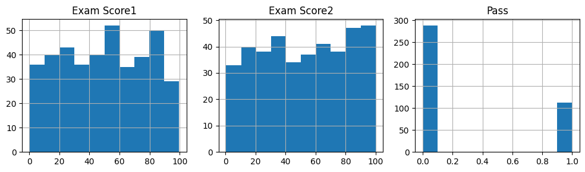

# Non Linear Regression

Configure the project. Indeed you create a dataset in csv format.


```python
! rm -rf *.csv
! unzip ./dataset/archive.zip
! head -n 1 *.csv | head -n 2 | tail -n 1 > data.csv && for file in *.csv; do (tail -n +2 "$file"; echo) >> data.csv; done && sed -i '/^$/d' data.csv
```

    Archive:  ./dataset/archive.zip
      inflating: exam_scores (1).csv     


Import needed libraries


```python
import matplotlib.pyplot as plt
import pandas as pd
import numpy as np
from sklearn.model_selection import train_test_split
from sklearn import linear_model
from sklearn.metrics import confusion_matrix, jaccard_score, accuracy_score

%matplotlib inline
```

Read data from data.csv using pandas and store in data frame structure. Also shuffle data to have uniform distribution. 


```python
df = pd.read_csv("data.csv")
df = df.sample(frac=1.0, random_state=42).reset_index(drop=True)
df.head()
```


<div>
<style scoped>
    .dataframe tbody tr th:only-of-type {
        vertical-align: middle;
    }

    .dataframe tbody tr th {
        vertical-align: top;
    }

    .dataframe thead th {
        text-align: right;
    }
</style>
<table border="1" class="dataframe">
  <thead>
    <tr style="text-align: right;">
      <th></th>
      <th>Exam Score1</th>
      <th>Exam Score2</th>
      <th>Pass</th>
    </tr>
  </thead>
  <tbody>
    <tr>
      <th>0</th>
      <td>86.40</td>
      <td>9.94</td>
      <td>0</td>
    </tr>
    <tr>
      <th>1</th>
      <td>74.60</td>
      <td>66.55</td>
      <td>1</td>
    </tr>
    <tr>
      <th>2</th>
      <td>14.13</td>
      <td>23.67</td>
      <td>0</td>
    </tr>
    <tr>
      <th>3</th>
      <td>36.05</td>
      <td>33.85</td>
      <td>0</td>
    </tr>
    <tr>
      <th>4</th>
      <td>37.02</td>
      <td>16.80</td>
      <td>0</td>
    </tr>
  </tbody>
</table>
</div>


```python
# summarize data
df.describe() 
```


<div>
<style scoped>
    .dataframe tbody tr th:only-of-type {
        vertical-align: middle;
    }

    .dataframe tbody tr th {
        vertical-align: top;
    }

    .dataframe thead th {
        text-align: right;
    }
</style>
<table border="1" class="dataframe">
  <thead>
    <tr style="text-align: right;">
      <th></th>
      <th>Exam Score1</th>
      <th>Exam Score2</th>
      <th>Pass</th>
    </tr>
  </thead>
  <tbody>
    <tr>
      <th>count</th>
      <td>400.000000</td>
      <td>400.000000</td>
      <td>400.000000</td>
    </tr>
    <tr>
      <th>mean</th>
      <td>49.812650</td>
      <td>52.264925</td>
      <td>0.280000</td>
    </tr>
    <tr>
      <th>std</th>
      <td>28.141381</td>
      <td>29.348627</td>
      <td>0.449561</td>
    </tr>
    <tr>
      <th>min</th>
      <td>0.240000</td>
      <td>0.460000</td>
      <td>0.000000</td>
    </tr>
    <tr>
      <th>25%</th>
      <td>24.010000</td>
      <td>27.070000</td>
      <td>0.000000</td>
    </tr>
    <tr>
      <th>50%</th>
      <td>50.735000</td>
      <td>53.180000</td>
      <td>0.000000</td>
    </tr>
    <tr>
      <th>75%</th>
      <td>75.442500</td>
      <td>78.900000</td>
      <td>1.000000</td>
    </tr>
    <tr>
      <th>max</th>
      <td>99.640000</td>
      <td>99.990000</td>
      <td>1.000000</td>
    </tr>
  </tbody>
</table>
</div>


Print the histogram chart of data


```python
viz = df[["Exam Score1", "Exam Score2", "Pass"]]

fig, axes = plt.subplots(1, 3, figsize=(10, 3))

viz["Exam Score1"].hist(ax=axes[0])
axes[0].set_title('Exam Score1')
viz["Exam Score2"].hist(ax=axes[1])
axes[1].set_title('Exam Score2')
viz["Pass"].hist(ax=axes[2])
axes[2].set_title('Pass')
plt.tight_layout()
plt.show()
```


    

    


Print scatter plot of data to recognize the patterns of data.


```python
plt.scatter(df["Exam Score1"], df.Pass, color="blue", label="Exam Score1", marker='D')
plt.scatter(df["Exam Score2"], df.Pass, color="red", label="Exam Score2", marker='*')
plt.ylabel("Pass")
plt.xlabel("Exam Scores")
plt.legend()
plt.show()
```


    

    


```python
# print(df)
train, test = train_test_split(df, test_size=0.20, random_state=42)
# test, evaluate = train_test_split(test, test_size=0.5, random_state=42)
```


```python
fig, (ax1, ax2) = plt.subplots(1, 2, figsize=(12, 5))

# First subplot for "Exam Score1" vs "Pass"
ax1.scatter(train["Exam Score1"], train.Pass, color="blue", label="Train", marker='o')
ax1.scatter(test["Exam Score1"], test.Pass, color="red", label="Test", marker='*')
ax1.set_ylabel("Pass")
ax1.set_xlabel("Exam Score1")
ax1.set_title("Exam Score1 vs Pass")

# Second subplot for "Exam Score2" vs "Pass"
ax2.scatter(train["Exam Score2"], train.Pass, color="blue", label="Train", marker='o')
ax2.scatter(test["Exam Score2"], test.Pass, color="red", label="Test", marker='*')
ax2.set_ylabel("Pass")
ax2.set_xlabel("Exam Score2")
ax2.set_title("Exam Score2 vs Pass")

# Display the plots
plt.tight_layout()
plt.show()
```


    

    


Find the best fitted line based on distribution of data. 


```python
train_x = np.asanyarray(train[['Exam Score1', 'Exam Score2']])
train_y = np.asanyarray(train[['Pass']])

# Converting to 1D array
train_y = train_y.ravel()  # or train_y = train_y.flatten()

reg = linear_model.LogisticRegression(C=1, solver="lbfgs", max_iter=10000)
reg.fit(train_x, train_y)

print("Coefficients:\t", reg.coef_)
print("Intercept:\t", reg.intercept_)
```

    Coefficients:	 [[0.11863908 0.09905547]]
    Intercept:	 [-14.02571281]


Compare predicted answers with real answers...


```python
test_x = np.asanyarray(test[['Exam Score1', 'Exam Score2']])
test_y = np.asanyarray(test[['Pass']])
test_y = test_y.ravel()  # or train_y = train_y.flatten()

test_y_ = reg.predict(test_x)
test_y_prob = reg.predict_proba(test_x)
test_y_prob = test_y_prob.ravel()

print("Predicted values:")
print(test_y_)
print("\nReal values:")
print(test_y)
print("\nProbability of each case:")
print(test_y_prob)
```

    Predicted values:
    [1 0 0 1 0 0 0 1 0 0 0 0 0 0 1 1 1 0 0 0 1 0 0 1 0 0 0 0 1 0 0 0 0 0 1 0 0
     1 0 0 1 1 0 1 0 0 0 1 0 0 0 0 0 0 0 0 1 1 0 0 0 0 0 0 0 0 1 0 1 0 0 0 0 0
     0 0 0 0 1 0]
    
    Real values:
    [1 0 0 1 0 0 0 1 1 0 0 0 0 0 1 0 0 0 0 0 0 0 0 1 0 0 0 0 1 0 0 0 0 0 1 1 0
     1 0 0 1 1 0 1 1 0 0 1 1 0 0 0 0 0 0 0 1 1 0 0 0 0 0 0 0 0 1 0 1 0 0 0 0 0
     0 0 1 0 1 0]
    
    Probability of each case:
    [3.48123854e-02 9.65187615e-01 9.63136266e-01 3.68637343e-02
     9.28384640e-01 7.16153599e-02 2.86076579e-03 9.97139234e-01
     9.99988632e-01 1.13675741e-05 7.78741519e-01 2.21258481e-01
     8.33130838e-01 1.66869162e-01 1.99505332e-03 9.98004947e-01
     6.83942898e-01 3.16057102e-01 9.99755242e-01 2.44758102e-04
     9.99967626e-01 3.23743551e-05 9.78670134e-01 2.13298658e-02
     9.72410936e-01 2.75890645e-02 9.99973602e-01 2.63978660e-05
     5.11837344e-02 9.48816266e-01 1.51108582e-01 8.48891418e-01
     3.20821873e-01 6.79178127e-01 9.87080146e-01 1.29198535e-02
     9.99267817e-01 7.32182667e-04 8.64539120e-01 1.35460880e-01
     3.52138424e-01 6.47861576e-01 9.20550796e-01 7.94492045e-02
     9.50702704e-01 4.92972960e-02 8.76735820e-03 9.91232642e-01
     9.42170392e-01 5.78296082e-02 8.98205052e-01 1.01794948e-01
     6.76438490e-01 3.23561510e-01 9.64491170e-01 3.55088301e-02
     2.34946901e-02 9.76505310e-01 7.70824033e-01 2.29175967e-01
     9.99998750e-01 1.25032903e-06 9.86192166e-01 1.38078342e-02
     9.99934843e-01 6.51567545e-05 9.99525306e-01 4.74693847e-04
     3.91142348e-02 9.60885765e-01 7.67853249e-01 2.32146751e-01
     7.42849600e-01 2.57150400e-01 3.48076495e-02 9.65192351e-01
     7.71188124e-01 2.28811876e-01 9.98976912e-01 1.02308772e-03
     1.64029279e-02 9.83597072e-01 4.70483261e-02 9.52951674e-01
     9.78913296e-01 2.10867042e-02 2.37277966e-01 7.62722034e-01
     7.40497639e-01 2.59502361e-01 9.99150654e-01 8.49345751e-04
     9.09575607e-01 9.04243928e-02 6.70443832e-03 9.93295562e-01
     8.56465729e-01 1.43534271e-01 9.91138468e-01 8.86153222e-03
     9.98840090e-01 1.15990990e-03 9.98920546e-01 1.07945375e-03
     5.24388881e-01 4.75611119e-01 9.99995392e-01 4.60760973e-06
     9.97450091e-01 2.54990948e-03 9.92818475e-01 7.18152496e-03
     1.20073082e-02 9.87992692e-01 5.94297395e-03 9.94057026e-01
     9.99576026e-01 4.23974124e-04 5.82494862e-01 4.17505138e-01
     9.42448558e-01 5.75514420e-02 8.96014225e-01 1.03985775e-01
     9.65107822e-01 3.48921779e-02 9.99983881e-01 1.61185215e-05
     5.48805932e-01 4.51194068e-01 5.13959536e-01 4.86040464e-01
     2.35686681e-01 7.64313319e-01 9.99840159e-01 1.59841133e-04
     5.88984445e-02 9.41101555e-01 8.78481110e-01 1.21518890e-01
     9.99015702e-01 9.84298166e-04 9.99989361e-01 1.06391746e-05
     9.55661639e-01 4.43383608e-02 9.90708401e-01 9.29159949e-03
     9.99625090e-01 3.74910187e-04 9.60485263e-01 3.95147368e-02
     5.94373006e-01 4.05626994e-01 9.99578509e-01 4.21491164e-04
     3.03189992e-01 6.96810008e-01 9.99757501e-01 2.42499494e-04]


### The jaccard score:


```python
print("The jaccard score for 0's:")
print(jaccard_score(test_y, test_y_, pos_label=0))
print("\nThe jaccard score for 1's:")
print(jaccard_score(test_y, test_y_, pos_label=1))
```

    The jaccard score for 0's:
    0.873015873015873
    
    The jaccard score for 1's:
    0.68


### Confusion Matrix: 


```python
from sklearn.metrics import classification_report, confusion_matrix, precision_score, recall_score

import scikitplot as skplt

accuracy = accuracy_score(test_y_, test_y_)
precision = precision_score(test_y, test_y_)
recall = recall_score(test_y, test_y_)


print("Logistic Regression Classification Report:")
print(classification_report(test_y, test_y_))

print("Logistic Regression Confusion Matrix:")
skplt.metrics.plot_confusion_matrix(test_y, test_y_)
```

    Logistic Regression Classification Report:
                  precision    recall  f1-score   support
    
               0       0.92      0.95      0.93        58
               1       0.85      0.77      0.81        22
    
        accuracy                           0.90        80
       macro avg       0.88      0.86      0.87        80
    weighted avg       0.90      0.90      0.90        80
    
    Logistic Regression Confusion Matrix:


    <Axes: title={'center': 'Confusion Matrix'}, xlabel='Predicted label', ylabel='True label'>


    

    


```python
print(classification_report(test_y, test_y_))
```

                  precision    recall  f1-score   support
    
               0       0.92      0.95      0.93        58
               1       0.85      0.77      0.81        22
    
        accuracy                           0.90        80
       macro avg       0.88      0.86      0.87        80
    weighted avg       0.90      0.90      0.90        80
    


## Result


```python
x_min, x_max = train_x[:, 0].min() - 1, train_x[:, 0].max() + 1
y_min, y_max = train_x[:, 1].min() - 1, train_x[:, 1].max() + 1
xx, yy = np.meshgrid(np.linspace(x_min, x_max, 100),
                     np.linspace(y_min, y_max, 100))

# Compute the probabilities (sigmoid function)
Z = reg.predict_proba(np.c_[xx.ravel(), yy.ravel()])[:, 1]
Z = Z.reshape(xx.shape)

# Plot the decision boundary
plt.contourf(xx, yy, Z, alpha=0.8, cmap=plt.cm.Spectral)
plt.colorbar(label='Predicted Probability')

# Scatter plot of the original data points
plt.scatter(train_x[:, 0], train_x[:, 1], c=train_y, edgecolors='k', marker='o', cmap=plt.cm.Spectral)

plt.xlabel('Exam Score1')
plt.ylabel('Exam Score2')
plt.title('Logistic Regression Decision Boundary and Sigmoid Function')

plt.show()
```


    

    

