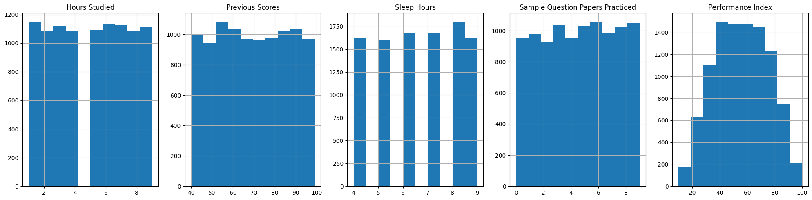
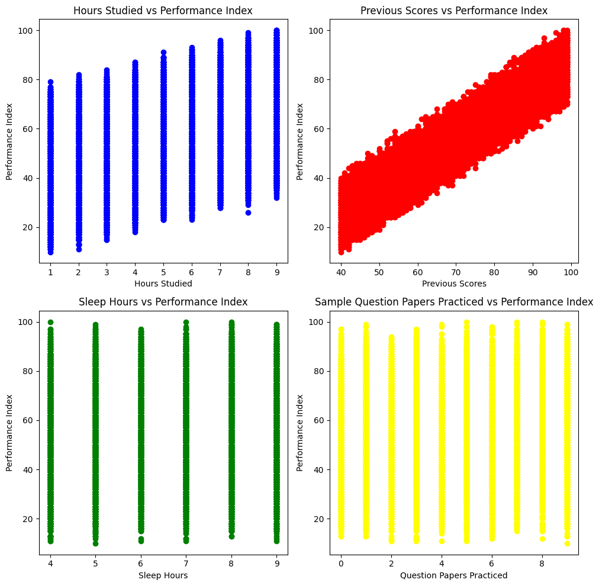
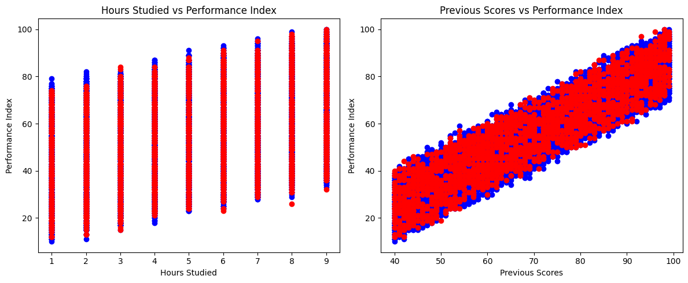
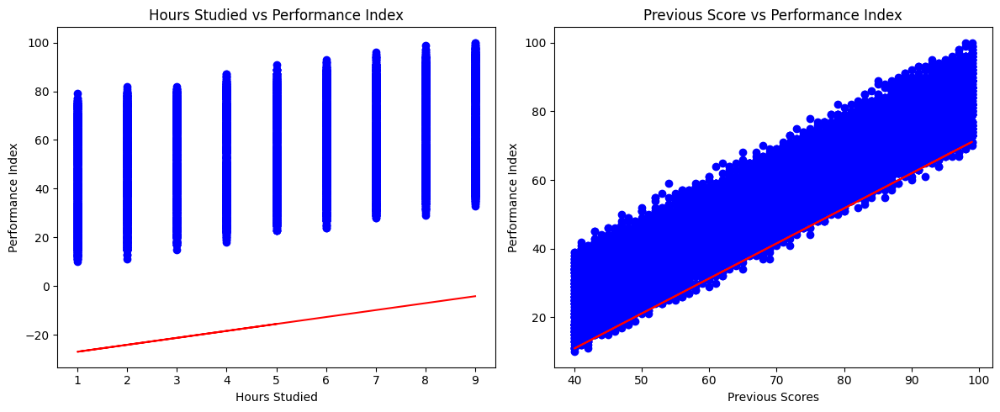

# Multiple Regression

Configure the project. Indeed you create a dataset in csv format.


```python
! rm -rf *.csv
! unzip ./dataset/archive.zip
! head -n 1 *.csv | head -n 2 | tail -n 1 > data.csv && for file in *.csv; do (tail -n +2 "$file"; echo) >> data.csv; done && sed -i '/^$/d' data.csv
```

    Archive:  ./dataset/archive.zip
      inflating: Student_Performance.csv  


Import needed libraries


```python
import matplotlib.pyplot as plt
import pandas as pd
import numpy as np
from sklearn.model_selection import train_test_split
from sklearn import linear_model
from sklearn.metrics import r2_score

%matplotlib inline
```

Read data from data.csv using pandas and store in data frame structure. Also shuffle data to have uniform distribution. 


```python
df = pd.read_csv("data.csv")
df.head()
df = df.sample(frac=1.0, random_state=42).reset_index(drop=True)
df.head()
```


<div>
<style scoped>
    .dataframe tbody tr th:only-of-type {
        vertical-align: middle;
    }

    .dataframe tbody tr th {
        vertical-align: top;
    }

    .dataframe thead th {
        text-align: right;
    }
</style>
<table border="1" class="dataframe">
  <thead>
    <tr style="text-align: right;">
      <th></th>
      <th>Hours Studied</th>
      <th>Previous Scores</th>
      <th>Extracurricular Activities</th>
      <th>Sleep Hours</th>
      <th>Sample Question Papers Practiced</th>
      <th>Performance Index</th>
    </tr>
  </thead>
  <tbody>
    <tr>
      <th>0</th>
      <td>5</td>
      <td>69</td>
      <td>No</td>
      <td>8</td>
      <td>2</td>
      <td>51.0</td>
    </tr>
    <tr>
      <th>1</th>
      <td>2</td>
      <td>46</td>
      <td>Yes</td>
      <td>4</td>
      <td>8</td>
      <td>20.0</td>
    </tr>
    <tr>
      <th>2</th>
      <td>7</td>
      <td>56</td>
      <td>Yes</td>
      <td>7</td>
      <td>5</td>
      <td>46.0</td>
    </tr>
    <tr>
      <th>3</th>
      <td>6</td>
      <td>42</td>
      <td>Yes</td>
      <td>8</td>
      <td>5</td>
      <td>28.0</td>
    </tr>
    <tr>
      <th>4</th>
      <td>7</td>
      <td>53</td>
      <td>No</td>
      <td>4</td>
      <td>6</td>
      <td>41.0</td>
    </tr>
  </tbody>
</table>
</div>


```python
# summarize data
df.describe() 
```


<div>
<style scoped>
    .dataframe tbody tr th:only-of-type {
        vertical-align: middle;
    }

    .dataframe tbody tr th {
        vertical-align: top;
    }

    .dataframe thead th {
        text-align: right;
    }
</style>
<table border="1" class="dataframe">
  <thead>
    <tr style="text-align: right;">
      <th></th>
      <th>Hours Studied</th>
      <th>Previous Scores</th>
      <th>Sleep Hours</th>
      <th>Sample Question Papers Practiced</th>
      <th>Performance Index</th>
    </tr>
  </thead>
  <tbody>
    <tr>
      <th>count</th>
      <td>10000.000000</td>
      <td>10000.000000</td>
      <td>10000.000000</td>
      <td>10000.000000</td>
      <td>10000.000000</td>
    </tr>
    <tr>
      <th>mean</th>
      <td>4.992900</td>
      <td>69.445700</td>
      <td>6.530600</td>
      <td>4.583300</td>
      <td>55.224800</td>
    </tr>
    <tr>
      <th>std</th>
      <td>2.589309</td>
      <td>17.343152</td>
      <td>1.695863</td>
      <td>2.867348</td>
      <td>19.212558</td>
    </tr>
    <tr>
      <th>min</th>
      <td>1.000000</td>
      <td>40.000000</td>
      <td>4.000000</td>
      <td>0.000000</td>
      <td>10.000000</td>
    </tr>
    <tr>
      <th>25%</th>
      <td>3.000000</td>
      <td>54.000000</td>
      <td>5.000000</td>
      <td>2.000000</td>
      <td>40.000000</td>
    </tr>
    <tr>
      <th>50%</th>
      <td>5.000000</td>
      <td>69.000000</td>
      <td>7.000000</td>
      <td>5.000000</td>
      <td>55.000000</td>
    </tr>
    <tr>
      <th>75%</th>
      <td>7.000000</td>
      <td>85.000000</td>
      <td>8.000000</td>
      <td>7.000000</td>
      <td>71.000000</td>
    </tr>
    <tr>
      <th>max</th>
      <td>9.000000</td>
      <td>99.000000</td>
      <td>9.000000</td>
      <td>9.000000</td>
      <td>100.000000</td>
    </tr>
  </tbody>
</table>
</div>


```python
numeric_df = df.select_dtypes(include=[float, int])
numeric_df.corr()
```


<div>
<style scoped>
    .dataframe tbody tr th:only-of-type {
        vertical-align: middle;
    }

    .dataframe tbody tr th {
        vertical-align: top;
    }

    .dataframe thead th {
        text-align: right;
    }
</style>
<table border="1" class="dataframe">
  <thead>
    <tr style="text-align: right;">
      <th></th>
      <th>Hours Studied</th>
      <th>Previous Scores</th>
      <th>Sleep Hours</th>
      <th>Sample Question Papers Practiced</th>
      <th>Performance Index</th>
    </tr>
  </thead>
  <tbody>
    <tr>
      <th>Hours Studied</th>
      <td>1.000000</td>
      <td>-0.012390</td>
      <td>0.001245</td>
      <td>0.017463</td>
      <td>0.373730</td>
    </tr>
    <tr>
      <th>Previous Scores</th>
      <td>-0.012390</td>
      <td>1.000000</td>
      <td>0.005944</td>
      <td>0.007888</td>
      <td>0.915189</td>
    </tr>
    <tr>
      <th>Sleep Hours</th>
      <td>0.001245</td>
      <td>0.005944</td>
      <td>1.000000</td>
      <td>0.003990</td>
      <td>0.048106</td>
    </tr>
    <tr>
      <th>Sample Question Papers Practiced</th>
      <td>0.017463</td>
      <td>0.007888</td>
      <td>0.003990</td>
      <td>1.000000</td>
      <td>0.043268</td>
    </tr>
    <tr>
      <th>Performance Index</th>
      <td>0.373730</td>
      <td>0.915189</td>
      <td>0.048106</td>
      <td>0.043268</td>
      <td>1.000000</td>
    </tr>
  </tbody>
</table>
</div>


Print the histogram chart of data


```python
viz = df[["Hours Studied", "Previous Scores", "Sleep Hours", "Sample Question Papers Practiced", "Performance Index"]]

# Create subplots
fig, axes = plt.subplots(nrows=1, ncols=5, figsize=(20, 5))  # Adjust the figsize as needed

# Plot histograms for each column
for i, column in enumerate(viz.columns):
    viz[column].hist(ax=axes[i])
    axes[i].set_title(column)

# Display the plots
plt.tight_layout()
plt.show()
```


    

    


Print scatter chart of data to recognize the patterns of data. Based on the below chart we must answer to this question "Is Linear Simple Regression good or not?"


```python
fig, axs = plt.subplots(2, 2, figsize=(10, 10))

# First subplot
axs[0, 0].scatter(df["Hours Studied"], df["Performance Index"], color="blue")
axs[0, 0].set_title('Hours Studied vs Performance Index')
axs[0, 0].set_ylabel('Performance Index')
axs[0, 0].set_xlabel('Hours Studied')

# Second subplot
axs[0, 1].scatter(df["Previous Scores"], df["Performance Index"], color="red")
axs[0, 1].set_title('Previous Scores vs Performance Index')
axs[0, 1].set_ylabel('Performance Index')
axs[0, 1].set_xlabel('Previous Scores')

# Third subplot
axs[1, 0].scatter(df["Sleep Hours"], df["Performance Index"], color="green")
axs[1, 0].set_title('Sleep Hours vs Performance Index')
axs[1, 0].set_ylabel('Performance Index')
axs[1, 0].set_xlabel('Sleep Hours')

# Fourth subplot
axs[1, 1].scatter(df["Sample Question Papers Practiced"], df["Performance Index"], color="yellow")
axs[1, 1].set_title('Sample Question Papers Practiced vs Performance Index')
axs[1, 1].set_ylabel('Performance Index')
axs[1, 1].set_xlabel('Question Papers Practiced')

plt.tight_layout()
plt.show()

```


    

    


```python
# print(df)
train, test = train_test_split(df, test_size=0.20, random_state=42)
# test, evaluate = train_test_split(test, test_size=0.5, random_state=42)
```


```python
fig, (ax1, ax2) = plt.subplots(1, 2, figsize=(12, 5))

# First subplot for "Hours Studied" vs "Performance Index"
ax1.scatter(train["Hours Studied"], train["Performance Index"], color="blue", label="Train")
ax1.scatter(test["Hours Studied"], test["Performance Index"], color="red", label="Test")
ax1.set_ylabel("Performance Index")
ax1.set_xlabel("Hours Studied")
ax1.set_title("Hours Studied vs Performance Index")

# Second subplot for "Previous Scores" vs "Performance Index"
ax2.scatter(train["Previous Scores"], train["Performance Index"], color="blue", label="Train")
ax2.scatter(test["Previous Scores"], test["Performance Index"], color="red", label="Test")
ax2.set_ylabel("Performance Index")
ax2.set_xlabel("Previous Scores")
ax2.set_title("Previous Scores vs Performance Index")

# Display the plots
plt.tight_layout()
plt.show()
```


    

    


Find the best fitted line based on distribution of data. 


```python
reg = linear_model.LinearRegression()
train_x = np.asanyarray(train[['Hours Studied' , 'Previous Scores']])
train_y = np.asanyarray(train[['Performance Index']])
reg.fit(train_x, train_y)

print("Coefficients:\t", reg.coef_)
print("Intercept:\t", reg.intercept_)
```

    Coefficients:	 [[2.85276154 1.02013356]]
    Intercept:	 [-29.85960894]


```python
fig, (ax1, ax2) = plt.subplots(1, 2, figsize=(12, 5))

ax1.scatter(train["Hours Studied"], train["Performance Index"], color="blue")

filtered_train_x = train_x[train_x <= 9]
if len(filtered_train_x) > 0:
    ax1.plot(filtered_train_x, reg.coef_[0][0]*filtered_train_x + reg.intercept_[0], "-r")
ax1.set_ylabel("Performance Index")
ax1.set_xlabel("Hours Studied")
ax1.set_title("Hours Studied vs Performance Index")

ax2.scatter(train["Previous Scores"], train["Performance Index"], color="blue")

filtered_train_x = train_x[train_x >= 40]
if len(filtered_train_x) > 0:
    ax2.plot(filtered_train_x, reg.coef_[0][1]*filtered_train_x + reg.intercept_[0], "-r")
ax2.set_ylabel("Performance Index")
ax2.set_xlabel("Previous Scores")
ax2.set_title("Previous Score vs Performance Index")

plt.tight_layout()
plt.show()
```


    

    


>__NOTE: The reason of the above regression behavior is that its fitted by effects of both parameters but I show them one by one.

Testing model based on Test data. Measure the R2 and MSE.


```python
test_x = np.asanyarray(test[['Hours Studied' , 'Previous Scores']])
test_y = np.asanyarray(test[['Performance Index']])

test_y_ = reg.predict(test_x)

print("Mean absolute error: %.2f" % np.mean(np.absolute(test_y_ - test_y)))
print("Residual sum of squares (MSE): %.2f" % np.mean((test_y_ - test_y)**2))
print("R2-score: %.2f" % r2_score(test_y_, test_y))
```

    Mean absolute error: 1.85
    Residual sum of squares (MSE): 5.48
    R2-score: 0.99

