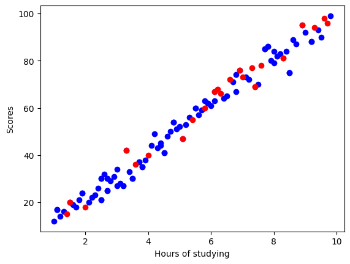

# Simple Regression

Configure the project. Indeed you create a dataset in csv format.


```python
! rm -rf *.csv
! unzip ./dataset/archive.zip
! head -n 1 *.csv | head -n 2 | tail -n 1 > data.csv && for file in *.csv; do (tail -n +2 "$file"; echo) >> data.csv; done && sed -i '/^$/d' data.csv
```

    Archive:  ./dataset/archive.zip
      inflating: score.csv               
      inflating: score_updated.csv       


Import needed libraries


```python
import matplotlib.pyplot as plt
import pandas as pd
import numpy as np
import pylab as pl
from sklearn.model_selection import train_test_split
from sklearn import linear_model
from sklearn.metrics import r2_score

%matplotlib inline
```

Read data from data.csv using pandas and store in data frame structure. Also shuffle data to have uniform distribution. 


```python
df = pd.read_csv("data.csv")
df.head()
df = df.sample(frac=1.0, random_state=42).reset_index(drop=True)
df.head()
```


<div>
<style scoped>
    .dataframe tbody tr th:only-of-type {
        vertical-align: middle;
    }

    .dataframe tbody tr th {
        vertical-align: top;
    }

    .dataframe thead th {
        text-align: right;
    }
</style>
<table border="1" class="dataframe">
  <thead>
    <tr style="text-align: right;">
      <th></th>
      <th>Hours</th>
      <th>Scores</th>
    </tr>
  </thead>
  <tbody>
    <tr>
      <th>0</th>
      <td>7.4</td>
      <td>69</td>
    </tr>
    <tr>
      <th>1</th>
      <td>3.8</td>
      <td>35</td>
    </tr>
    <tr>
      <th>2</th>
      <td>3.5</td>
      <td>30</td>
    </tr>
    <tr>
      <th>3</th>
      <td>1.6</td>
      <td>19</td>
    </tr>
    <tr>
      <th>4</th>
      <td>5.1</td>
      <td>47</td>
    </tr>
  </tbody>
</table>
</div>


```python
# summarize data
df.describe() 
```


<div>
<style scoped>
    .dataframe tbody tr th:only-of-type {
        vertical-align: middle;
    }

    .dataframe tbody tr th {
        vertical-align: top;
    }

    .dataframe thead th {
        text-align: right;
    }
</style>
<table border="1" class="dataframe">
  <thead>
    <tr style="text-align: right;">
      <th></th>
      <th>Hours</th>
      <th>Scores</th>
    </tr>
  </thead>
  <tbody>
    <tr>
      <th>count</th>
      <td>121.000000</td>
      <td>121.000000</td>
    </tr>
    <tr>
      <th>mean</th>
      <td>5.214876</td>
      <td>53.495868</td>
    </tr>
    <tr>
      <th>std</th>
      <td>2.499189</td>
      <td>24.988705</td>
    </tr>
    <tr>
      <th>min</th>
      <td>1.000000</td>
      <td>12.000000</td>
    </tr>
    <tr>
      <th>25%</th>
      <td>3.000000</td>
      <td>30.000000</td>
    </tr>
    <tr>
      <th>50%</th>
      <td>5.100000</td>
      <td>54.000000</td>
    </tr>
    <tr>
      <th>75%</th>
      <td>7.400000</td>
      <td>75.000000</td>
    </tr>
    <tr>
      <th>max</th>
      <td>9.800000</td>
      <td>99.000000</td>
    </tr>
  </tbody>
</table>
</div>


Print the histogram chart of data


```python
viz = df[["Hours", "Scores"]]
viz.hist()
plt.show()
```


    

    


Print scatter chart of data to recognize the patterns of data. Based on the below chart we must answer to this question "Is Linear Simple Regression good or not?"


```python
plt.scatter(df.Hours, df.Scores, color="blue")
plt.ylabel("Scores")
plt.xlabel("Hours of studying")
plt.show()
```


    

    


```python
# print(df)
train, temp = train_test_split(df, test_size=0.25, random_state=42)
test, evaluate = train_test_split(temp, test_size=0.5, random_state=42)
```


```python
fig = plt.figure()
ax1 = fig.add_subplot()
ax1.scatter(train.Hours, train.Scores, color="blue")
ax1.scatter(test.Hours, test.Scores, color="red")
ax1.scatter(evaluate.Hours, evaluate.Scores, color="green")
plt.ylabel("Scores")
plt.xlabel("Hours of studying")
plt.show()
```


    

    


Find the best fitted line based on distribution of data. 


```python
reg = linear_model.LinearRegression()
train_x = np.asanyarray(train[['Hours']])
train_y = np.asanyarray(train[['Scores']])
reg.fit(train_x, train_y)

print("Coefficients:\t", reg.coef_)
print("Intercept:\t", reg.intercept_)
```

    Coefficients:	 [[9.86801899]]
    Intercept:	 [1.90944816]


```python
plt.scatter(train.Hours, train.Scores, color="blue")
plt.plot(train_x, reg.coef_[0][0]*train_x + reg.intercept_[0], "-r")
#               y = theta1 x + theta0
plt.ylabel("Scores")
plt.xlabel("Hours of studying")
```


    Text(0.5, 0, 'Hours of studying')


    

    


Testing model based on Test data. Measure the R2 and MSE.


```python
test_x = np.asanyarray(test[['Hours']])
test_y = np.asanyarray(test[['Scores']])

test_y_ = reg.predict(test_x)

print("Mean absolute error: %.2f" % np.mean(np.absolute(test_y_ - test_y)))
print("Residual sum of squares (MSE): %.2f" % np.mean(test_y_ - test_y)**2)
print("R2-score: %.2f" % r2_score(test_y_, test_y))
```

    Mean absolute error: 2.95
    Residual sum of squares (MSE): 1.62
    R2-score: 0.97

